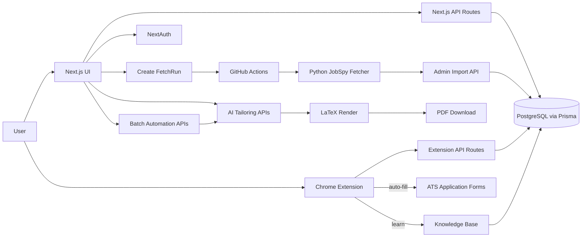

<div align="center">

# Joblit

**An end-to-end job-search workstation.** Fetch roles, triage them, tailor a custom resume and cover letter for each JD, auto-fill any ATS form, and export production-grade PDFs — without copy-paste.

[Live Demo](https://www.joblit.tech) · [Codex Batch Protocol](./AGENTS.md) · [Architecture Notes](./docs/CODEMAPS) · [Report a bug](https://github.com/ShousenZHANG/jobflow-web/issues)


<!-- AUTO_METRICS_BADGES_START -->


<!-- Generated by: npm run readme:metrics -->
<!-- AUTO_METRICS_BADGES_END -->

</div>

---

## What is Joblit

Most job-search tools stop at listing or tracking. Joblit closes the loop:

| Stage | What Joblit does | How |
|---|---|---|
| **Discover** | Batch-fetch roles from job boards | GitHub Actions + Python JobSpy pipeline |
| **Triage** | Fast scan, filter, status-track | Two-pane workspace with search and JD rendering |
| **Tailor** | Generate targeted resume and cover letter | AI prompt engine with versioned rule templates |
| **Apply** | Auto-fill any ATS application form | Chrome extension with self-learning knowledge base |
| **Export** | Production-grade PDF output | LaTeX compile pipeline, EN + CN templates |

The product differentiator is the **Chrome extension**: every correction you make trains a personal knowledge base, so subsequent fills get faster and more accurate.

## Table of Contents

- [Features](#features)
- [Chrome Extension](#chrome-extension)
- [Architecture](#architecture)
- [Project Structure](#project-structure)
- [Quick Start](#quick-start)
- [Scripts](#scripts)
- [Environment Variables](#environment-variables)
- [Codex Batch Workflow](#codex-batch-workflow)
- [Testing](#testing)
- [Deployment](#deployment)
- [Troubleshooting](#troubleshooting)
- [Contributing](#contributing)
- [Security](#security)
- [Acknowledgments](#acknowledgments)
- [License](#license)

## Features

### Job Intake Pipeline

- `FetchRun` tasks with configurable role categories, markets, and filters
- Dispatched to GitHub Actions running the Python JobSpy fetcher across multiple boards
- Import path with dedupe on `userId + jobUrl` and tombstone filtering for permanently dismissed URLs
- Description-level exclusion rules (PR/citizenship requirement, security clearance, no visa sponsorship, 4+ years experience minimum)

### Jobs Workspace

- Two-pane review UI: fast scan on the left, full JD with markdown rendering on the right
- Search, filter, pagination, and status transitions (`NEW` / `APPLIED` / `REJECTED`)
- Batch operations and tombstone tracking on delete

### Resume Studio

- Multi-step master-resume editor: basics, summary, experience, projects, education, skills
- Bullet-level edits with markdown emphasis and live preview
- Per-locale profiles (`en-AU` / `zh-CN`) with localized LaTeX templates

### AI Tailoring Engine

- Versioned `PromptRuleTemplate` with skill-pack delivery
- Prompt generation for resume and cover-letter targets
- Strict schema validation, `promptMeta` consistency checks, evidence-grounded bullets
- Manual JSON import path: copy prompt to any external model, import the result back

### PDF Export

- LaTeX-based resume and cover-letter rendering with bilingual templates
- Optional persistent storage via Vercel Blob

### Batch Automation (Codex Workflow)

- Create `NEW`-scope batches from filtered jobs
- Atomic claim-and-complete loop via `POST /api/application-batches/:id/run-once`
- Progress tracking via batch summary API
- Full external orchestration protocol documented in [AGENTS.md](./AGENTS.md)

## Chrome Extension

Manifest V3 extension that auto-fills job application forms using your Joblit resume profile.

### ATS Adapters

Purpose-built field detection per ATS:

| ATS | Adapter | Coverage |
|---|---|---|
| Workday | `workday.ts` | Inputs, dropdowns, custom components |
| Greenhouse | `greenhouse.ts` | Standard application forms |
| Lever | `lever.ts` | Application and referral forms |
| iCIMS | `icims.ts` | Career portal forms |
| SuccessFactors | `successFactors.ts` | SAP-based application flows |
| Generic | `generic.ts` | Fallback for unknown ATS platforms |

### Self-Learning Knowledge Base

Each application teaches the extension:

1. **Fill** — auto-fill detected fields from your resume profile
2. **Review** — floating widget shows what was filled; edit any value inline
3. **Learn** — each correction auto-saves as a mapping rule (field selector → profile path)
4. **Recall** — next time the same field appears, the knowledge base supplies the corrected value

Rule matching priority: user rules → exact form signature → same ATS + domain → same ATS cross-domain.
Rules are scoped at three levels (global / ATS-level / site-specific) and managed from the web dashboard.

### Technical Notes

- **Shadow DOM widget** — vanilla JS, no framework dependency in content script (~39 KB)
- **React-compatible input simulation** — dispatches native events to work with React, Angular, and Vue controlled inputs
- **Form signature** — djb2 hash of field structure for cross-session form matching
- **Offline queue** — submissions queue locally and sync when back online
- **Bilingual UI** — English and Chinese via lightweight i18n

## Architecture



Deeper architecture references live in [`docs/CODEMAPS/`](./docs/CODEMAPS): `architecture.md`, `backend.md`, `data.md`, `frontend.md`, `dependencies.md`.

## Project Structure

```
app/
  (marketing)/        Landing, privacy, terms, get-extension
  (auth)/             Login
  (app)/              Protected workspace
    fetch/            Job intake pipeline
    jobs/             Jobs triage workspace
    resume/           Resume studio + prompt rules
    discover/         Curated learning videos
    extension/        Token + knowledge-base dashboard
  api/                Backend routes (52 routes / 66 handlers)
    ext/              Extension-specific APIs
chrome-extension/
  src/
    background/       Service worker, auth, API client, sync queue
    content/          Content script, form detection, filling, widget
      detector/       Field classifier, ATS adapters, form signature
      filler/         Input simulator, form filler
      widget/         Shadow DOM floating widget
      recorder/       Submission recorder
    popup/            Extension popup UI (React)
    shared/           Constants, i18n, types, field taxonomy
lib/
  api/                Client-side fetch helper
  server/             Domain services (AI, PDF, prompts, persistence, observability)
  shared/             Zod schemas, market/locale seam, shared config
prisma/               Schema (17 models) + migrations
tools/                Fetcher integration, readme metrics, CI policy checks
test/                 API + server test suites
```

## Quick Start

### Prerequisites

- Node.js **>= 20.10**
- npm **>= 10**
- PostgreSQL database (Neon recommended; any Postgres 14+ works)
- Optional: Gemini API key, Vercel Blob token, Chrome 120+ for the extension

### Setup

```bash
# 1. Clone and install
git clone https://github.com/ShousenZHANG/jobflow-web.git
cd jobflow-web
npm install

# 2. Configure environment
cp .env.example .env
# Edit .env: fill DATABASE_URL, AUTH_SECRET, OAuth credentials, etc.

# 3. Initialize database
npx prisma migrate deploy
npx prisma generate

# 4. Run dev server
npm run dev
```

Open [http://localhost:3000](http://localhost:3000).

### Chrome Extension (optional)

```bash
cd chrome-extension
npm install
npm run dev        # HMR for active development
npm run build      # Production build → chrome-extension/dist
```

Load `chrome-extension/dist` as an unpacked extension at `chrome://extensions`.

## Scripts

| Command | Description |
|---|---|
| `npm run dev` | Start Next.js dev server |
| `npm run build` | Production build |
| `npm test` | Run all tests once (Vitest) |
| `npm run test:watch` | Tests in watch mode |
| `npm run lint` | ESLint |
| `npm run readme:metrics` | Refresh auto-metrics badges in this README |
| `npm run deps:policy` | Check repository dependency policy |
| `npm run deps:audit` | npm audit (production deps, high severity) |
| `npx prisma migrate dev` | Apply database migrations in development |
| `npx prisma studio` | Database GUI |

Run a single test file:

```bash
npx vitest run path/to/file.test.ts
```

## Environment Variables

A complete template lives in [`.env.example`](./.env.example).

### Required

| Variable | Purpose |
|---|---|
| `DATABASE_URL` | PostgreSQL connection string (Neon serverless adapter) |
| `AUTH_SECRET` | NextAuth session signing secret |
| `GOOGLE_CLIENT_ID` / `GOOGLE_CLIENT_SECRET` | Google OAuth |
| `GITHUB_ID` / `GITHUB_SECRET` | GitHub OAuth |
| `IMPORT_SECRET` | Auth for the admin import API used by the fetch worker |
| `FETCH_RUN_SECRET` | Auth for the fetch-run config callback |
| `APP_ENC_KEY` | Extension token encryption key (base64) |
| `LATEX_RENDER_URL` / `LATEX_RENDER_TOKEN` | External LaTeX render service |

### Optional

| Variable | Purpose |
|---|---|
| `GEMINI_API_KEY` / `GEMINI_MODEL` | AI provider |
| `BLOB_READ_WRITE_TOKEN` | Vercel Blob storage |
| `GITHUB_OWNER` / `GITHUB_REPO` / `GITHUB_TOKEN` / `GITHUB_WORKFLOW_FILE` | Fetch workflow dispatch |
| `JOBLIT_WEB_URL` | Public URL for the extension callback |
| `YOUTUBE_API_KEY` | Discover-page video pipeline |
| `CRON_SECRET` | Cron endpoint auth |
| `RSSHUB_URL` / `RSSHUB_JOB_ROUTES` / `GITHUB_CN_JOB_REPOS` | China job sources |
| `SENTRY_DSN` | Error reporting (when SDK is installed) |

## Codex Batch Workflow

External orchestration protocol for AI-assisted batch tailoring is documented in [AGENTS.md](./AGENTS.md). Summary:

1. Fetch jobs and keep target roles as `NEW`.
2. `POST /api/application-batches` with scope `NEW`.
3. Loop `POST /api/application-batches/:id/run-once` (atomic claim + complete).
4. For each task: generate prompt, run external model, import result.
5. Track progress with `GET /api/application-batches/:id/summary`.

## Testing

- **652 tests** across **101 files** (Vitest)
- Test files live alongside sources (`*.test.ts` / `*.test.tsx`) or in `test/`
- `test/api/` covers API routes, `test/server/` covers domain modules
- 80%+ coverage target for new code
- E2E with Playwright for critical user flows (planned; see [`docs/plans/`](./docs/plans))

CI runs lint, dependency policy, full test suite, and (per-PR) Lighthouse against the Vercel preview URL with the budget defined in [`.lighthouserc.json`](./.lighthouserc.json).

## Deployment

- **Recommended:** Vercel + Neon (PostgreSQL)
- Configure all environment variables in the deployment platform
- Chrome extension is distributed as a `.zip` for sideloading or via the Chrome Web Store

## Troubleshooting

| Symptom | Fix |
|---|---|
| `GITHUB_DISPATCH_FAILED` | Verify `GITHUB_TOKEN` workflow permissions on the fetch repo |
| Low import volume | Increase fetch breadth or relax title/description excludes |
| `PROMPT_META_MISMATCH` | Re-download skill pack and re-copy the prompt |
| Extension fields not filling | Check token validity on the Extension page |
| `403 Forbidden` on Vercel preview | Disable Vercel deployment protection or use the custom domain |

## Contributing

Issues and pull requests are welcome. See [CONTRIBUTING.md](./CONTRIBUTING.md) for the development workflow, commit conventions, and review expectations. Architectural decisions are tracked in [`docs/adr/`](./docs/adr) once a decision needs to outlive the PR thread.

## Security

If you find a security vulnerability, please follow the responsible disclosure process documented in [SECURITY.md](./SECURITY.md). Do **not** open a public GitHub issue for security reports.

## Acknowledgments

Joblit is built on top of excellent open-source work:

- [JobSpy](https://github.com/Bunsly/JobSpy) — multi-board job scraping pipeline
- [Next.js](https://nextjs.org), [React](https://react.dev), [Prisma](https://prisma.io), [Tailwind CSS](https://tailwindcss.com)
- [Radix UI](https://www.radix-ui.com) primitives + the [shadcn/ui](https://ui.shadcn.com) layer
- [Framer Motion](https://www.framer.com/motion), [TanStack Query](https://tanstack.com/query), [Zod](https://zod.dev)
- [next-intl](https://next-intl.dev), [NextAuth](https://next-auth.js.org), [Lucide](https://lucide.dev)
- LaTeX render service is built on the [TeX Live](https://www.tug.org/texlive/) toolchain

## License

Apache License 2.0. See [LICENSE](./LICENSE) and [NOTICE](./NOTICE).
