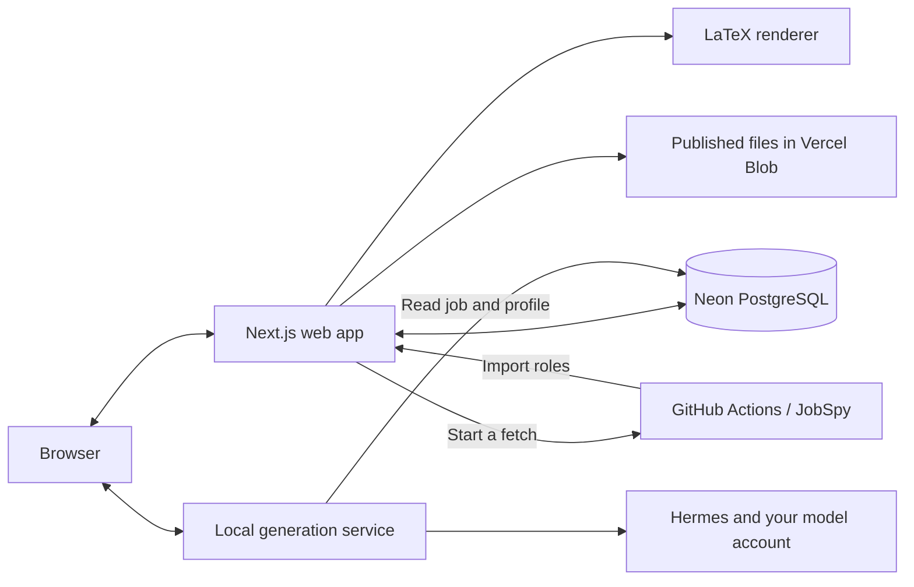

<div align="center">

# Joblit

**Your job search, in one place.**

Find Australian roles, prepare an application around your real experience, and keep track of what comes next.

[Website](https://www.joblit.tech) · [Try the demo](https://www.joblit.tech/#demo) · [Run locally](#run-locally) · [Report an issue](https://github.com/ShousenZHANG/joblit/issues)


</div>

## Why Joblit

A job search spreads across job boards, resume files, notes and unfinished applications. Joblit brings those pieces together: collect roles, understand what each one asks for, tailor your materials, and keep a record of your applications.

Tailoring starts with the experience you already have. It adjusts your summary and selects relevant skills from your profile; it leaves your experience bullets alone.

The [interactive demo](https://www.joblit.tech/#demo) needs no sign-in or AI setup. It uses fictional jobs and a sample profile, with six prepared resume and cover-letter PDFs you can open. Live AI generation requires the [local setup](#local-ai-generation) below.

## What you can do

- **Collect Australian opportunities.** Fetch LinkedIn roles by job title or keywords, location and freshness. Follow each run's progress, avoid duplicate listings, and keep dismissed roles from being imported again.
- **Read the role in context.** Browse jobs in a two-pane workspace. See required experience and named technologies, and jump from an experience requirement to its original wording in the job description.
- **Build a reusable resume profile.** Edit your details, experience, projects, education and skills with auto-save and preview. Keep multiple profile versions and choose an active profile for each supported locale.
- **Tailor each application.** Generate a role-specific summary, choose and order skills from your existing profile, and prepare a three-paragraph cover letter. Resume and cover letter have separate generation, editing and publication states.
- **Review and export.** Edit tailored text in the same dialog and publish a new PDF when ready. LaTeX templates produce resume and cover-letter documents; saved PDFs remain accessible from the job.
- **Keep your search organised.** Search saved roles and move them between New, Applied and Rejected. Open the original posting when you are ready to apply; Joblit does not submit applications for you.

The interface supports English and Chinese, with light and dark themes, responsive layouts and reduced-motion support. The landing page includes a 3D workflow and a hands-on product demo. A GitHub Trending view is also available from the app navigation.

**Current coverage:** job fetching and the Jobs-page tailoring flow are currently available only for Australian roles. Chinese resume profiles and templates remain supported; Chinese and global job fetching are not active features.

## A typical application

1. **Add your profile** in Resume and select the version you want to use.
2. **Fetch and review roles.** Open a job in Jobs and check its requirements against the full description.
3. **Choose Tailor**, then Resume or Cover Letter. With the local service running, **Generate PDF with AI** generates, validates and publishes that document.
4. **Read the result.** Use Review to refine the summary, skills or cover-letter paragraphs, then Publish to update the PDF. Generate the other document separately if needed.
5. **Apply through the original posting** and update the job's status yourself.

The first successful generation publishes a PDF automatically; it does not wait for a separate approval click. Review your material before sending it. If publication fails after import, the draft remains available for review and another publish attempt.

## Run locally

### What you need

- **Node.js 24.x** and **npm 10+**. This also supports the native TypeScript loading used by the local generation tools.
- A **Neon PostgreSQL database**. The application currently uses Prisma's Neon adapter; a different PostgreSQL setup needs a compatible runtime adapter.
- **Google and GitHub OAuth apps** for sign-in.
- A compatible **LaTeX render service** and **Vercel Blob storage** for publishing PDFs.

The full application has external service dependencies. To explore the product without configuring them, use the hosted demo.

### Start the web app

```bash
git clone https://github.com/ShousenZHANG/joblit.git
cd joblit
cp .env.example .env
# Fill in .env before continuing.
npm ci
npm run db:migrate:deploy
npm run dev
```

On PowerShell, use `Copy-Item .env.example .env` in place of `cp`. `npm ci` also generates the Prisma client.

Open [localhost:3000](http://localhost:3000). Set `NEXTAUTH_URL=http://localhost:3000` for local sign-in and register these OAuth callback URLs:

```text
http://localhost:3000/api/auth/callback/google
http://localhost:3000/api/auth/callback/github
```

Use your deployment's origin instead of localhost when configuring production callbacks.

### Environment variables

Start with [`.env.example`](./.env.example). The current startup requirements are defined in [`lib/server/env.ts`](./lib/server/env.ts).

| Purpose | Variables |
| --- | --- |
| Database | `DATABASE_URL`; use `DIRECT_URL` for an explicit unpooled migration connection |
| Sessions | `AUTH_SECRET`, `NEXTAUTH_URL` |
| Google sign-in | `GOOGLE_CLIENT_ID`, `GOOGLE_CLIENT_SECRET` |
| GitHub sign-in | `GITHUB_ID`, `GITHUB_SECRET` |
| Fetch worker authentication | `FETCH_RUN_SECRET` |
| PDF renderer | `LATEX_RENDER_URL`, `LATEX_RENDER_TOKEN` |
| Published PDFs and uploaded photos | `BLOB_READ_WRITE_TOKEN` |

Startup validation requires the database, session secret, both OAuth providers, fetch secret and render-service settings. Blob storage is required to publish PDFs outside tests; editing drafts does not upload artifacts. Use a publicly reachable HTTPS render service; allowing HTTP does not permit private-network or loopback render URLs.

### Enable job fetching

Fetching runs in the repository's [JobSpy GitHub Actions workflow](./.github/workflows/jobspy-fetch.yml), separate from the web server.

1. Set `GITHUB_OWNER`, `GITHUB_REPO` and `GITHUB_TOKEN` on the web app. The token must be able to dispatch workflows in that repository.
2. Use `GITHUB_WORKFLOW_FILE=jobspy-fetch.yml` and set `GITHUB_REF` to the branch containing the workflow.
3. Add `JOBLIT_WEB_URL` and `FETCH_RUN_SECRET` as GitHub Actions secrets. The fetch secret must match the web app's value.
4. Start a run from Fetch.

`JOBLIT_WEB_URL` must be reachable from GitHub Actions; a local-only URL cannot receive worker results. The workflow installs its Python dependencies itself. Fetching is user-triggered and currently uses LinkedIn for Australian roles.

### Local AI generation

The **Generate PDF with AI** button connects to a service running on your computer. That service invokes Hermes with your model account, checks the output, and returns it to the browser. The browser then imports and publishes the document through the web app.

This is currently a **single-operator setup**: the local service needs database access to the same Joblit instance you are using. Signing into the website alone does not configure generation.

Before starting it:

- Install and authenticate the Hermes CLI for the provider used by the [generation adapter](./tools/tailor/generateTailoring.mjs). The adapter defines the current provider and default model; it does not automatically use an arbitrary Hermes configuration.
- Keep the full `npm ci` installation, including development dependencies used by the local tools.
- Configure the repository's `.env` with access to the same database as the web app.
- If Hermes is not found automatically, set `HERMES_EXE` to its executable path. On Windows, use the executable rather than a `.cmd` shim.

From the repository root, in a separate terminal:

```bash
node --env-file=.env --experimental-loader ./tools/evals/aliasLoader.mjs tools/tailor/serve.mjs
```

On Windows, you can instead open [`tools/tailor/start-sidecar.cmd`](./tools/tailor/start-sidecar.cmd). Leave the process running while generating. The browser connects to `http://127.0.0.1:8791`; it cannot start the process for you.

The service binds only to loopback and has no per-request authentication. Keep it local. Its allowed browser origins are defined in [`serve.mjs`](./tools/tailor/serve.mjs); a custom deployment domain needs an explicit allowlist change. See [ADR-0024](./docs/adr/0024-generate-from-a-local-sidecar.md) for the generation flow and its current limits.

## How it fits together


```mermaid
flowchart LR
  Browser[Browser] <--> Web[Next.js web app]
  Web <--> DB[(Neon PostgreSQL)]
  Browser <--> Local[Local generation service]
  Local -->|Read job and profile| DB
  Local --> Hermes[Hermes and your model account]
  Web --> Renderer[LaTeX renderer]
  Web --> Blob[Published files in Vercel Blob]
  Web -->|Start a fetch| Actions[GitHub Actions / JobSpy]
  Actions -->|Import roles| Web
```

**Model credentials stay off the web server.** Generation runs through your local environment and may call the configured model provider. This does not mean all application data stays on your computer: the web app stores profiles and jobs in its database, and publishes files to Blob storage. Published file URLs currently use public Blob access.

**Tailoring has a deliberately small scope.** Skills are selected by references to your own skill bank, not generated as new names. Summary checks validate length, role wording, numbers and recognised skills against the job and profile. These checks do not replace a human review of the writing. Experience bullets are preserved. See [ADR-0023](./docs/adr/0023-tailor-the-summary-and-the-skills-only.md).

## Development

| Command | Purpose |
| --- | --- |
| `npm run dev` | Start the development server |
| `npm run verify` | Run type checks, lint, dependency policy, dead-code checks and Vitest |
| `npm run build` | Build the web app for production |
| `npm start` | Serve a production build |
| `npm test` | Run Vitest once |
| `npm run test:watch` | Run tests in watch mode |
| `npm run test:coverage` | Generate test coverage |
| `npm run db:migrate:deploy` | Apply committed database migrations |
| `npm run readme:metrics` | Refresh the repository counts below |

Tests live beside their sources and in `test/`. The [CI workflow](./.github/workflows/ci.yml) also checks migrations, deployment policy, the Python fetcher and the production build. Contributor setup and review conventions are in [CONTRIBUTING.md](./CONTRIBUTING.md).

```text
app/                    Web pages and API routes
components/landing/     Landing, 3D scene and interactive demo
components/resume/      Resume Studio
lib/server/             Application services, validation and PDF composition
lib/shared/             Shared schemas and document logic
prisma/                 Database schema and migrations
tools/fetcher/          Australian job-fetching worker
tools/tailor/           Local generation service and CLI
tools/demo/             Reproducible sample documents and job postings
public/demo/            Static files used by the landing demo
test/                   API and server tests
```

The [domain glossary](./CONTEXT.md) and [architecture decisions](./docs/adr/) document the model behind the code. For generation, ADR-0023 and ADR-0024 describe the current behaviour; older decisions may be superseded.

<details>
<summary>Repository at a glance</summary>

<!-- AUTO_METRICS_BADGES_START -->


<!-- Generated by: npm run readme:metrics -->
<!-- AUTO_METRICS_BADGES_END -->

These are source-file counts, not a record of test results.

</details>

## Deployment

The repository includes a Vercel deployment path with Neon and Vercel Blob. Configure the web environment and OAuth callback URLs for your domain, plus the separate fetch workflow and PDF renderer.

- The [Vercel build script](./tools/deploy/vercel-build.mjs) runs committed migrations before a **Production** build and stops if they fail. Local and preview builds do not run production migrations.
- Use an unpooled connection for migrations. Supported overrides are `DIRECT_URL`, `DATABASE_URL_UNPOOLED` and `POSTGRES_URL_NON_POOLING`; standard Neon pooler URLs can be resolved to their direct host by the deployment helper.
- The scheduled artifact-cleanup route is disabled until `ARTIFACT_RECONCILE_ENABLED` is enabled. Configure `CRON_SECRET` and Blob storage before enabling it; `ARTIFACT_RECONCILE_SECRET` is an optional credential for manual cleanup.
- Deploying the web app does not start the local AI service. Live generation still needs the operator setup described above.

## Troubleshooting

| Problem | Check |
| --- | --- |
| Sign-in fails or redirects to the wrong host | OAuth callback URLs, both provider credentials and `NEXTAUTH_URL` |
| Fetch cannot start | Workflow dispatch permissions, repository settings and `GITHUB_REF` |
| Fetch starts but no results arrive | Actions logs, the public callback URL and the matching `FETCH_RUN_SECRET` |
| The local generation service is unavailable | Start the sidecar, keep it running, and check port 8791 and the allowed browser origin |
| Hermes cannot start or authenticate | The installed executable, `HERMES_EXE`, model-account authentication and the adapter's provider configuration |
| PDF publication fails | Render-service configuration and `BLOB_READ_WRITE_TOKEN`; retry Publish if the draft was already imported |

## Contributing and security

Bug reports and pull requests are welcome. Follow [CONTRIBUTING.md](./CONTRIBUTING.md) for development and review guidance. Report vulnerabilities through the process in [SECURITY.md](./SECURITY.md), rather than a public issue.

Joblit builds on [JobSpy](https://github.com/Bunsly/JobSpy), Next.js, React, Prisma, Radix UI, Three.js, React Three Fiber, Framer Motion, LangGraph and the wider open-source ecosystem.

## License

[Apache License 2.0](./LICENSE). See [NOTICE](./NOTICE) for attribution.
