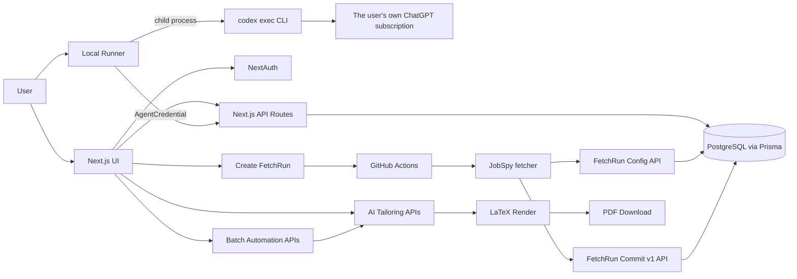

<div align="center">

# Joblit

**An end-to-end job-search workstation.** Fetch roles, triage them, tailor a custom resume and cover letter for each JD with a local Agent Runner, and export production-grade PDFs — without copy-paste.

[Live Demo](https://www.joblit.tech) · [Codex Batch Protocol](./AGENTS.md) · [Domain Context](./CONTEXT.md) · [Report a bug](https://github.com/ShousenZHANG/joblit/issues)


<!-- AUTO_METRICS_BADGES_START -->


<!-- Generated by: npm run readme:metrics -->
<!-- AUTO_METRICS_BADGES_END -->

</div>

---

## Codex & GPT-5.6

Joblit uses both as **product infrastructure**, not just as build-time assistants.

### GPT-5.6 can run the tailoring through the user's local Runner

The first-party Agent path generates CVs and cover letters through the official
Codex CLI running as a child process of the
[Joblit Runner](./tools/runner/) — a dependency-free Node process that speaks
the same public API any external agent uses. Joblit already stores the Job and
Master Resume Profile needed to build the prompt; the privacy boundary is the
model connection. Joblit never sees a model credential at all: `codex login`
holds the user's own ChatGPT subscription and the child process inherits it.
There is no server-side generation path and no server-held model key
(ADR-0015).

What the model is trusted with is deliberately narrow:

| Joblit asks GPT-5.6 for                                              | Joblit computes itself                              |
| -------------------------------------------------------------------- | --------------------------------------------------- |
| A per-requirement judgement: `MATCH` / `PARTIAL` / `GAP` / `UNKNOWN` | The fit score, from those judgements                |
| Rewritten summary and bullet candidates                              | Which claims survive the evidence gate              |
| A strict JSON payload against a published schema                     | The verdict, the hard-gate caps, the final document |

This split is the core design decision. Letting a prompt emit its own score
makes the number drift between models and between runs; aggregating
deterministically in `lib/server/ai/fitScoring.ts` means swapping the model
changes the judgements, never the scoring rule. A frozen golden set
(`test/fixtures/fitGolden/`) replays recorded model output through the real
aggregator so a prompt or model change that shifts verdicts fails CI at zero
cost.

The same separation powers the grounding gate. `lib/server/ai/evidenceLedger.ts`
traces every generated claim back to evidence in the candidate's real profile,
and **blocks the PDF from rendering** when a claim has none — the model
proposes, it never gets the last word on what carries the user's name.

### Codex drives the batch pipeline

Tailoring one application at a time is fine; tailoring forty is a job for an
agent. Codex runs Joblit's batch loop through a documented HTTP protocol
([AGENTS.md](./AGENTS.md)):

```
POST /api/application-batches              → create a batch from NEW-status jobs
POST /api/application-batches/:id/run-once → report failure/skip + claim next
POST /api/applications/prompt              → issue the task-bound Tailoring Run
POST /api/applications/manual-generate     → accept one target with its run handle
GET  /api/application-batches/:id/summary  → progress (interactive session)
```

Every claimed task carries `protocolVersion: 1`, an attempt UUID, and a stable,
Joblit-derived `issueKey`. The claim also reports `acceptedTargets` and
`remainingTargets`;
after stale reclaim, Codex and the server executor process only the missing
targets and preserve the already accepted Application half. Missing-target
prompt requests echo the claimed protocol version and `issueKey`, then bind the
batch, task, and attempt; each import echoes the returned public Tailoring Run
handle. `run-once` and the session-only task `PATCH` endpoint report only
`FAILED` or `SKIPPED`. Success has no independent
callback: accepting the final required target atomically commits the
Application, immutable receipt, Tailoring Run, and batch task. Lost responses
can therefore replay the same receipt without fabricating a second success.

The Runner also fences live work against the exact Tailoring Run
`{ id, attemptId }`. If a lease is taken over, the stale Runner stops its local
Hermes operation instead of importing into the new attempt. An ambiguous
timeout or transport failure during import is not a task failure: the Runner
replays the byte-identical receipt, and preserves local recovery state if the
settlement still cannot be confirmed. When another task still owns a live
lease, `run-once` returns a bounded retry hint and the Runner waits rather than
mistaking an empty claim for a finished batch.

### TailoringRun rolling cutover

TailoringRun uses an expand-and-drain rollout so old data stays honest and an
old batch worker cannot certify a newly claimed attempt.

**Phase A — expand and compatibility.** Deploy the additive migration and
mixed-version readers first. Historical `ApplicationBatchTask` rows remain
`tailoringProtocolVersion = 0`; they are not backfilled with attempts,
completion proofs, Tailoring Runs, or receipts. During this window an old
client may retry a prompt endpoint without `issueKey` and mark the resulting
envelope legacy. Legacy imports without a run handle remain temporarily
readable, but they do not manufacture TailoringRun evidence.

**Phase B — drain and switch writers.** Pause Codex/server batch dispatch, wait
for old deployments and claimed tasks to drain, then deploy the v1 claim and
acceptance writers. A new claim atomically sets
`tailoringProtocolVersion = 1`, replaces `executionAttemptId`, clears
`completionAttemptId`, and returns its stable `issueKey` plus durable target
progress. PostgreSQL permits a v1 task to become `SUCCEEDED` only when
TailoringRun acceptance writes `completionAttemptId = executionAttemptId`.
Consequently, an old worker that finishes after a new claim cannot write an
unreceipted success even if it still reaches the database.

Before resuming dispatch, verify no old active task remains:

```sql
SELECT id, status, "executionAttemptId", "tailoringProtocolVersion",
       "completionAttemptId"
FROM "ApplicationBatchTask"
WHERE status IN ('PENDING', 'RUNNING')
ORDER BY "updatedAt";
```

Canary a fresh two-target task, then force or observe one stale reclaim after
the first target is accepted. The reclaimed claim must return that target in
`acceptedTargets`, only the other in `remainingTargets`, and finish with:

```sql
SELECT t.id, t.status, t."executionAttemptId",
       t."tailoringProtocolVersion", t."completionAttemptId",
       r."acceptedTargetMask", r."requiredTargetMask"
FROM "ApplicationBatchTask" t
JOIN "TailoringRun" r ON r."applicationBatchTaskId" = t.id
WHERE t.id = '<canary-task-uuid>';
```

Healthy v1 success is `tailoringProtocolVersion = 1`,
`completionAttemptId = executionAttemptId`, and equal accepted/required masks.
If the canary fails, pause dispatch again; do not repair it with a direct
`SUCCEEDED` update.

**Phase C — contract.** After legacy envelope telemetry reaches zero and every
old client/deployment has drained, remove the legacy fallback and require a
TailoringRun handle for every import. Historical v0 rows remain
legacy audit history. Never backfill synthetic run or receipt evidence merely
to make old data look v1.

### Application Artifact lifecycle rollout

ADR-0010 implements durable lifecycle handling for Application PDF and TeX
Blobs. Artifacts move through stage, reference, and retirement states; deletion
uses a leased claim, an external call, and a claim-fenced settle. The migration
safely registers existing `Application` URL pointers as `REFERENCED`, while the
same change adds dual-writing, Job-deletion retirement, and reconciliation.
Once retirement begins, a pathname is never reused: identical later content
gets a UUID incarnation path so a delayed stale delete cannot erase new bytes.
Legacy reference checks are bounded and fail closed, and inventory never
revives a retired pathname.

Production still deploys the migration before the writer binary. The existing
Application URL columns remain the current aggregate pointers and a mandatory
second deletion fence. The scheduled route has no inventory, claim, or delete
side effect unless `ARTIFACT_RECONCILE_ENABLED` is exactly `true` or `1`; keep
it disabled until the writer is deployed and all older binaries have drained,
then enable one bounded Phase C run explicitly. The worker drains retirement
work first; inventory is limited to two 50-object pages per run, resumes from a
leased database checkpoint, scans only `applications/`, and never scans Resume
Photos under `resume-photos/`.

### How Codex was used to build Joblit

Codex worked as a development collaborator across three areas of the codebase.
Most of that work was refinement rather than greenfield — taking a system that
already ran and making it correct, faster, or harder to misuse.

**Hermes and the local GPT-5.6 integration.** This began as a browser
extension driving the loopback runtime through a service worker and a
`postMessage` bridge — five hops to reach a server on `127.0.0.1`, each with its
own failure mode, and a scan that died when the tab closed. Codex worked through
that bridge protocol and the run lifecycle, and the experience is what motivated
replacing it: the extension was retired for a local Runner (see
[ADR-0014](./docs/adr/0014-retire-the-browser-extension-for-a-local-runner.md)),
which is headless, survives a closed tab, and authenticates like any other
agent. The profile bootstrap that keeps a Joblit Hermes install isolated from a
user's existing profiles survives from that work.

**The fetch pipeline.** Australian role intake and the title-relevance filter in
the Python JobSpy worker. The
filtering work was the fiddliest: a title filter that matches literal tokens
looks correct until an "AI Engineer" search silently drops every Machine
Learning Engineer, GenAI Engineer and MLOps Engineer because none of them
contain the string "ai". Getting recall right meant measuring against a real
title corpus rather than reasoning about regexes. The pipeline now persists a
versioned execution config and commits every worker batch through one receipt-backed
transaction boundary, so retries and cancellation have deterministic results.

**Scoring and grounding.** The deterministic aggregator in
`lib/server/ai/fitScoring.ts`, the prescreen path, the evidence ledger in
`lib/server/ai/evidenceLedger.ts`, and the frozen golden set that pins verdicts
across model changes. This is where the model/scoring split described above was
worked out and hardened.

**Codex Session ID:** `019f497c-61d9-7363-a4d6-309eb78a7fdb`

## What is Joblit

Most job-search tools stop at listing or tracking. Joblit closes the loop:

| Stage        | What Joblit does                          | How                                                                                                                                 |
| ------------ | ----------------------------------------- | ----------------------------------------------------------------------------------------------------------------------------------- |
| **Fetch**    | Batch-fetch Australian roles              | LinkedIn through the AU JobSpy worker; every batch crosses the receipt-backed FetchRun commit boundary                            |
| **Triage**   | Fast scan, filter, status-track           | Two-pane workspace with search and JD rendering                                                                                     |
| **Tailor**   | Generate targeted resume and cover letter | AI prompt engine with versioned rule templates                                                                                      |
| **Apply**    | Review generated materials, then apply    | Drafts land for your approval; nothing is submitted without you                                                                     |
| **Export**   | Production-grade PDF output               | LaTeX compile pipeline, EN + CN templates                                                                                           |

The product differentiator is **where the AI can run**: tailoring can flow
through your own local Runner and Hermes provider configuration, while Joblit
stores the deterministic workflow and never sees your model key.

> Joblit is free and open to everyone. Sign in with Google or GitHub; no invitation, manual approval, subscription, or credit card is required.

## Table of Contents

- [Features](#features)
- [Codex & GPT-5.6](#codex--gpt-56)
- [Local Runner](#local-runner)
- [Architecture](#architecture)
- [Project Structure](#project-structure)
- [Quick Start](#quick-start)
- [Scripts](#scripts)
- [Environment Variables](#environment-variables)
- [Codex Batch Workflow](#codex-batch-workflow)
- [Testing](#testing)
- [Deployment](#deployment)
- [Troubleshooting](#troubleshooting)
- [Contributing](#contributing)
- [Security](#security)
- [Acknowledgments](#acknowledgments)
- [License](#license)

## Features

### Job Intake Pipeline

- AU-only `FetchRun` tasks with configurable role categories, location, and freshness
- **LinkedIn** runs through the JobSpy worker (`tools/fetcher/run_jobspy.py`) on GitHub Actions, and stops on any anti-bot challenge by design
- Strict AU `FetchRunConfig` v2 writes with an AU v1 compatibility reader for historical runs
- Receipt-backed, ordered batch commits that atomically persist Jobs and FetchRun progress; identical retries replay safely
- Import dedupe on `userId + jobUrl` and tombstone filtering for permanently dismissed URLs
- Server-owned, recall-safe title and eligibility exclusions that keep ambiguous roles
- CN Jobs, Resume, Chinese LaTeX, and translated UI remain; CN Fetch/Nowcoder and GLOBAL feed/ATS/source-health execution are retired (ADR-0017)

### Jobs Workspace

- Two-pane review UI: fast scan on the left, full JD with markdown rendering on the right
- Search, filter, pagination, and status transitions (`NEW` / `APPLIED` / `REJECTED`)
- Batch operations and tombstone tracking on delete

### Resume Studio

- Multi-step master-resume editor: basics, summary, experience, projects, education, skills
- Bullet-level edits with markdown emphasis and live preview
- Per-locale profiles (`en-AU` / `zh-CN`) with localized LaTeX templates

### AI Tailoring Engine

- Versioned `PromptRuleTemplate` with skill-pack delivery
- Prompt generation for resume and cover-letter targets
- Strict schema validation, `promptMeta` consistency checks, evidence-grounded bullets
- Manual JSON import path: copy prompt to any external model, import the result back

### PDF Export

- LaTeX-based resume and cover-letter rendering with bilingual templates
- FINAL artifacts persist through Vercel Blob outside tests; DRAFT edits do not upload

### Batch Automation (Codex Workflow)

- Create `NEW`-scope batches from filtered jobs
- Atomic claim-and-complete loop via `POST /api/application-batches/:id/run-once`
- Progress tracking via batch summary API
- Full external orchestration protocol documented in [AGENTS.md](./AGENTS.md)

### Open Access & Fetch Worker

- **Self-service access** — anyone can sign in with Google or GitHub OAuth and start using Joblit immediately
- **No account gate** — there is no invitation, manual approval, subscription, or credit-card requirement
- **Run-bound worker access** — the AU JobSpy worker reads one run's config and submits `fetch-run-commit/v1` commands with `FETCH_RUN_SECRET`; the server derives the owning user and market from that run

### GitHub Trending

- Official-order GitHub weekly/monthly trending repositories, reached from the flame icon in the app nav
- Fetched on demand the first time the popover is opened, then cached per period for the session
- A DB-backed last-known-good cache survives serverless cold starts; an empty or changed parse never overwrites known-good content
- The curated YouTube video pipeline and the standalone Discover workspace were deleted; do not reintroduce them

## Local Runner

`tools/runner/` is a dependency-free Node process that generates your materials
on your own machine. It replaces the Chrome extension
([ADR-0014](./docs/adr/0014-retire-the-browser-extension-for-a-local-runner.md)).

### What it does

Each cycle it drains two server-side queues, then sleeps.

**Fit scan.** Leases a durable `FitBatchClaim`, asks Joblit for the triage
prompt, scores it through Hermes, and posts the verdicts back. A Claim keeps one
exact ordered Job set across lease takeover; its attempt UUID and lease live on
the Claim rather than borrowing `Job.updatedAt`. The Runner heartbeats that
attempt while Hermes works. The prompt has a content-addressed 64-hex
`issueKey` bound to the Claim and its server-owned snapshot.
`FitBatchImportReceipt` commits every claimed Job's scored or failed outcome in
the same transaction as the terminal Claim projection, so an identical retry
returns the original result. An unknown import outcome keeps Hermes state for
exact replay. Startup distinguishes active, settled, and terminal-without-
receipt work before retaining or clearing a local result. Stop terminally
cancels the Claim and pending rows at the database queue boundary; a late local
result cannot import through its stale attempt, and the next explicit scan may
retry it.

**Tailoring batch.** Claims a task from the batch protocol, generates each
remaining target, and imports the result with the exact receipt and TailoringRun
handle the prompt endpoint issued. Success is implicit; only failures are
reported back.

**Crash recovery.** Before claiming new work, the Runner reconciles
machine-local Hermes state with Joblit's Tailoring Run and Fit receipts. It
clears a local result only after Joblit proves the target or Fit issue was
accepted, discards only a terminal obsolete result, and otherwise preserves the
exact active attempt. Before a stock-Hermes start, the Runner records a
non-secret transcript cursor and request hashes. If the start response is lost,
it recovers only when the session proves one matching user turn and one unique
terminal assistant output. An incomplete tool-call snapshot remains deferred;
a completed tool sequence qualifies only through its later unique terminal
`finish_reason: "stop"` output. Retryable gateway failures are never blindly
resubmitted or marked as model failure. Atomic compare-and-set makes
same-session starts
single-flight across local Runner processes. The state file contains opaque
ids, hashes, transcript cursors, and non-secret operation identity, never
prompts, model output, feedback text, or credentials.

The recovery and queue invariants are recorded in
[ADR-0016](./docs/adr/0016-durable-agent-queue-recovery.md).

Generated materials and their PDFs land in Joblit for review. The Runner never
submits an application.

### Why it is not in the browser

The extension reached the same gateway through a service worker, a content
script, a `postMessage` bridge, a wire contract and a run registry. The Runner
makes one HTTPS call to Joblit and one HTTP call to `127.0.0.1`. It is headless,
so a scan no longer dies when you close the tab.

### Security

- **The Runner holds no model credential.** There is nothing to leak: `codex
  login` stores the user's own subscription auth and the Codex child process
  inherits it. The Runner's only secret is the Joblit agent token.
- **The model is pinned to a text generator.** Every invocation passes
  `--sandbox read-only`, `features.shell_tool=false`, `web_search=disabled`,
  `--ignore-user-config`, `--ignore-rules`, `--ephemeral`, and a throwaway
  working directory. Job descriptions are untrusted text from the internet and
  they go straight into the prompt.
- **Agent credentials are versioned, scoped, revocable, and stored hashed.**
  A presented credential is never rescued by a session cookie, so revoking one
  stops the Runner immediately. Runner credentials use the `jfagent_v1_`
  prefix, the `joblit-agent` audience, and explicit capabilities.
- **The Runner imports no repository code.** The HTTP API is its only contract,
  the same one documented in [AGENTS.md](./AGENTS.md) for external agents.

### Protocol

`withAgentRoute` accepts either a Bearer `AgentCredential` or a browser session
and produces the same identity, so the batch protocol, the fit queue and the
tailoring endpoints serve humans and agents through one seam. Credentials are
minted through the session-only `/api/agent-tokens` route, reached from the
Runner setup popover in the app nav; that endpoint refuses Bearer auth, because
minting a credential from a credential would let a leaked credential outlive its
revocation.

## Architecture


```mermaid
flowchart LR
  U[User] --> FE[Next.js UI]
  U --> RUN[Local Runner]

  FE --> API[Next.js API Routes]
  API --> DB[(PostgreSQL via Prisma)]
  FE --> AUTH[NextAuth]

  RUN -->|AgentCredential| API
  RUN -->|child process| CODEX[codex exec CLI]
  CODEX --> GPT[The user's own ChatGPT subscription]

  FE --> FR[Create FetchRun]
  FR --> GH[GitHub Actions]
  GH --> PY[JobSpy fetcher]
  PY --> CFG[FetchRun Config API]
  PY --> COMMIT[FetchRun Commit v1 API]
  CFG --> DB
  COMMIT --> DB

  FE --> AIPATH[AI Tailoring APIs]
  AIPATH --> PDF[LaTeX Render]
  PDF --> DL[PDF Download]

  FE --> BATCH[Batch Automation APIs]
  BATCH --> AIPATH
```

Domain vocabulary lives in [`CONTEXT.md`](./CONTEXT.md), while durable architecture decisions live in [`docs/adr/`](./docs/adr/).

## Project Structure

```
app/
  (marketing)/        Landing, privacy, terms
  (auth)/             Login
  (app)/              Protected workspace
    fetch/            Job intake pipeline
    jobs/             Jobs triage workspace
    resume/           Resume studio + prompt rules
    career/           Redirect to /jobs (ADR-0006)
  api/                Backend routes
    agent-tokens/     Issue and revoke AgentCredential records (session-only)
    fetch-runs/[id]/  Run config and receipt-backed worker commit routes
lib/
  api/                Client-side fetch helper
  server/             Domain services (AI, PDF, prompts, persistence, observability)
  shared/             Zod schemas, market/locale seam, shared config
prisma/               Schema + migrations
tools/
  runner/             The local Runner — fit queue + tailoring batches
  fetcher/            Python JobSpy worker
  ci/, deploy/        Policy gates and deployment guards
test/                 API + server test suites
```

## Quick Start

### Prerequisites

- Node.js **>= 20.10**
- npm **>= 10**
- PostgreSQL database (Neon recommended; any Postgres 14+ works)
- Vercel Blob token for FINAL export and artifact reconciliation
- Optional: the official Codex CLI, signed in, for the local Runner

### Setup

```bash
# 1. Clone and install
git clone https://github.com/ShousenZHANG/joblit.git
cd joblit
npm install

# 2. Configure environment
cp .env.example .env
# Edit .env: fill DATABASE_URL, AUTH_SECRET, OAuth credentials, etc.

# 3. Initialize database
npx prisma migrate deploy
npx prisma generate

# 4. Run dev server
npm run dev
```

Open [http://localhost:3000](http://localhost:3000).

### Local Runner (optional)

Generate CVs and cover letters on your own machine. Install and sign in to the
Codex CLI, then issue an `AgentCredential` from the Runner setup popover in the
app nav:

```bash
npm i -g @openai/codex
codex login
```

The popover hands you the whole start command as one line:

```bash
JOBLIT_URL="http://localhost:3000" JOBLIT_TOKEN="jfagent_v1_..." node tools/runner/cli.mjs --watch
```

Full setup in [tools/runner/README.md](./tools/runner/README.md).

## Scripts

| Command                                                                                | Description                                            |
| -------------------------------------------------------------------------------------- | ------------------------------------------------------ |
| `npm run dev`                                                                          | Start Next.js dev server                               |
| `npm run build`                                                                        | Production build                                       |
| `npm run db:migrate:deploy`                                                            | Apply committed migrations in a deployment environment |
| `npm test`                                                                             | Run all tests once (Vitest)                            |
| `npm run test:watch`                                                                   | Tests in watch mode                                    |
| `npm run lint`                                                                         | ESLint                                                 |
| `npm run readme:metrics`                                                               | Refresh auto-metrics badges in this README             |
| `npm run deps:policy`                                                                  | Check repository dependency policy                     |
| `npm run deps:audit`                                                                   | npm audit (production deps, high severity)             |
| `npm run hermes:profile:test`                                                          | Validate the minimal stock-Hermes Joblit profile       |
| `npm run hermes:package:test`                                                          | Test deterministic packaging and Ed25519 verification  |
| `npm run hermes:package:build -- --staging <dir> --source-commit <sha>`                | Build a deterministic profile package                  |
| `npm run hermes:package:verify -- --root <dir> --mode <integrity\|digest\|production>` | Verify profile package trust and content               |
| `npx prisma migrate dev`                                                               | Apply database migrations in development               |
| `npx prisma studio`                                                                    | Database GUI                                           |

Run a single test file:

```bash
npx vitest run path/to/file.test.ts
```

## Environment Variables

A complete template lives in [`.env.example`](./.env.example).

### Required

| Variable                                    | Purpose                                                         |
| ------------------------------------------- | --------------------------------------------------------------- |
| `DATABASE_URL`                              | Pooled PostgreSQL connection used by the running serverless app |
| `AUTH_SECRET`                               | NextAuth session signing secret                                 |
| `GOOGLE_CLIENT_ID` / `GOOGLE_CLIENT_SECRET` | Google OAuth                                                    |
| `GITHUB_ID` / `GITHUB_SECRET`               | GitHub OAuth                                                    |
| `FETCH_RUN_SECRET`                          | Auth for AU worker config reads and FetchRun v1 commits         |
| `LATEX_RENDER_URL` / `LATEX_RENDER_TOKEN`   | External LaTeX render service                                   |

### Optional

| Variable                                                                                | Purpose                                                                                                                                                                                                                          |
| --------------------------------------------------------------------------------------- | -------------------------------------------------------------------------------------------------------------------------------------------------------------------------------------------------------------------------------- |
| `DIRECT_URL` / `DATABASE_URL_UNPOOLED` / `POSTGRES_URL_NON_POOLING`                     | Optional explicit unpooled PostgreSQL endpoint for Prisma migrations, resolved in that order. If only a standard Neon `-pooler` URL exists, Joblit derives its documented direct host; other pooled providers must configure one |
| `BLOB_READ_WRITE_TOKEN`                                                                 | Enables FINAL PDF/photo persistence and artifact reconciliation; DRAFT edits do not require Blob                                                                                                                                 |
| `GITHUB_OWNER` / `GITHUB_REPO` / `GITHUB_TOKEN` / `GITHUB_WORKFLOW_FILE` / `GITHUB_REF` | Fetch workflow dispatch; owner, repository, and token are required together                                                                                                                                                      |
| `JOBLIT_WEB_URL`                                                                        | Public URL of this deployment                                                                                                                                                                                                    |
| `CRON_SECRET`                                                                           | Bearer secret Vercel attaches to the scheduled artifact-reconciliation call                                                                                                                                            |
| `ARTIFACT_RECONCILE_SECRET`                                                             | Optional additional bearer for manual artifact-reconciliation calls; it does not replace `CRON_SECRET` for Vercel Cron                                                                                                           |
| `ARTIFACT_RECONCILE_ENABLED`                                                            | Default-off kill switch; only `true` / `1` permits Application artifact inventory, claim, and deletion                                                                                                                           |
| `LATEX_RENDER_ALLOW_INSECURE_HTTP`                                                      | Explicit `true` opt-in for a self-hosted HTTP renderer; HTTPS remains the safe default                                                                                                                                           |
| `SENTRY_DSN`                                                                            | Error reporting (when SDK is installed)                                                                                                                                                                                          |

## Codex Batch Workflow

External orchestration protocol for AI-assisted batch tailoring is documented in [AGENTS.md](./AGENTS.md). Summary:

1. Fetch jobs and keep target roles as `NEW`.
2. `POST /api/application-batches` with scope `NEW`.
3. Claim tasks through session-only `codex-run` or AgentCredential-enabled
   `run-once`; retain each task's `protocolVersion`, `attemptId`, `issueKey`,
   `acceptedTargets`, and `remainingTargets`.
4. Only for `remainingTargets`, request the prompt with
   `source: "codex_batch"`, `delivery: "FINAL"`, `protocolVersion: 1`, the
   claimed `issueKey`, and the batch/task/attempt binding.
5. Import each result through `manual-generate`, echoing its exact `promptMeta`
   and `tailoringRun` handle. The final target import commits task success.
6. Report only `FAILED` or `SKIPPED` with `attemptId`; use the `run-once`
   response for unattended progress, or the session-only
   `GET /api/application-batches/:id/summary` interactively.

## Testing

- **1,700+ tests** across the web suites (Vitest) plus a Python suite for the fetcher, green on every push
- Test files live alongside sources (`*.test.ts` / `*.test.tsx`) or in `test/`
- `test/api/` covers API routes, `test/server/` covers domain modules
- 80%+ coverage target for new code
- E2E with Playwright for critical user flows (planned; see [`docs/plans/`](./docs/plans))

CI runs lint, dependency policy, full test suite, and (per-PR) Lighthouse against the Vercel preview URL with the budget defined in [`.lighthouserc.json`](./.lighthouserc.json).

## Deployment

- **Recommended:** Vercel + Neon (PostgreSQL)
- Configure all environment variables in the deployment platform
- Vercel Production builds run `prisma migrate deploy` before `next build` and
  fail closed if migration fails. Preview, Development, custom-environment, and
  local builds never run production migrations.
- Production migrations require an unpooled connection. Resolution order is
  `DIRECT_URL`, `DATABASE_URL_UNPOOLED`, `POSTGRES_URL_NON_POOLING`, then a
  verified direct-host derivation for standard Neon `-pooler` URLs. The build
  refuses any other pooled fallback because Prisma's session-scoped migration
  lock cannot survive a transaction pooler.
  `DATABASE_URL` should remain pooled for the running serverless application.
- Vercel invokes `/api/artifacts/reconcile` at `07:00 UTC`, but the route has no
  inventory, claim, or delete side effect until
  `ARTIFACT_RECONCILE_ENABLED=true` (or `1`). When enabling Phase C, also
  configure `BLOB_READ_WRITE_TOKEN` and `CRON_SECRET`;
  `ARTIFACT_RECONCILE_SECRET` is an optional additional operator credential.
- Job fetching remains explicitly user-triggered and has no Cron schedule.

### FetchRun v1 / JobSpy drain and cutover

ADR-0008 removes the legacy worker write routes, so an old JobSpy process must
not overlap the v1 server. Run this sequence for every existing environment.
The examples require authenticated `gh`, `psql`, `curl`, and `jq`.

1. Disable new JobSpy dispatches:

   ```bash
   export JOBLIT_GITHUB_REPO="ShousenZHANG/joblit"
   export JOBSPY_WORKFLOW="jobspy-fetch.yml"

   gh workflow disable "$JOBSPY_WORKFLOW" --repo "$JOBLIT_GITHUB_REPO"
   ```

2. Let every already-queued or running old workflow finish against the old
   server, then wait for both counts to reach zero. Do not cancel a healthy
   workflow during the drain: external cancellation cannot project its
   FetchRun terminal state.

   ```bash
   while :; do
     queued="$(gh run list --repo "$JOBLIT_GITHUB_REPO" --workflow "$JOBSPY_WORKFLOW" --status queued --limit 100 --json databaseId --jq 'length')"
     running="$(gh run list --repo "$JOBLIT_GITHUB_REPO" --workflow "$JOBSPY_WORKFLOW" --status in_progress --limit 100 --json databaseId --jq 'length')"
     echo "JobSpy queued=$queued in_progress=$running"
     [ "$queued" -eq 0 ] && [ "$running" -eq 0 ] && break
     sleep 10
   done
   ```

   If a workflow is genuinely stuck, cancel its FetchRun through the signed-in
   product flow first, then cancel the Action. For an abandoned process that
   cannot be cancelled normally, wait for the 30-minute stale threshold and
   invoke the authenticated `/api/fetch-runs/cleanup-stuck` operations route
   before continuing.

3. Require zero active AU rows in Postgres. This is the database-side drain
   criterion, including a QUEUED row whose workflow has not started:

   ```bash
   psql "$DATABASE_URL" -v ON_ERROR_STOP=1 <<'SQL'
   SELECT id, status, "updatedAt"
   FROM "FetchRun"
   WHERE market = 'AU'
     AND status IN ('QUEUED', 'RUNNING')
   ORDER BY "updatedAt";
   SQL
   ```

   Proceed only when the query returns no rows. Resolve each remaining run
   through the normal cancel flow; do not manufacture terminal state with a
   direct SQL update.

4. Deploy the migration, server, and updated workflow from the same source
   revision. Vercel Production does this through its migration-first build; for
   another platform run:

   ```bash
   npm ci
   npm run db:migrate:deploy
   npm run build
   # Deploy this exact build artifact before continuing.
   ```

   Confirm the expand migration, including the retained nullable compatibility
   column and receipt table:

   ```bash
   psql "$DATABASE_URL" -v ON_ERROR_STOP=1 <<'SQL'
   SELECT column_name, is_nullable
   FROM information_schema.columns
   WHERE table_name = 'FetchRun'
     AND column_name IN (
       'userEmail',
       'executionAttemptId',
       'executionLeaseExpiresAt'
     )
   ORDER BY column_name;

   SELECT to_regclass('"FetchRunCommitReceipt"') AS receipt_table;
   SQL
   ```

5. Keep the workflow disabled and smoke-test the v1 server boundary. Create an
   AU FetchRun in the signed-in UI but do not trigger it, then use its UUID:

   ```bash
   export JOBLIT_URL="https://www.joblit.tech"
   export CANARY_RUN_ID="<new-au-fetch-run-uuid>"
   export CANARY_ATTEMPT_ID="$(node -p 'require("node:crypto").randomUUID()')"
   # Set FETCH_RUN_SECRET in the shell without printing it.

   curl -fsS \
     -H "x-fetch-run-secret: $FETCH_RUN_SECRET" \
     "$JOBLIT_URL/api/fetch-runs/$CANARY_RUN_ID/config" |
     jq -e '.run.config.schemaVersion == 1 and .run.config.market == "AU"'

   curl -fsS -X POST \
     -H "content-type: application/json" \
     -H "x-fetch-run-secret: $FETCH_RUN_SECRET" \
     -d "{\"protocol\":\"fetch-run-commit/v1\",\"command\":\"start\",\"attemptId\":\"$CANARY_ATTEMPT_ID\"}" \
     "$JOBLIT_URL/api/fetch-runs/$CANARY_RUN_ID/commit" |
     jq -e '.ok == true and .status == "RUNNING"'

   curl -fsS -X POST \
     -H "content-type: application/json" \
     -H "x-fetch-run-secret: $FETCH_RUN_SECRET" \
     -d "{\"protocol\":\"fetch-run-commit/v1\",\"command\":\"commit\",\"attemptId\":\"$CANARY_ATTEMPT_ID\",\"batchKey\":\"cutover-canary\",\"batchIndex\":0,\"batchCount\":1,\"items\":[],\"terminal\":true,\"discoveredCount\":0}" \
     "$JOBLIT_URL/api/fetch-runs/$CANARY_RUN_ID/commit" |
     jq -e '.ok == true and .status == "SUCCEEDED" and .batchImported == 0'
   ```

6. Enable dispatch only after that smoke test passes:

   ```bash
   gh workflow enable "$JOBSPY_WORKFLOW" --repo "$JOBLIT_GITHUB_REPO"
   ```

7. Create and trigger one fresh AU run through the UI. Watch the newest Action
   to completion, then verify a terminal run and its terminal receipt:

   ```bash
   export JOBSPY_RUN_ID="$(
     gh run list \
       --repo "$JOBLIT_GITHUB_REPO" \
       --workflow "$JOBSPY_WORKFLOW" \
       --limit 1 \
       --json databaseId \
       --jq '.[0].databaseId'
   )"
   gh run watch "$JOBSPY_RUN_ID" --repo "$JOBLIT_GITHUB_REPO" --exit-status

   psql "$DATABASE_URL" -v ON_ERROR_STOP=1 <<'SQL'
   SELECT id, status, "executionAttemptId", "terminalAt"
   FROM "FetchRun"
   WHERE id = '<fresh-au-fetch-run-uuid>';

   SELECT "fetchRunId", count(*) AS receipts, bool_or(terminal) AS has_terminal
   FROM "FetchRunCommitReceipt"
   WHERE "fetchRunId" = '<fresh-au-fetch-run-uuid>'
   GROUP BY "fetchRunId";
   SQL
   ```

   The acceptance result is `SUCCEEDED`, a non-null `executionAttemptId`, and
   `has_terminal = true`. `PARTIAL` is a valid protocol result but requires
   investigation before declaring the cutover healthy. A zero-result success
   still has one terminal empty-batch receipt.

If cutover fails, disable the workflow again before investigating. An old
binary rollback is allowed only after the GitHub drain is again zero and this
query returns no active row that depends on the new nullable/v1 contract:

```bash
psql "$DATABASE_URL" -v ON_ERROR_STOP=1 <<'SQL'
SELECT id, status, "userEmail", "executionAttemptId",
       queries ->> 'schemaVersion' AS config_version
FROM "FetchRun"
WHERE market = 'AU'
  AND status IN ('QUEUED', 'RUNNING')
  AND (
    "userEmail" IS NULL
    OR "executionAttemptId" IS NOT NULL
    OR queries ->> 'schemaVersion' = '1'
  );
SQL
```

Do not drop `userEmail`, attempt columns, or the receipt table during a binary
rollback. Dropping `userEmail` is a later contract migration after the retained
rollback artifacts and all executable old-worker dependencies have expired.

### Existing-environment cutover

The migration that removes the obsolete access-request schema is destructive, so existing
environments must use a code-first drain sequence:

1. Deploy the current application code **without** running the drop migration.
2. Wait for every old application instance and serverless deployment version to drain.
3. Run `npx prisma migrate deploy` against the environment database.
4. Remove the obsolete `ADMIN_EMAILS` environment setting.

Fresh environments may run all migrations during initial provisioning because no older
application instance can still reference the removed schema.

## Troubleshooting

| Symptom                           | Fix                                                                                                      |
| --------------------------------- | -------------------------------------------------------------------------------------------------------- |
| `GITHUB_DISPATCH_FAILED`          | Verify `GITHUB_TOKEN` workflow permissions on the fetch repo                                             |
| Low import volume                 | Increase fetch breadth or relax title/description excludes                                               |
| `PROMPT_META_MISMATCH`            | Re-download skill pack and re-copy the prompt                                                            |
| Runner not picking up work        | Regenerate the credential in the Runner setup popover, and confirm `codex login` is still signed in                |
| `403 Forbidden` on Vercel preview | Disable Vercel deployment protection or use the custom domain                                            |

## Contributing

Issues and pull requests are welcome. See [CONTRIBUTING.md](./CONTRIBUTING.md) for the development workflow, commit conventions, and review expectations. Architectural decisions are tracked in [`docs/adr/`](./docs/adr) once a decision needs to outlive the PR thread.

## Security

If you find a security vulnerability, please follow the responsible disclosure process documented in [SECURITY.md](./SECURITY.md). Do **not** open a public GitHub issue for security reports.

## Acknowledgments

Joblit is built on top of excellent open-source work:

- [JobSpy](https://github.com/Bunsly/JobSpy) — multi-board job scraping pipeline
- [Next.js](https://nextjs.org), [React](https://react.dev), [Prisma](https://prisma.io), [Tailwind CSS](https://tailwindcss.com)
- [Radix UI](https://www.radix-ui.com) primitives + the [shadcn/ui](https://ui.shadcn.com) layer
- [Framer Motion](https://www.framer.com/motion), [TanStack Query](https://tanstack.com/query), [Zod](https://zod.dev)
- [next-intl](https://next-intl.dev), [NextAuth](https://next-auth.js.org), [Lucide](https://lucide.dev)
- LaTeX render service is built on the [TeX Live](https://www.tug.org/texlive/) toolchain

## License

Apache License 2.0. See [LICENSE](./LICENSE) and [NOTICE](./NOTICE).
