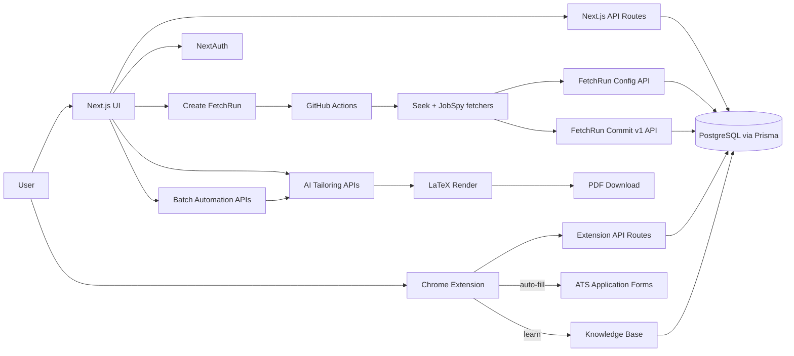

<div align="center">

# Joblit

**An end-to-end job-search workstation.** Fetch roles, triage them, tailor a custom resume and cover letter for each JD, auto-fill any ATS form, and export production-grade PDFs — without copy-paste.

[Live Demo](https://www.joblit.tech) · [Codex Batch Protocol](./AGENTS.md) · [Domain Context](./CONTEXT.md) · [Report a bug](https://github.com/ShousenZHANG/joblit/issues)


<!-- AUTO_METRICS_BADGES_START -->


<!-- Generated by: npm run readme:metrics -->
<!-- AUTO_METRICS_BADGES_END -->

</div>

---

## Codex & GPT-5.6

Joblit uses both as **product infrastructure**, not just as build-time assistants.

### GPT-5.6 runs the tailoring, on the user's own machine

Every CV and cover letter is generated by **GPT-5.6 through a local Hermes
runtime** bound to `127.0.0.1`. A job description and a candidate's full work
history are among the most sensitive documents a person owns, so neither ever
leaves the machine. There is no server-side model call and no API key stored
server-side.

What the model is trusted with is deliberately narrow:

| Joblit asks GPT-5.6 for | Joblit computes itself |
|---|---|
| A per-requirement judgement: `MATCH` / `PARTIAL` / `GAP` / `UNKNOWN` | The fit score, from those judgements |
| Rewritten summary and bullet candidates | Which claims survive the evidence gate |
| A strict JSON payload against a published schema | The verdict, the hard-gate caps, the final document |

This split is the core design decision. Letting a prompt emit its own score
makes the number drift between models and between runs; aggregating
deterministically in `lib/server/ai/fitScoring.ts` means swapping the model
changes the judgements, never the scoring rule. A frozen golden set
(`test/fixtures/fitGolden/`) replays recorded model output through the real
aggregator so a prompt or model change that shifts verdicts fails CI at zero
cost.

The same separation powers the grounding gate. `lib/server/ai/evidenceLedger.ts`
traces every generated claim back to evidence in the candidate's real profile,
and **blocks the PDF from rendering** when a claim has none — the model
proposes, it never gets the last word on what carries the user's name.

### Codex drives the batch pipeline

Tailoring one application at a time is fine; tailoring forty is a job for an
agent. Codex runs Joblit's batch loop through a documented HTTP protocol
([AGENTS.md](./AGENTS.md)):

```
POST /api/application-batches            → create a batch from NEW-status jobs
POST /api/application-batches/:id/run-once → atomic: complete previous + claim next
GET  /api/application-batches/:id/summary  → progress
```

`run-once` is one call rather than separate claim and complete calls, and it is
idempotent for the same `taskId`. That matters because an agent loop dies —
rate limit, timeout, closed laptop. With two calls, a death between them leaves
a task claimed but never completed and the batch stalls. Folding both into one
transaction means a dead run resumes cleanly on the next call.

### How Codex was used to build Joblit

Codex worked as a development collaborator across three areas of the codebase.
Most of that work was refinement rather than greenfield — taking a system that
already ran and making it correct, faster, or harder to misuse.

**Hermes and the local GPT-5.6 integration.** Wiring a browser extension to a
loopback AI runtime has an awkward shape: the page may not hold the API key, the
service worker is the only component allowed to reach `127.0.0.1`, and a run can
outlive the popup that started it. Codex worked through the bridge protocol, the
run lifecycle, and the profile bootstrap that keeps a Joblit Hermes install
isolated from a user's existing profiles. This part is **still in active
development** — the local-AI path is shipping as Beta while the Hermes API
surface continues to firm up.

**The fetch pipeline.** Multi-source intake, the title-relevance filter in the
Python JobSpy worker, and the adapter registry in `lib/server/sources/`. The
filtering work was the fiddliest: a title filter that matches literal tokens
looks correct until an "AI Engineer" search silently drops every Machine
Learning Engineer, GenAI Engineer and MLOps Engineer because none of them
contain the string "ai". Getting recall right meant measuring against a real
title corpus rather than reasoning about regexes. The pipeline now persists a
versioned execution config and commits every adapter through one receipt-backed
transaction boundary, so retries and cancellation have deterministic results.

**Scoring and grounding.** The deterministic aggregator in
`lib/server/ai/fitScoring.ts`, the prescreen path, the evidence ledger in
`lib/server/ai/evidenceLedger.ts`, and the frozen golden set that pins verdicts
across model changes. This is where the model/scoring split described above was
worked out and hardened.

**Codex Session ID:** `019f497c-61d9-7363-a4d6-309eb78a7fdb`

## What is Joblit

Most job-search tools stop at listing or tracking. Joblit closes the loop:

| Stage | What Joblit does | How |
|---|---|---|
| **Discover** | Batch-fetch roles from many boards | LinkedIn via a JobSpy worker, aggregator feeds, company ATS boards, and CN sources — every source behind one hardened HTTPS gateway |
| **Triage** | Fast scan, filter, status-track | Two-pane workspace with search and JD rendering |
| **Tailor** | Generate targeted resume and cover letter | AI prompt engine with versioned rule templates |
| **Apply** | Auto-fill any ATS application form | Chrome extension with self-learning knowledge base |
| **Export** | Production-grade PDF output | LaTeX compile pipeline, EN + CN templates |

The product differentiator is the **Chrome extension**: every correction you make trains a personal knowledge base, so subsequent fills get faster and more accurate.

> Joblit is free and open to everyone. Sign in with Google or GitHub; no invitation, manual approval, subscription, or credit card is required.

## Table of Contents

- [Features](#features)
- [Codex & GPT-5.6](#codex--gpt-56)
- [Chrome Extension](#chrome-extension)
- [Architecture](#architecture)
- [Project Structure](#project-structure)
- [Quick Start](#quick-start)
- [Scripts](#scripts)
- [Environment Variables](#environment-variables)
- [Codex Batch Workflow](#codex-batch-workflow)
- [Testing](#testing)
- [Deployment](#deployment)
- [Troubleshooting](#troubleshooting)
- [Contributing](#contributing)
- [Security](#security)
- [Acknowledgments](#acknowledgments)
- [License](#license)

## Features

### Job Intake Pipeline

- `FetchRun` tasks with configurable role categories, markets, and filters
- **LinkedIn** runs through the JobSpy worker (`tools/fetcher/run_jobspy.py`) on GitHub Actions, and stops on any anti-bot challenge by design
- **Aggregator feeds and company ATS boards** (Greenhouse, Lever, Ashby, Workable) run in-process as adapters in `lib/server/sources/`, each pinned to its own host allowlist with redirects refused
- Strict `FetchRunConfig` v1 contracts for AU, CN, and GLOBAL, with legacy rows normalized only at the read boundary
- Receipt-backed, ordered batch commits that atomically persist Jobs and FetchRun progress; identical retries replay safely
- Import dedupe on `userId + jobUrl` and tombstone filtering for permanently dismissed URLs
- Title/description exclusion rules, work-type / classification filters, and an on-demand full-JD enrich for teaser-only Seek listings at tailoring time

### Jobs Workspace

- Two-pane review UI: fast scan on the left, full JD with markdown rendering on the right
- Search, filter, pagination, and status transitions (`NEW` / `APPLIED` / `REJECTED`)
- Batch operations and tombstone tracking on delete

### Resume Studio

- Multi-step master-resume editor: basics, summary, experience, projects, education, skills
- Bullet-level edits with markdown emphasis and live preview
- Per-locale profiles (`en-AU` / `zh-CN`) with localized LaTeX templates

### AI Tailoring Engine

- Versioned `PromptRuleTemplate` with skill-pack delivery
- Prompt generation for resume and cover-letter targets
- Strict schema validation, `promptMeta` consistency checks, evidence-grounded bullets
- Manual JSON import path: copy prompt to any external model, import the result back

### PDF Export

- LaTeX-based resume and cover-letter rendering with bilingual templates
- Optional persistent storage via Vercel Blob

### Batch Automation (Codex Workflow)

- Create `NEW`-scope batches from filtered jobs
- Atomic claim-and-complete loop via `POST /api/application-batches/:id/run-once`
- Progress tracking via batch summary API
- Full external orchestration protocol documented in [AGENTS.md](./AGENTS.md)

### Open Access & Fetch Worker

- **Self-service access** — anyone can sign in with Google or GitHub OAuth and start using Joblit immediately
- **No account gate** — there is no invitation, manual approval, subscription, or credit-card requirement
- **Run-bound worker access** — the AU JobSpy worker reads one run's config and submits `fetch-run-commit/v1` commands with `FETCH_RUN_SECRET`; the server derives the owning user and market from that run

### Discover Learning Feed

- Curated, ranked YouTube videos across Codex, Claude, RAG, agents, and harness engineering
- Official-order GitHub weekly/monthly trending repositories with an optional low-signal filter
- One authenticated daily Vercel Cron refresh during the `06:00 UTC` target hour; DB-backed fresh and last-known-good caches survive serverless cold starts
- GitHub refresh remains available when `YOUTUBE_API_KEY` is absent or exhausted; an empty/changed GitHub parse never overwrites known-good content

## Chrome Extension

Manifest V3 extension that auto-fills job application forms using your Joblit resume profile.

### ATS Adapters

Purpose-built field detection per ATS:

| ATS | Adapter | Coverage |
|---|---|---|
| Workday | `workday.ts` | Inputs, dropdowns, custom components |
| Greenhouse | `greenhouse.ts` | Standard application forms |
| Lever | `lever.ts` | Application and referral forms |
| iCIMS | `icims.ts` | Career portal forms |
| SuccessFactors | `successFactors.ts` | SAP-based application flows |
| Generic | `generic.ts` | Fallback for unknown ATS platforms |

### Self-Learning Knowledge Base

Each application teaches the extension:

1. **Fill** — auto-fill detected fields from your resume profile
2. **Review** — floating widget shows what was filled; edit any value inline
3. **Learn** — each correction auto-saves as a mapping rule (field selector → profile path)
4. **Recall** — next time the same field appears, the knowledge base supplies the corrected value

Rule matching priority: user rules → exact form signature → same ATS + domain → same ATS cross-domain.
Rules are scoped at three levels (global / ATS-level / site-specific) and managed from the web dashboard.

### Technical Notes

- **Shadow DOM widget** — vanilla JS, no framework dependency in content script (~39 KB)
- **React-compatible input simulation** — dispatches native events to work with React, Angular, and Vue controlled inputs
- **Form signature** — djb2 hash of field structure for cross-session form matching
- **Offline queue** — submissions queue locally and sync when back online
- **Bilingual UI** — English and Chinese via lightweight i18n

### Local AI with stock Hermes (Beta)

Joblit can generate a grounded CV or cover letter through the official Hermes client on the user's own computer. The website sends only a job ID and target to the extension; the extension fetches the canonical Joblit prompt, calls the loopback Hermes Runs API, and returns a strict JSON result to the existing DRAFT editor.

- Uses an unmodified Hermes installation and the user's own `openai-codex` / ChatGPT OAuth session
- Binds only to `127.0.0.1`; Joblit and Hermes API keys never enter page JavaScript
- Disables Hermes memory, MCP, and executable toolsets for the Joblit profile
- Keeps a verified persistent local distribution source so official profile updates remain repeatable
- Reuses an existing `openai-codex` login and opens OAuth only when Hermes reports logged out
- Preserves the existing manual Skill/copy/paste method as fallback

Windows setup is user-launched and isolated from existing Hermes profiles:

```powershell
pwsh -File tools/hermes/bootstrap/Install-JoblitHermes.ps1 `
  -PackagePath <verified-package.zip> `
  -ProfileName joblit-<opaque-account-hash> `
  -ExpectedArchiveSha256 <published-sha256>
```

After bootstrap succeeds, paste the one-time local API key into **Extension settings → Local AI Beta**. Production profile releases require a trusted Ed25519 signature; the current empty key registry intentionally fails closed until a real release key is provisioned.

## Architecture


```mermaid
flowchart LR
  U[User] --> FE[Next.js UI]
  U --> EXT[Chrome Extension]

  FE --> API[Next.js API Routes]
  API --> DB[(PostgreSQL via Prisma)]
  FE --> AUTH[NextAuth]

  EXT --> EXTAPI[Extension API Routes]
  EXTAPI --> DB
  EXT -->|auto-fill| ATS[ATS Application Forms]
  EXT -->|learn| KB[Knowledge Base]
  KB --> DB

  FE --> FR[Create FetchRun]
  FR --> GH[GitHub Actions]
  GH --> PY[Seek + JobSpy fetchers]
  PY --> CFG[FetchRun Config API]
  PY --> COMMIT[FetchRun Commit v1 API]
  CFG --> DB
  COMMIT --> DB

  FE --> AIPATH[AI Tailoring APIs]
  AIPATH --> PDF[LaTeX Render]
  PDF --> DL[PDF Download]

  FE --> BATCH[Batch Automation APIs]
  BATCH --> AIPATH
```

Domain vocabulary lives in [`CONTEXT.md`](./CONTEXT.md), while durable architecture decisions live in [`docs/adr/`](./docs/adr/).

## Project Structure

```
app/
  (marketing)/        Landing, privacy, terms, get-extension
  (auth)/             Login
  (app)/              Protected workspace
    fetch/            Job intake pipeline
    jobs/             Jobs triage workspace
    resume/           Resume studio + prompt rules
    discover/         Curated learning videos
    extension/        Token + knowledge-base dashboard
  api/                Backend routes
    ext/              Extension-specific APIs
    fetch-runs/[id]/  Run config and receipt-backed worker commit routes
chrome-extension/
  src/
    background/       Service worker, auth, API client, sync queue
    content/          Content script, form detection, filling, widget
      detector/       Field classifier, ATS adapters, form signature
      filler/         Input simulator, form filler
      widget/         Shadow DOM floating widget
      recorder/       Submission recorder
    popup/            Extension popup UI (React)
    shared/           Constants, i18n, types, field taxonomy
lib/
  api/                Client-side fetch helper
  server/             Domain services (AI, PDF, prompts, persistence, observability)
  shared/             Zod schemas, market/locale seam, shared config
prisma/               Schema + migrations
tools/                Fetcher integration (Seek + JobSpy), readme metrics, CI policy checks
test/                 API + server test suites
```

## Quick Start

### Prerequisites

- Node.js **>= 20.10**
- npm **>= 10**
- PostgreSQL database (Neon recommended; any Postgres 14+ works)
- Optional: Gemini API key, Vercel Blob token, Chrome 120+ for the extension

### Setup

```bash
# 1. Clone and install
git clone https://github.com/ShousenZHANG/joblit.git
cd joblit
npm install

# 2. Configure environment
cp .env.example .env
# Edit .env: fill DATABASE_URL, AUTH_SECRET, OAuth credentials, etc.

# 3. Initialize database
npx prisma migrate deploy
npx prisma generate

# 4. Run dev server
npm run dev
```

Open [http://localhost:3000](http://localhost:3000).

### Chrome Extension (optional)

```bash
cd chrome-extension
npm install
npm run dev        # HMR for active development
npm run build      # Production build → chrome-extension/dist
```

Load `chrome-extension/dist` as an unpacked extension at `chrome://extensions`.

## Scripts

| Command | Description |
|---|---|
| `npm run dev` | Start Next.js dev server |
| `npm run build` | Production build |
| `npm run db:migrate:deploy` | Apply committed migrations in a deployment environment |
| `npm test` | Run all tests once (Vitest) |
| `npm run test:watch` | Tests in watch mode |
| `npm run lint` | ESLint |
| `npm run readme:metrics` | Refresh auto-metrics badges in this README |
| `npm run deps:policy` | Check repository dependency policy |
| `npm run deps:audit` | npm audit (production deps, high severity) |
| `npm run hermes:profile:test` | Validate the minimal stock-Hermes Joblit profile |
| `npm run hermes:package:test` | Test deterministic packaging and Ed25519 verification |
| `npm run hermes:package:build -- --staging <dir> --source-commit <sha>` | Build a deterministic profile package |
| `npm run hermes:package:verify -- --root <dir> --mode <integrity\|digest\|production>` | Verify profile package trust and content |
| `npx prisma migrate dev` | Apply database migrations in development |
| `npx prisma studio` | Database GUI |

Run a single test file:

```bash
npx vitest run path/to/file.test.ts
```

## Environment Variables

A complete template lives in [`.env.example`](./.env.example).

### Required

| Variable | Purpose |
|---|---|
| `DATABASE_URL` | PostgreSQL connection string (Neon serverless adapter) |
| `AUTH_SECRET` | NextAuth session signing secret |
| `GOOGLE_CLIENT_ID` / `GOOGLE_CLIENT_SECRET` | Google OAuth |
| `GITHUB_ID` / `GITHUB_SECRET` | GitHub OAuth |
| `FETCH_RUN_SECRET` | Auth for AU worker config reads and FetchRun v1 commits |
| `APP_ENC_KEY` | Extension token encryption key (base64) |
| `LATEX_RENDER_URL` / `LATEX_RENDER_TOKEN` | External LaTeX render service |

### Optional

| Variable | Purpose |
|---|---|
| `SEEK_FETCH_ENABLED` | Kill-switch for **server-side** Seek fetching (`1` / `true` to enable). **Off by default** — Seek is unreachable from datacenter / CI IPs (Cloudflare blocks every endpoint); the supported path is the browser extension. See [ADR-0003](docs/adr/0003-seek-fetch-via-browser-extension.md). |
| `GEMINI_API_KEY` / `GEMINI_MODEL` | AI provider |
| `BLOB_READ_WRITE_TOKEN` | Vercel Blob storage |
| `GITHUB_OWNER` / `GITHUB_REPO` / `GITHUB_TOKEN` / `GITHUB_WORKFLOW_FILE` | Fetch workflow dispatch |
| `JOBLIT_WEB_URL` | Public URL for the extension callback |
| `YOUTUBE_API_KEY` | Discover-page video pipeline |
| `CRON_SECRET` | Bearer secret for the daily Discover-only refresh route |
| `RSSHUB_URL` / `RSSHUB_JOB_ROUTES` / `GITHUB_CN_JOB_REPOS` | China job sources |
| `SENTRY_DSN` | Error reporting (when SDK is installed) |

## Codex Batch Workflow

External orchestration protocol for AI-assisted batch tailoring is documented in [AGENTS.md](./AGENTS.md). Summary:

1. Fetch jobs and keep target roles as `NEW`.
2. `POST /api/application-batches` with scope `NEW`.
3. Loop `POST /api/application-batches/:id/run-once` (atomic claim + complete).
4. For each task: generate prompt, run external model, import result.
5. Track progress with `GET /api/application-batches/:id/summary`.

## Testing

- **1,700+ tests** across the web suites (Vitest) plus a Python suite for the fetcher, green on every push
- Test files live alongside sources (`*.test.ts` / `*.test.tsx`) or in `test/`
- `test/api/` covers API routes, `test/server/` covers domain modules
- 80%+ coverage target for new code
- E2E with Playwright for critical user flows (planned; see [`docs/plans/`](./docs/plans))

CI runs lint, dependency policy, full test suite, and (per-PR) Lighthouse against the Vercel preview URL with the budget defined in [`.lighthouserc.json`](./.lighthouserc.json).

## Deployment

- **Recommended:** Vercel + Neon (PostgreSQL)
- Configure all environment variables in the deployment platform
- Chrome extension is distributed as a `.zip` for sideloading or via the Chrome Web Store
- Vercel Production builds run `prisma migrate deploy` before `next build` and
  fail closed if migration fails. Preview, Development, custom-environment, and
  local builds never run production migrations.
- Vercel invokes `/api/discover/refresh-daily` once per day during the
  `06:00 UTC` target hour.
  Configure `CRON_SECRET` and, for videos, `YOUTUBE_API_KEY`. This schedule
  refreshes only Discover videos and GitHub repositories; job fetching remains
  explicitly user-triggered and has no Cron schedule.

### FetchRun v1 / JobSpy drain and cutover

ADR-0008 removes the legacy worker write routes, so an old JobSpy process must
not overlap the v1 server. Run this sequence for every existing environment.
The examples require authenticated `gh`, `psql`, `curl`, and `jq`.

1. Disable new JobSpy dispatches:

   ```bash
   export JOBLIT_GITHUB_REPO="ShousenZHANG/joblit"
   export JOBSPY_WORKFLOW="jobspy-fetch.yml"

   gh workflow disable "$JOBSPY_WORKFLOW" --repo "$JOBLIT_GITHUB_REPO"
   ```

2. Let every already-queued or running old workflow finish against the old
   server, then wait for both counts to reach zero. Do not cancel a healthy
   workflow during the drain: external cancellation cannot project its
   FetchRun terminal state.

   ```bash
   while :; do
     queued="$(gh run list --repo "$JOBLIT_GITHUB_REPO" --workflow "$JOBSPY_WORKFLOW" --status queued --limit 100 --json databaseId --jq 'length')"
     running="$(gh run list --repo "$JOBLIT_GITHUB_REPO" --workflow "$JOBSPY_WORKFLOW" --status in_progress --limit 100 --json databaseId --jq 'length')"
     echo "JobSpy queued=$queued in_progress=$running"
     [ "$queued" -eq 0 ] && [ "$running" -eq 0 ] && break
     sleep 10
   done
   ```

   If a workflow is genuinely stuck, cancel its FetchRun through the signed-in
   product flow first, then cancel the Action. For an abandoned process that
   cannot be cancelled normally, wait for the 30-minute stale threshold and
   invoke the authenticated `/api/fetch-runs/cleanup-stuck` operations route
   before continuing.

3. Require zero active AU rows in Postgres. This is the database-side drain
   criterion, including a QUEUED row whose workflow has not started:

   ```bash
   psql "$DATABASE_URL" -v ON_ERROR_STOP=1 <<'SQL'
   SELECT id, status, "updatedAt"
   FROM "FetchRun"
   WHERE market = 'AU'
     AND status IN ('QUEUED', 'RUNNING')
   ORDER BY "updatedAt";
   SQL
   ```

   Proceed only when the query returns no rows. Resolve each remaining run
   through the normal cancel flow; do not manufacture terminal state with a
   direct SQL update.

4. Deploy the migration, server, and updated workflow from the same source
   revision. Vercel Production does this through its migration-first build; for
   another platform run:

   ```bash
   npm ci
   npm run db:migrate:deploy
   npm run build
   # Deploy this exact build artifact before continuing.
   ```

   Confirm the expand migration, including the retained nullable compatibility
   column and receipt table:

   ```bash
   psql "$DATABASE_URL" -v ON_ERROR_STOP=1 <<'SQL'
   SELECT column_name, is_nullable
   FROM information_schema.columns
   WHERE table_name = 'FetchRun'
     AND column_name IN (
       'userEmail',
       'executionAttemptId',
       'executionLeaseExpiresAt'
     )
   ORDER BY column_name;

   SELECT to_regclass('"FetchRunCommitReceipt"') AS receipt_table;
   SQL
   ```

5. Keep the workflow disabled and smoke-test the v1 server boundary. Create an
   AU FetchRun in the signed-in UI but do not trigger it, then use its UUID:

   ```bash
   export JOBLIT_URL="https://www.joblit.tech"
   export CANARY_RUN_ID="<new-au-fetch-run-uuid>"
   export CANARY_ATTEMPT_ID="$(node -p 'require("node:crypto").randomUUID()')"
   # Set FETCH_RUN_SECRET in the shell without printing it.

   curl -fsS \
     -H "x-fetch-run-secret: $FETCH_RUN_SECRET" \
     "$JOBLIT_URL/api/fetch-runs/$CANARY_RUN_ID/config" |
     jq -e '.run.config.schemaVersion == 1 and .run.config.market == "AU"'

   curl -fsS -X POST \
     -H "content-type: application/json" \
     -H "x-fetch-run-secret: $FETCH_RUN_SECRET" \
     -d "{\"protocol\":\"fetch-run-commit/v1\",\"command\":\"start\",\"attemptId\":\"$CANARY_ATTEMPT_ID\"}" \
     "$JOBLIT_URL/api/fetch-runs/$CANARY_RUN_ID/commit" |
     jq -e '.ok == true and .status == "RUNNING"'

   curl -fsS -X POST \
     -H "content-type: application/json" \
     -H "x-fetch-run-secret: $FETCH_RUN_SECRET" \
     -d "{\"protocol\":\"fetch-run-commit/v1\",\"command\":\"commit\",\"attemptId\":\"$CANARY_ATTEMPT_ID\",\"batchKey\":\"cutover-canary\",\"batchIndex\":0,\"batchCount\":1,\"items\":[],\"terminal\":true,\"discoveredCount\":0}" \
     "$JOBLIT_URL/api/fetch-runs/$CANARY_RUN_ID/commit" |
     jq -e '.ok == true and .status == "SUCCEEDED" and .batchImported == 0'
   ```

6. Enable dispatch only after that smoke test passes:

   ```bash
   gh workflow enable "$JOBSPY_WORKFLOW" --repo "$JOBLIT_GITHUB_REPO"
   ```

7. Create and trigger one fresh AU run through the UI. Watch the newest Action
   to completion, then verify a terminal run and its terminal receipt:

   ```bash
   export JOBSPY_RUN_ID="$(
     gh run list \
       --repo "$JOBLIT_GITHUB_REPO" \
       --workflow "$JOBSPY_WORKFLOW" \
       --limit 1 \
       --json databaseId \
       --jq '.[0].databaseId'
   )"
   gh run watch "$JOBSPY_RUN_ID" --repo "$JOBLIT_GITHUB_REPO" --exit-status

   psql "$DATABASE_URL" -v ON_ERROR_STOP=1 <<'SQL'
   SELECT id, status, "executionAttemptId", "terminalAt"
   FROM "FetchRun"
   WHERE id = '<fresh-au-fetch-run-uuid>';

   SELECT "fetchRunId", count(*) AS receipts, bool_or(terminal) AS has_terminal
   FROM "FetchRunCommitReceipt"
   WHERE "fetchRunId" = '<fresh-au-fetch-run-uuid>'
   GROUP BY "fetchRunId";
   SQL
   ```

   The acceptance result is `SUCCEEDED`, a non-null `executionAttemptId`, and
   `has_terminal = true`. `PARTIAL` is a valid protocol result but requires
   investigation before declaring the cutover healthy. A zero-result success
   still has one terminal empty-batch receipt.

If cutover fails, disable the workflow again before investigating. An old
binary rollback is allowed only after the GitHub drain is again zero and this
query returns no active row that depends on the new nullable/v1 contract:

```bash
psql "$DATABASE_URL" -v ON_ERROR_STOP=1 <<'SQL'
SELECT id, status, "userEmail", "executionAttemptId",
       queries ->> 'schemaVersion' AS config_version
FROM "FetchRun"
WHERE market = 'AU'
  AND status IN ('QUEUED', 'RUNNING')
  AND (
    "userEmail" IS NULL
    OR "executionAttemptId" IS NOT NULL
    OR queries ->> 'schemaVersion' = '1'
  );
SQL
```

Do not drop `userEmail`, attempt columns, or the receipt table during a binary
rollback. Dropping `userEmail` is a later contract migration after the retained
rollback artifacts and all executable old-worker dependencies have expired.

### Existing-environment cutover

The migration that removes the obsolete access-request schema is destructive, so existing
environments must use a code-first drain sequence:

1. Deploy the current application code **without** running the drop migration.
2. Wait for every old application instance and serverless deployment version to drain.
3. Run `npx prisma migrate deploy` against the environment database.
4. Remove the obsolete `ADMIN_EMAILS` environment setting.

Fresh environments may run all migrations during initial provisioning because no older
application instance can still reference the removed schema.

## Troubleshooting

| Symptom | Fix |
|---|---|
| `GITHUB_DISPATCH_FAILED` | Verify `GITHUB_TOKEN` workflow permissions on the fetch repo |
| Low import volume | Increase fetch breadth or relax title/description excludes |
| `PROMPT_META_MISMATCH` | Re-download skill pack and re-copy the prompt |
| Extension fields not filling | Check token validity on the Extension page |
| `403 Forbidden` on Vercel preview | Disable Vercel deployment protection or use the custom domain |

## Contributing

Issues and pull requests are welcome. See [CONTRIBUTING.md](./CONTRIBUTING.md) for the development workflow, commit conventions, and review expectations. Architectural decisions are tracked in [`docs/adr/`](./docs/adr) once a decision needs to outlive the PR thread.

## Security

If you find a security vulnerability, please follow the responsible disclosure process documented in [SECURITY.md](./SECURITY.md). Do **not** open a public GitHub issue for security reports.

## Acknowledgments

Joblit is built on top of excellent open-source work:

- [JobSpy](https://github.com/Bunsly/JobSpy) — multi-board job scraping pipeline
- [Next.js](https://nextjs.org), [React](https://react.dev), [Prisma](https://prisma.io), [Tailwind CSS](https://tailwindcss.com)
- [Radix UI](https://www.radix-ui.com) primitives + the [shadcn/ui](https://ui.shadcn.com) layer
- [Framer Motion](https://www.framer.com/motion), [TanStack Query](https://tanstack.com/query), [Zod](https://zod.dev)
- [next-intl](https://next-intl.dev), [NextAuth](https://next-auth.js.org), [Lucide](https://lucide.dev)
- LaTeX render service is built on the [TeX Live](https://www.tug.org/texlive/) toolchain

## License

Apache License 2.0. See [LICENSE](./LICENSE) and [NOTICE](./NOTICE).
