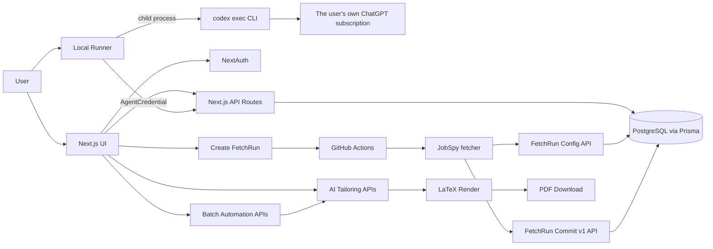

<div align="center">

# Joblit

**An end-to-end job-search workstation.** Fetch roles, triage them, tailor a custom resume and cover letter for each JD with a local Agent Runner, and export production-grade PDFs — without copy-paste.

[Live Demo](https://www.joblit.tech) · [Codex Batch Protocol](./AGENTS.md) · [Domain Context](./CONTEXT.md) · [Report a bug](https://github.com/ShousenZHANG/joblit/issues)


<!-- AUTO_METRICS_BADGES_START -->


<!-- Generated by: npm run readme:metrics -->
<!-- AUTO_METRICS_BADGES_END -->

</div>

---

## Codex & GPT-5.6

Joblit uses both as **product infrastructure**, not just as build-time assistants.

### GPT-5.6 runs the tailoring through the user's local Runner

The first-party Agent path generates CVs and cover letters through the official
Codex CLI running as a child process of the
[Joblit Runner](./tools/runner/) — a dependency-free Node process that speaks
the same public API any external agent uses. Joblit already stores the Job and
Master Resume Profile needed to build the prompt; the privacy boundary is the
model connection. Joblit never sees a model credential at all: `codex login`
holds the user's own ChatGPT subscription and the child process inherits it.
There is no server-side generation path and no server-held model key
(ADR-0015).

What the model is trusted with is deliberately narrow:

| Joblit asks GPT-5.6 for                           | Joblit computes itself                              |
| ------------------------------------------------- | --------------------------------------------------- |
| Rewritten summary and bullet candidates           | Which claims survive the evidence gate              |
| A strict JSON payload against a published schema  | The hard-gate caps and the final document           |

The evidence gate is the core design decision. `lib/server/ai/evidenceLedger.ts`
traces every generated claim back to evidence in the candidate's real profile,
and **blocks the PDF from rendering** when a claim has none — the model
proposes, it never gets the last word on what carries the user's name.

### Codex drives the batch pipeline

Tailoring one application at a time is fine; tailoring forty is a job for an
agent. Codex runs Joblit's batch loop through a documented HTTP protocol
([AGENTS.md](./AGENTS.md)):

```
POST /api/application-batches/enqueue      → add chosen jobs to the tailoring queue
POST /api/application-batches/:id/run-once → report failure/skip + claim next
POST /api/applications/prompt              → issue the task-bound Tailoring Run
POST /api/applications/manual-generate     → accept one target with its run handle
GET  /api/application-batches/:id/summary  → progress (interactive session)
```

New Runners advertise protocol `[2, 1]`; an older caller that advertises
nothing stays on protocol v1. Protocol v2 first persists each generated target
as an editable DRAFT, then publishes its PDF independently. A task is complete
only when every required target has both an immutable acceptance receipt and an
immutable publication receipt. After a stale reclaim, the claim reports
`remainingTargets` and `remainingPublicationTargets`, so an uncertain Cover
publication retries without another Codex run. Existing bound v1 tasks remain
FINAL/v1 for their lifetime. See
[ADR-0020](./docs/adr/0020-durable-two-stage-tailoring-publication.md).

### How Codex was used to build Joblit

Codex worked as a development collaborator across the codebase. Most of that
work was refinement rather than greenfield — taking a system that already ran
and making it correct, faster, or harder to misuse.

**The local GPT-5.6 integration.** This began as a browser extension driving a
loopback runtime through a service worker and a `postMessage` bridge — five
hops to reach a server on `127.0.0.1`, each with its own failure mode, and work
that died when the tab closed. Codex worked through that bridge protocol and
the run lifecycle, and the experience is what motivated replacing it: the
extension was retired for a local Runner
([ADR-0014](./docs/adr/0014-retire-the-browser-extension-for-a-local-runner.md)),
which is headless, survives a closed tab, and authenticates like any other
agent.

**The fetch pipeline.** Australian role intake and the title-relevance filter
in the Python JobSpy worker. The filtering work was the fiddliest: a title
filter that matches literal tokens looks correct until an "AI Engineer" search
silently drops every Machine Learning Engineer, GenAI Engineer and MLOps
Engineer because none of them contain the string "ai". Getting recall right
meant measuring against a real title corpus rather than reasoning about
regexes. The pipeline now persists a versioned execution config and commits
every worker batch through one receipt-backed transaction boundary, so retries
and cancellation have deterministic results.

**Grounding.** The evidence ledger in `lib/server/ai/evidenceLedger.ts` and the
model/verification split described above were worked out and hardened here:
the model drafts, deterministic server code decides what ships.

**Codex Session ID:** `019f497c-61d9-7363-a4d6-309eb78a7fdb`

## What is Joblit

Most job-search tools stop at listing or tracking. Joblit closes the loop:

| Stage        | What Joblit does                          | How                                                                                                    |
| ------------ | ----------------------------------------- | ------------------------------------------------------------------------------------------------------ |
| **Fetch**    | Batch-fetch Australian roles              | LinkedIn through the AU JobSpy worker; every batch crosses the receipt-backed FetchRun commit boundary |
| **Triage**   | Fast scan, filter, status-track           | Two-pane workspace with search, JD rendering, and deterministic JD requirements analysis               |
| **Tailor**   | Generate targeted resume and cover letter | AI prompt engine with versioned rule templates                                                         |
| **Apply**    | Review generated materials, then apply    | Drafts land for your approval; nothing is submitted without you                                        |
| **Export**   | Production-grade PDF output               | LaTeX compile pipeline, EN + CN templates                                                              |

The product differentiator is **where the AI can run**: tailoring flows through
your own local Runner and your own Codex CLI login, while Joblit stores the
deterministic workflow and never sees your model key.

> Joblit is free and open to everyone. Sign in with Google or GitHub; no invitation, manual approval, subscription, or credit card is required.

## Table of Contents

- [Codex & GPT-5.6](#codex--gpt-56)
- [Features](#features)
- [Local Runner](#local-runner)
- [Architecture](#architecture)
- [Project Structure](#project-structure)
- [Quick Start](#quick-start)
- [Scripts](#scripts)
- [Environment Variables](#environment-variables)
- [Codex Batch Workflow](#codex-batch-workflow)
- [Testing](#testing)
- [Deployment](#deployment)
- [Troubleshooting](#troubleshooting)
- [Contributing](#contributing)
- [Security](#security)
- [Acknowledgments](#acknowledgments)
- [License](#license)

## Features

### Job Intake Pipeline

- AU-only `FetchRun` tasks with configurable role categories, location, and freshness
- **LinkedIn** runs through the JobSpy worker (`tools/fetcher/run_jobspy.py`) on GitHub Actions, and stops on any anti-bot challenge by design
- Strict AU `FetchRunConfig` v2 writes with an AU v1 compatibility reader for historical runs
- Receipt-backed, ordered batch commits that atomically persist Jobs and FetchRun progress; identical retries replay safely
- Import dedupe on `userId + jobUrl` and tombstone filtering for permanently dismissed URLs
- Server-owned, recall-safe title and eligibility exclusions that keep ambiguous roles
- CN Jobs, Resume, Chinese LaTeX, and translated UI remain; CN Fetch/Nowcoder and GLOBAL feed/ATS/source-health execution are retired (ADR-0017)

### Jobs Workspace

- Two-pane review UI: fast scan on the left, full JD with markdown rendering on the right
- **Deterministic JD requirements analysis**: hard asks in the ad — years of experience, clearances, work rights, named technologies — extracted as evidence-backed chips that jump to the exact sentence in the JD. No model in the loop, so the same ad always reads the same way
- Search, filter, pagination, and status transitions (`NEW` / `APPLIED` / `REJECTED`)
- Batch operations and tombstone tracking on delete

### Resume Studio

- Multi-step master-resume editor: basics, summary, experience, projects, education, skills
- Bullet-level edits with markdown emphasis and live preview
- Per-locale profiles (`en-AU` / `zh-CN`) with localized LaTeX templates

### AI Tailoring Engine

- Versioned `PromptRuleTemplate` with skill-pack delivery
- Prompt generation for resume and cover-letter targets
- Strict schema validation, `promptMeta` consistency checks, evidence-grounded bullets
- Delta-only output: tailoring adds a fresh summary and up to three new bullets; it never rewrites what you wrote
- Manual JSON import path: copy prompt to any external model, import the result back

### PDF Export

- LaTeX-based resume and cover-letter rendering with bilingual templates
- FINAL artifacts persist through Vercel Blob outside tests; DRAFT edits do not upload

### Batch Automation (Codex Workflow)

- Queue any `NEW` job for tailoring from its own AI Generate button
- Atomic claim-and-complete loop via `POST /api/application-batches/:id/run-once`
- Progress tracking via batch summary API
- Full external orchestration protocol documented in [AGENTS.md](./AGENTS.md)

### Open Access & Fetch Worker

- **Self-service access** — anyone can sign in with Google or GitHub OAuth and start using Joblit immediately
- **Run-bound worker access** — the AU JobSpy worker reads one run's config and submits `fetch-run-commit/v1` commands with `FETCH_RUN_SECRET`; the server derives the owning user and market from that run

### GitHub Trending

- Official-order GitHub weekly/monthly trending repositories, reached from the flame icon in the app nav
- A DB-backed last-known-good cache survives serverless cold starts; an empty or changed parse never overwrites known-good content

## Local Runner

`tools/runner/` is a dependency-free Node process that generates your materials
on your own machine. It replaces the Chrome extension
([ADR-0014](./docs/adr/0014-retire-the-browser-extension-for-a-local-runner.md)).

### What it does

Each cycle it drains the active tailoring batch, then sleeps. It claims a task,
generates each `remainingTarget` by running `codex exec`, and first persists the
result as an editable DRAFT with the exact issued receipt. It then publishes
each `remainingPublicationTarget` as a PDF. A recovered publication-only task
never calls Codex again. Success is implicit; only failures and skips are
reported back.

The Runner keeps no model output on disk (ADR-0018). An unknown import replays
the byte-identical receipt. Once DRAFT persistence succeeds, publication
recovery is server-owned and reuses the Application and content hashes, so a
dropped PDF response never re-runs the model or creates duplicates (ADR-0020).

Generated materials and their PDFs land in Joblit for review. The Runner never
submits an application.

### Why it is not in the browser

The extension reached the local model through a service worker, a content
script, a `postMessage` bridge, a wire contract and a run registry. The Runner
makes one HTTPS call to Joblit and runs one local child process. It is
headless, so work no longer dies when you close a tab.

### Security

- **The Runner holds no model credential.** There is nothing to leak: `codex
  login` stores the user's own subscription auth and the Codex child process
  inherits it. The Runner's only secret is the Joblit agent token.
- **The model is pinned to a text generator.** Every invocation passes
  `--sandbox read-only`, `features.shell_tool=false`, `web_search=disabled`,
  `--ignore-user-config`, `--ignore-rules`, `--ephemeral`, and a throwaway
  working directory. Job descriptions are untrusted text from the internet and
  they go straight into the prompt.
- **Agent credentials are versioned, scoped, revocable, and stored hashed.**
  A presented credential is never rescued by a session cookie, so revoking one
  stops the Runner immediately. Runner credentials use the `jfagent_v1_`
  prefix, the `joblit-agent` audience, and explicit capabilities.
- **The Runner imports no repository code.** The HTTP API is its only contract,
  the same one documented in [AGENTS.md](./AGENTS.md) for external agents.

### Protocol

`withAgentRoute` accepts either a Bearer `AgentCredential` or a browser session
and produces the same identity, so the batch protocol and the tailoring
endpoints serve humans and agents through one seam. Credentials are minted
through the session-only `/api/agent-tokens` route, reached from the Runner
setup popover in the app nav; that endpoint refuses Bearer auth, because
minting a credential from a credential would let a leaked credential outlive
its revocation.

## Architecture


```mermaid
flowchart LR
  U[User] --> FE[Next.js UI]
  U --> RUN[Local Runner]

  FE --> API[Next.js API Routes]
  API --> DB[(PostgreSQL via Prisma)]
  FE --> AUTH[NextAuth]

  RUN -->|AgentCredential| API
  RUN -->|child process| CODEX[codex exec CLI]
  CODEX --> GPT[The user's own ChatGPT subscription]

  FE --> FR[Create FetchRun]
  FR --> GH[GitHub Actions]
  GH --> PY[JobSpy fetcher]
  PY --> CFG[FetchRun Config API]
  PY --> COMMIT[FetchRun Commit v1 API]
  CFG --> DB
  COMMIT --> DB

  FE --> AIPATH[AI Tailoring APIs]
  AIPATH --> PDF[LaTeX Render]
  PDF --> DL[PDF Download]

  FE --> BATCH[Batch Automation APIs]
  BATCH --> AIPATH
```

Domain vocabulary lives in [`CONTEXT.md`](./CONTEXT.md), while durable architecture decisions live in [`docs/adr/`](./docs/adr/).

## Project Structure

```
app/
  (marketing)/        Landing, privacy, terms
  (auth)/             Login
  (app)/              Protected workspace
    fetch/            Job intake pipeline
    jobs/             Jobs triage workspace
    resume/           Resume studio + prompt rules
    career/           Redirect to /jobs (ADR-0006)
  api/                Backend routes
    agent-tokens/     Issue and revoke AgentCredential records (session-only)
    fetch-runs/[id]/  Run config and receipt-backed worker commit routes
lib/
  api/                Client-side fetch helper
  server/             Domain services (AI, PDF, prompts, persistence, observability)
  shared/             Zod schemas, market/locale seam, shared config
prisma/               Schema + migrations
tools/
  runner/             The local Runner — tailoring batch drain
  fetcher/            Python JobSpy worker
  ci/, deploy/        Policy gates and deployment guards
test/                 API + server test suites
```

## Quick Start

### Prerequisites

- Node.js **>= 20.10**
- npm **>= 10**
- PostgreSQL database (Neon recommended; any Postgres 14+ works)
- Vercel Blob token for FINAL export and artifact reconciliation
- Optional: the official Codex CLI, signed in, for the local Runner

### Setup

```bash
# 1. Clone and install
git clone https://github.com/ShousenZHANG/joblit.git
cd joblit
npm install

# 2. Configure environment
cp .env.example .env
# Edit .env: fill DATABASE_URL, AUTH_SECRET, OAuth credentials, etc.

# 3. Initialize database
npx prisma migrate deploy
npx prisma generate

# 4. Run dev server
npm run dev
```

Open [http://localhost:3000](http://localhost:3000).

### Local Runner (optional)

Generate CVs and cover letters on your own machine. Install and sign in to the
Codex CLI, then issue an `AgentCredential` from the Runner setup popover in the
app nav:

```bash
npm i -g @openai/codex
codex login
```

The popover hands you the whole start command as one line:

```bash
JOBLIT_URL="http://localhost:3000" JOBLIT_TOKEN="jfagent_v1_..." node tools/runner/cli.mjs --watch
```

Full setup in [tools/runner/README.md](./tools/runner/README.md).

## Scripts

| Command                                                                                | Description                                            |
| -------------------------------------------------------------------------------------- | ------------------------------------------------------ |
| `npm run dev`                                                                          | Start Next.js dev server                               |
| `npm run build`                                                                        | Production build                                       |
| `npm run db:migrate:deploy`                                                            | Apply committed migrations in a deployment environment |
| `npm test`                                                                             | Run all tests once (Vitest)                            |
| `npm run test:watch`                                                                   | Tests in watch mode                                    |
| `npm run lint`                                                                         | ESLint                                                 |
| `npm run readme:metrics`                                                               | Refresh auto-metrics badges in this README             |
| `npm run deps:policy`                                                                  | Check repository dependency policy                     |
| `npm run deps:audit`                                                                   | npm audit (production deps, high severity)             |
| `npx prisma migrate dev`                                                               | Apply database migrations in development               |
| `npx prisma studio`                                                                    | Database GUI                                           |

Run a single test file:

```bash
npx vitest run path/to/file.test.ts
```

## Environment Variables

A complete template lives in [`.env.example`](./.env.example).

### Required

| Variable                                    | Purpose                                                         |
| ------------------------------------------- | --------------------------------------------------------------- |
| `DATABASE_URL`                              | Pooled PostgreSQL connection used by the running serverless app |
| `AUTH_SECRET`                               | NextAuth session signing secret                                 |
| `GOOGLE_CLIENT_ID` / `GOOGLE_CLIENT_SECRET` | Google OAuth                                                    |
| `GITHUB_ID` / `GITHUB_SECRET`               | GitHub OAuth                                                    |
| `FETCH_RUN_SECRET`                          | Auth for AU worker config reads and FetchRun v1 commits         |
| `LATEX_RENDER_URL` / `LATEX_RENDER_TOKEN`   | External LaTeX render service                                   |

### Optional

| Variable                                                                                | Purpose                                                                                                                                                                                                                          |
| --------------------------------------------------------------------------------------- | -------------------------------------------------------------------------------------------------------------------------------------------------------------------------------------------------------------------------------- |
| `DIRECT_URL` / `DATABASE_URL_UNPOOLED` / `POSTGRES_URL_NON_POOLING`                     | Optional explicit unpooled PostgreSQL endpoint for Prisma migrations, resolved in that order. If only a standard Neon `-pooler` URL exists, Joblit derives its documented direct host; other pooled providers must configure one |
| `BLOB_READ_WRITE_TOKEN`                                                                 | Enables FINAL PDF/photo persistence and artifact reconciliation; DRAFT edits do not require Blob                                                                                                                                 |
| `GITHUB_OWNER` / `GITHUB_REPO` / `GITHUB_TOKEN` / `GITHUB_WORKFLOW_FILE` / `GITHUB_REF` | Fetch workflow dispatch; owner, repository, and token are required together                                                                                                                                                      |
| `JOBLIT_WEB_URL`                                                                        | Public URL of this deployment                                                                                                                                                                                                    |
| `CRON_SECRET`                                                                           | Bearer secret Vercel attaches to the scheduled artifact-reconciliation call                                                                                                                                            |
| `ARTIFACT_RECONCILE_SECRET`                                                             | Optional additional bearer for manual artifact-reconciliation calls; it does not replace `CRON_SECRET` for Vercel Cron                                                                                                           |
| `ARTIFACT_RECONCILE_ENABLED`                                                            | Default-off kill switch; only `true` / `1` permits Application artifact inventory, claim, and deletion                                                                                                                           |
| `LATEX_RENDER_ALLOW_INSECURE_HTTP`                                                      | Explicit `true` opt-in for a self-hosted HTTP renderer; HTTPS remains the safe default                                                                                                                                           |
| `SENTRY_DSN`                                                                            | Error reporting (when SDK is installed)                                                                                                                                                                                          |

## Codex Batch Workflow

The full external orchestration protocol is documented in
[AGENTS.md](./AGENTS.md), which is the canonical contract. In short:

1. Fetch jobs and keep target roles as `NEW`, then `POST /api/application-batches/enqueue` with the `jobIds` you want. It appends to the live batch rather than refusing while one drains.
2. Claim through `run-once`, advertise supported protocols, and retain the task's exact attempt, issue, target, and publication progress.
3. For protocol v2, request prompts only for `remainingTargets`, persist each through `manual-generate?finalize=false`, then finalize only `remainingPublicationTargets` with the returned Application identity and the exact run fence.
4. A task succeeds only after both current PDFs have publication receipts. Report only `FAILED` or `SKIPPED`; success needs no callback.

## Testing

- Vitest web suites plus a Python suite for the fetcher, green on every push
- Test files live alongside sources (`*.test.ts` / `*.test.tsx`) or in `test/`
- `test/api/` covers API routes, `test/server/` covers domain modules
- 80%+ coverage target for new code
- E2E with Playwright for critical user flows (planned; see [`docs/plans/`](./docs/plans))

CI runs lint, dependency policy, full test suite, and (per-PR) Lighthouse against the Vercel preview URL with the budget defined in [`.lighthouserc.json`](./.lighthouserc.json).

## Deployment

- **Recommended:** Vercel + Neon (PostgreSQL)
- Configure all environment variables in the deployment platform
- Vercel Production builds run `prisma migrate deploy` before `next build` and
  fail closed if migration fails. Preview, Development, custom-environment, and
  local builds never run production migrations.
- Production migrations require an unpooled connection. Resolution order is
  `DIRECT_URL`, `DATABASE_URL_UNPOOLED`, `POSTGRES_URL_NON_POOLING`, then a
  verified direct-host derivation for standard Neon `-pooler` URLs. The build
  refuses any other pooled fallback because Prisma's session-scoped migration
  lock cannot survive a transaction pooler.
  `DATABASE_URL` should remain pooled for the running serverless application.
- Vercel invokes `/api/artifacts/reconcile` at `07:00 UTC`, but the route has no
  inventory, claim, or delete side effect until
  `ARTIFACT_RECONCILE_ENABLED=true` (or `1`). When enabling it, also
  configure `BLOB_READ_WRITE_TOKEN` and `CRON_SECRET`;
  `ARTIFACT_RECONCILE_SECRET` is an optional additional operator credential.
- Job fetching remains explicitly user-triggered and has no Cron schedule.

## Troubleshooting

| Symptom                           | Fix                                                                                                      |
| --------------------------------- | -------------------------------------------------------------------------------------------------------- |
| `GITHUB_DISPATCH_FAILED`          | Verify `GITHUB_TOKEN` workflow permissions on the fetch repo                                             |
| Low import volume                 | Increase fetch breadth or relax title/description excludes                                               |
| `PROMPT_META_MISMATCH`            | Re-download skill pack and re-copy the prompt                                                            |
| Runner not picking up work        | Regenerate the credential in the Runner setup popover, and confirm `codex login` is still signed in                |
| `403 Forbidden` on Vercel preview | Disable Vercel deployment protection or use the custom domain                                            |

## Contributing

Issues and pull requests are welcome. See [CONTRIBUTING.md](./CONTRIBUTING.md) for the development workflow, commit conventions, and review expectations. Architectural decisions are tracked in [`docs/adr/`](./docs/adr) once a decision needs to outlive the PR thread.

## Security

If you find a security vulnerability, please follow the responsible disclosure process documented in [SECURITY.md](./SECURITY.md). Do **not** open a public GitHub issue for security reports.

## Acknowledgments

Joblit is built on top of excellent open-source work:

- [JobSpy](https://github.com/Bunsly/JobSpy) — multi-board job scraping pipeline
- [Next.js](https://nextjs.org), [React](https://react.dev), [Prisma](https://prisma.io), [Tailwind CSS](https://tailwindcss.com)
- [Radix UI](https://www.radix-ui.com) primitives + the [shadcn/ui](https://ui.shadcn.com) layer
- [Framer Motion](https://www.framer.com/motion), [TanStack Query](https://tanstack.com/query), [Zod](https://zod.dev)
- [next-intl](https://next-intl.dev), [NextAuth](https://next-auth.js.org), [Lucide](https://lucide.dev)
- LaTeX render service is built on the [TeX Live](https://www.tug.org/texlive/) toolchain

## License

Apache License 2.0. See [LICENSE](./LICENSE) and [NOTICE](./NOTICE).
