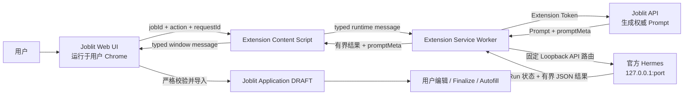

# Joblit × Hermes Local AI 整合需求与交付规范

> 文档状态：Consolidated / Active
>
> 最后更新：2026-07-17
>
> 适用范围：Joblit Web、Joblit Chrome Extension、官方 Hermes 本地客户端
>
> 首发能力：本地生成 Tailored CV 与 Cover Letter

## 1. 文档目的

本文档将此前关于 Joblit 整合 Hermes 的产品、架构、安全、交互、运行时、测试与上线要求收敛为唯一执行基线。

目标不是把 Hermes 代码合并进 Joblit，也不是让 Joblit 云端控制用户电脑；目标是让用户留在 Joblit 网页内，通过本机 Chrome Extension 安全调用本机官方 Hermes，并使用用户自己的 ChatGPT 授权完成 AI 功能。

后续实现、评审和验收应以本文档为主；更细的历史设计和实施计划保留在文末“参考文档”。

## 2. 已确认的核心决策

1. **只使用官方、未修改的 Hermes。** Joblit 不 Fork、不 Patch、不维护、不重新发布 Hermes Runtime 源码。
2. **每位用户使用自己的 ChatGPT 授权。** OAuth 和模型调用发生在用户本机 Hermes 内；Joblit 不接收 ChatGPT 密码、OAuth Token 或 Hermes API Key。
3. **用户始终留在 Joblit 操作。** 正常流程不要求切换到 ChatGPT，不要求复制 Prompt，不要求手动复制 Skills，也不要求粘贴 AI JSON。
4. **Chrome Extension 是唯一的本地桥梁。** Joblit 云端不能、也不应直接访问用户的 `localhost`。
5. **Joblit 是唯一业务事实源和策略引擎。** Hermes 负责理解、匹配、撰写与解释；Joblit 负责授权、数据、校验、确定性计分、保存、Finalize 和投递状态。
6. **AI 结果只能先进入 `DRAFT`。** AI 不得直接 Finalize，不得直接提交 Job Board 表单。
7. **首发禁用 Hermes 内置/外部记忆。** 用户确认过的偏好由 Joblit 管理并随每次请求注入；Hermes 自主长期记忆作为后续单独评审的可选能力。
8. **首发不新增云端 `AiTask` 数据表。** 使用浏览器会话态和 Hermes Run 状态完成短生命周期任务；确有跨设备、长任务或审计需求后再评估持久化任务表。

## 3. 产品目标

### 3.1 用户目标

- 用户可以使用已有的官方 Hermes 安装，不需要安装 Joblit 定制版 Hermes。
- 用户只需一次完成 Extension、Joblit Token、Hermes Profile 与 ChatGPT OAuth 设置。
- 设置完成后，用户可以在 Joblit 内一键生成 CV、Cover Letter、岗位匹配分析等 AI 结果。
- 用户能够看到清晰的连接状态、运行进度、失败原因和恢复动作。
- 用户始终能够检查、编辑和确认 AI 结果。
- 用户的个人资料、简历、岗位信息和 AI 内容不会被无必要地传给 Joblit 以外的第三方服务。

### 3.2 业务目标

- 支持公开上线后的自助接入，不依赖管理员逐个授权。
- 让用户使用自己的 ChatGPT 套餐和本机 Hermes，降低 Joblit 集中承担模型成本的压力。
- 复用 Joblit 已有的 Job、Master Resume、Application、编辑器、PDF 和 Extension Autofill 流程。
- 保留 Manual Skill Pack、Codex Batch 和可选 Provider API 作为兼容/恢复通道。

### 3.3 非目标

- 不让 Vercel、Joblit Server 或其他云服务直接访问用户 `127.0.0.1`。
- 不把 Extension 做成任意 URL、任意路径、任意方法的通用本地代理。
- 不让 Hermes 直接写数据库、改变 Application 状态或触发真实投递。
- 不让模型决定最终计分、权限、所有权、数据版本或持久化策略。
- 不依赖 Hermes 自动加载某个 Skill 才能保证输出正确。
- 不承诺“零本地留存”；Hermes、模型提供商和浏览器可能各自保留受其产品策略控制的状态。

## 4. 最终架构



### 4.1 “云端如何访问本机”的准确解释

云端不访问本机。Vercel 只向浏览器提供网页和 Joblit API。网页 JavaScript 在用户本机 Chrome 中执行，再通过已安装的 Extension 与 Extension Service Worker 通信。只有 Service Worker 使用 Chrome 的 Loopback Host Permission 请求 `http://127.0.0.1:<port>` 上的 Hermes。

因此必须分别验证三层状态：

1. **Extension Present**：网页能与 Content Script 建立协议握手。
2. **Hermes Reachable**：Extension Service Worker 能访问本机 Hermes。
3. **Local AI Ready**：Extension 已连接 Joblit，Hermes 鉴权、Profile、模型与安全能力全部通过校验。

Popup 显示 `Ready` 不能单独证明网页桥接可用。

## 5. 信任边界与职责

| 组件 | 可以做 | 不可以做 |
| --- | --- | --- |
| Joblit Web | 发起动作、展示状态、导入结果、编辑 DRAFT | 读取 Hermes Key、调用任意本地 API、直接 Finalize/提交 |
| Joblit API | 验证用户/Job 所有权、生成权威 Prompt、校验版本、保存 DRAFT | 访问用户 localhost、保存 ChatGPT/Hermes 凭据 |
| Extension Content Script | 校验页面来源、转发少量类型化消息 | 持有 Hermes Key、暴露通用代理、信任页面任意数据 |
| Extension Service Worker | 持有本地设置、请求固定 Joblit/Hermes 路由、编排 Run | 接受页面指定任意 URL/方法/Headers、公开 Secret |
| Hermes | 使用用户本机授权运行模型、返回结构化结果 | 写 Joblit DB、改变业务状态、决定最终分数或提交 |
| Joblit DB | 保存业务事实、版本、DRAFT、确认偏好和审计元数据 | 保存 Hermes API Key、ChatGPT OAuth Token、完整本地运行日志 |

## 6. 能力范围与优先级

### P0：首发必须完成

- `TAILOR_RESUME`：基于 Master Resume 与目标 Job 生成定制 CV。
- `WRITE_COVER`：基于同一证据快照生成定制 Cover Letter。
- Extension Presence / Status / Run / Cancel 桥接。
- 本地 Hermes Profile 安装、升级、验证与恢复。
- 严格 JSON 校验、一次有限修复、`DRAFT` 导入和现有编辑器打开。
- Manual Method 作为可见回退方案。

### P1：首发稳定后

- `JOB_ANALYZE`：提取职位职责、硬性要求、偏好要求与风险项。
- `MATCH_DEEP`：生成逐项证据匹配矩阵。
- `JOB_RANK`：由 Joblit 按确定性规则聚合最终岗位匹配分。
- `REVIEW_APPLICATION`：检查简历、求职信和岗位之间的一致性与缺口。

### P2：完整求职工作流

- `ANSWER_APPLICATION`：生成有证据支持的申请问题答案。
- `INTERVIEW_PREP`：基于岗位和候选人事实生成面试准备材料。
- `LEARN_OUTCOME`：从用户明确确认的投递结果提取可复用洞察。
- `PLAN_UPSKILL`：基于重复出现的真实技能缺口生成学习计划。

### P3：受控个性化

- 可选的长期偏好学习。
- 可解释的策略调整和版本回滚。
- 经单独隐私/隔离评审后，再决定是否启用 Hermes Memory Provider。

## 7. 业务数据与 AI 合同

### 7.1 输入快照

每次运行必须基于不可变、可校验的快照：

- Candidate Snapshot：Master Resume Revision、确认技能、经历、教育、偏好与约束。
- Job Snapshot：Job Revision、职位名称、公司、地点、JD 与规范化要求。
- Action Contract：动作类型、Schema Version、Prompt Version、输出上限。
- Security Context：用户 ID 只在 Joblit Server 使用；发送给 Hermes 的上下文不得包含内部权限信息。

每个快照必须有内容 Hash 或 Revision。导入结果时 Joblit 重新检查所有权和新鲜度；任何关键输入已变化时返回 `STALE_INPUT`，不得静默保存旧结果。

### 7.2 证据原则

- 所有候选人事实必须来自 Candidate Snapshot。
- 模型不得发明技能、工具、年限、公司、职责、成果、指标、证书、教育或日期。
- 重要结论应引用稳定的 `evidenceId`。
- Job 要求应使用稳定的 `requirementId`。
- 无证据时输出缺口或不确定性，不得合理猜测。
- JD、网页文本和用户粘贴内容均视为不可信数据，不能覆盖系统规则。

### 7.3 CV 输出合同

首发严格输出一个 JSON Object，至少包含：

- `cvSummary`
- `latestExperience.bullets`
- `skillsFinal`

约束：

- `skillsFinal` 最多 5 个清晰类别。
- 不得输出 Markdown Code Fence、解释文字或第二个 JSON Object。
- 保持 Joblit Resume Schema 兼容。
- 无证据内容必须拒绝生成或明确标为缺口，不能进入最终文案。
- 导入前执行 Schema、字节数、证据、Prompt Version 与 Snapshot Hash 校验。

### 7.4 Cover Letter 输出合同

首发严格输出一个 JSON Object，包含 Joblit 现有 Cover Schema 所需字段，并满足：

- 正文恰好 3 个短段落。
- 第一人称候选人语气。
- 只使用候选人快照中可证明的经历和技能。
- Subject、Salutation 等元数据必须符合现有 Application 合同。
- 不得输出额外解释、Markdown Code Fence 或多个候选版本。

### 7.5 岗位匹配合同

Hermes 返回结构化的要求矩阵，不直接返回可被信任的最终总分。每条要求至少包含：

- `requirementId`
- 类型：Required / Preferred / Responsibility / Seniority / Domain / Credential
- 判断：MATCH / PARTIAL / GAP / UNKNOWN
- `evidenceIds`
- 简短理由
- 风险或澄清项

Joblit 使用确定性权重计算 Role Fit：

| 维度 | 权重 |
| --- | ---: |
| 必需技能 | 30 |
| 职责与经验 | 25 |
| Seniority | 15 |
| 偏好技能 | 10 |
| Domain | 10 |
| 教育、证书与语言 | 10 |

Eligibility 必须单独显示为 `PASS` / `RISK` / `BLOCK`，不得混入 Role Fit 总分掩盖签证、地点、资格或硬性条件风险。

### 7.6 结果信封

所有本地 AI 结果应携带可校验元数据：

- `requestId`
- `action`
- `schemaVersion`
- `promptVersion`
- `candidateRevision` / `candidateHash`
- `jobRevision` / `jobHash`
- `generatedAt`
- `model/provider` 的非敏感标识
- `result`
- 可选 `warnings`

Joblit Server 只信任自己重新计算或签发的 `promptMeta`，不信任页面或模型自报的版本信息。

## 8. Hermes Runtime 与 Profile 要求

### 8.1 Runtime

- 使用官方支持版本，当前基线为 Hermes `>=0.18.2`；升级必须重新跑兼容性与安全校验。
- Provider 为 `openai-codex`。
- `model.openai_runtime` 为 `auto`。
- 禁止启用 `codex_app_server`，避免暴露 Shell 和 Patch 等编码代理工具。
- API 仅绑定 `127.0.0.1`，不得绑定 `0.0.0.0`、局域网 IP 或公网地址。
- 每个 Joblit Account 使用独立不透明 Profile：`joblit-<accountHash>`；不得使用 Email、Display Name 或原始数据库 ID。

### 8.2 Zero-Tool 安全配置

- `platform_toolsets.api_server: [no_mcp]`
- `platform_toolsets.cron: [no_mcp]`
- 禁用 Terminal、File Operations、Browser、Web、Code Execution、Delegation、Cron、Vision、Session Search、Memory、Skill Management 和不需要的 Communication Toolsets。
- 不安装 Plugins，不自动继承默认 MCP。
- `memory.memory_enabled: false`
- `memory.user_profile_enabled: false`
- Honcho 或其他外部 Memory Provider 首发禁用。
- Profile 更新后必须重新验证实际生效配置，不能只信任安装包声明。

### 8.3 Joblit Profile Distribution

Joblit 只拥有并发布下列类型的内容：

- `distribution.yaml`
- `config.yaml`
- `SOUL.md`
- `.no-bundled-skills`
- Joblit Career Skill 与引用资料
- 内容 Manifest 和签名

禁止包含：

- `.env`
- API Key、OAuth Token、认证文件
- Memory、Session、Trajectory、Log、Cache
- MCP 配置、Plugin、Binary
- 用户简历、岗位、输出或任何个人数据

Skill 只用于可读的行为组织与版本管理。每个 API Prompt 必须自包含完整规则和输出合同，不能依赖 Stock Hermes 一定预加载 Skill。

## 9. Windows Bootstrap 与已有 Hermes 安装

### 9.1 原则

- Bootstrap 是 Joblit 自己的配置/验证工具，不是 Hermes 安装替代品。
- 用户已经安装 Hermes 时，直接复用官方 Hermes CLI。
- 不覆盖用户 Default Profile，不修改现有源代码 Checkout，不影响其他 Profile。
- 所有安装和更新只作用于指定 `joblit-<accountHash>` Profile。

### 9.2 状态机

```text
Preflight
→ VerifyPackage
→ InspectExistingProfile
→ InstallOrUpdate
→ ConfigureOAuth
→ WriteLocalEnv
→ InstallGateway
→ Probe
→ EmitConnectionReceipt
```

### 9.3 必须行为

- 检查 Hermes 是否存在以及版本是否满足要求；不存在时仅提供官方安装指引。
- 在任何 Hermes 变更前验证 Archive SHA-256、Manifest、文件 Hash 与签名。
- Production 包无可信签名时 Fail Closed。
- Beta Digest 模式必须要求用户显式提供发布页 SHA-256，并清楚标记 Beta。
- 使用官方 `hermes profile install`、`hermes auth add openai-codex` 和 `hermes -p <profile> gateway install` 生命周期。
- 生成至少 32 Bytes 的高熵 `API_SERVER_KEY`。
- 原子写入 Profile Local `.env`，并把 ACL 限制到当前 Windows 用户。
- 保存 `API_SERVER_ENABLED=true`、`API_SERVER_HOST=127.0.0.1`、显式 Port、API Key 和 Model Name。
- 安装/启动官方 Per-Profile Gateway；不自行创建未经管理的 Scheduled Task。
- 先探测 `/health`，再使用 Key 探测 `/v1/capabilities`。
- API Key 只显示一次给用户录入 Extension；Receipt 只保存 Endpoint、Profile、版本、信任级别和 Key Fingerprint。
- 脚本可重复运行；失败时保留旧 Profile，输出唯一且可执行的恢复动作。

## 10. Extension 本地桥接要求

### 10.1 页面协议

允许的公开动作仅限：

- `PING` 或等价的主动 `BRIDGE_READY`：只证明 Content Script 存在，不访问 Hermes。
- `GET_STATUS`：返回分层的连接与安全状态。
- `START_RUN`
- `GET_RUN`
- `STOP_RUN`

每条消息必须校验：

- Exact Origin：生产环境仅允许 `https://www.joblit.tech`。
- `event.source === window`
- Protocol Version、Direction Marker、Action
- Request ID、Nonce、Timestamp/Expiry
- Entity ID 和 Payload Size
- Rate Limit 与并发上限

不得接受页面指定任意 Endpoint、Path、HTTP Method、Header 或 Raw Hermes Body。

### 10.2 Service Worker 职责

- 使用 Extension Token 请求 Joblit 的权威 Prompt API。
- 使用 Extension 内部保存的 Endpoint/Profile/API Key 请求本机 Hermes。
- 仅调用固定 allowlist 路由。
- 维护 `requestId -> runId` 的会话映射，保存在 `chrome.storage.session`。
- 轮询、取消、超时和恢复 Run。
- 对返回内容执行字节上限和基本 JSON 边界检查，再传回页面。
- 绝不把 Extension Token、Hermes Key、Endpoint、完整 Prompt 或 `runId` 暴露给页面。

### 10.3 Secret Storage

- Endpoint、Profile、Hermes Key 和 Joblit Extension Token 保存在 `chrome.storage.local`。
- 初始化后调用 `chrome.storage.local.setAccessLevel({ accessLevel: "TRUSTED_CONTEXTS" })` 或对应安全 API。
- Secret 不得出现在 DOM、Page Storage、URL、Query String、Analytics、Console 或错误详情。
- API Key 只允许覆盖输入，不允许再次明文展示或复制。

### 10.4 Endpoint 校验

只允许：

- Scheme：`http`
- Host：`127.0.0.1`、`localhost` 或 `[::1]`
- 显式 Port
- Root Path

拒绝：

- HTTPS 伪装、本地网络 IP、公网 Host
- Username/Password、Query、Fragment
- 非 Root Path、Redirect
- DNS 可变 Host、页面控制的 URL

## 11. Hermes Local API 合同

Extension 只可调用以下官方表面：

- `GET /health`
- `GET /health/detailed`（Readiness Probe：`gateway_state` 必须为 `running`，否则 Ready 判定为不可服务；旧版本无此端点时容忍降级）
- `GET /v1/capabilities`
- `GET /v1/models`
- `GET /v1/toolsets`
- `POST /v1/runs`
- `GET /v1/runs/{id}`
- `GET /v1/runs/{id}/events`（仅短时只读窥探 `message.delta` 累计长度用于进度显示；失败静默，不影响 Run 生命周期）
- `POST /v1/runs/{id}/stop`
- `POST /api/sessions/{id}/chat`（仅用于同一 Run Session 上的一次有限 AI Repair，见 12.2；每个 Run 至多一次，与 Start 共享速率预算）

以上仍为固定路由 allowlist；不得扩展为通用代理。

Run 请求使用自包含的：

- `input`
- `instructions`
- `session_id`

不得假设存在可确定加载 Skill 的 `skills` 参数，也不得依赖 Slash Command。

`session_id` 仅用于 Transcript Correlation，不能宣称它隔离 Hermes Built-in Memory。

### 11.1 Run 生命周期

```text
IDLE
→ STARTING
→ QUEUED
→ RUNNING
→ IMPORTING
→ SUCCEEDED

任意执行状态 → FAILED / CANCELLED / RUN_LOST
STARTING 且响应不明确 → RUN_START_UNKNOWN
```

- Stock `/v1/runs` 不是幂等接口。
- 如果 `POST /v1/runs` 超时或连接中断，不能自动重试；必须返回 `RUN_START_UNKNOWN`，避免重复生成和重复计费。
- Zero-Tool Profile 不应进入 `waiting_for_approval`；出现时视为配置不安全或不兼容。
- 浏览器重启或 Service Worker 回收后，能够从 Session Mapping 恢复仍在运行的任务；无法确认时返回 `RUN_LOST`。
- 用户取消必须调用 Stop Route，并把 UI 状态稳定收敛到 `CANCELLED`。

## 12. Joblit Server API 要求

### 12.1 权威 Prompt Endpoint

提供 Extension-Authenticated Endpoint，例如：

```text
POST /api/ext/applications/prompt
```

请求只包含最少实体引用与 Action；Server 必须：

- 验证 Extension Token、用户、Job 和 Resume Profile 所有权。
- 获取最新授权快照。
- 构造完整且版本化的 Prompt。
- 返回权威 `promptMeta`、Snapshot Hash 与大小受限的 Prompt。
- 不返回其他用户数据或内部权限信息。

### 12.2 严格导入 Endpoint

复用或等价实现：

```text
POST /api/applications/manual-generate?finalize=false
```

导入时必须：

- 重新验证 Session、所有权、Action、Snapshot Revision 和 Prompt Meta。
- 执行严格 Schema、证据引用、字节数与内容规则校验。
- 最多允许一次带有有限校验反馈的 AI Repair。
- 保证同一 `requestId` 不重复保存。
- CV 与 Cover 必须按目标增量合并；导入一个目标时不得清空、重置或覆盖另一个目标已存在的 `aiContent`。
- `source: local_ai` 必须强制携带完整且权威的 `promptMeta`；只有兼容的 Manual Import 可以允许缺省。
- 只创建或更新 `DRAFT`。
- 成功后打开现有全屏编辑器，不跳转到第三方页面。

## 13. 记忆与持续优化策略

### 13.1 首发策略

Hermes Built-in Memory、User Profile Memory、Session Search 和外部 Memory Provider 全部关闭。原因：Stock Hermes 的 Built-in Memory 是 Profile Scope，无法通过单次请求 Header 可靠分区，也不能满足 Joblit 对事实来源、撤销、审计和版本控制的要求。

### 13.2 Joblit Confirmed Preference Ledger

首发由 Joblit 保存用户明确确认的可复用偏好，例如：

- 目标岗位、地点、远程偏好
- 文案风格和长度偏好
- 用户明确接受/拒绝的技能强调策略
- 用户确认的求职约束
- 用户确认的面试或投递反馈

每条记录必须包含：来源、创建时间、作用范围、版本、用户确认状态和撤销能力。AI 推断不能直接升级为事实；必须先让用户确认。

### 13.3 自我更新边界

系统可以根据持续投递结果提出优化建议，但不得无提示地改写 Master Resume、虚构新事实、改变硬性偏好或自动提交。安全闭环应为：

```text
观察结果 → AI 提议 → Joblit 展示证据与影响 → 用户确认 → 更新偏好版本
```

后续如启用 Hermes Memory，必须单独完成租户隔离、删除语义、Provider Retention、用户开关、数据导出和回滚设计。

## 14. UI/UX 要求

### 14.1 Extension Popup

- 推荐宽度 360–380 px；内容高度不超过 Chrome Popup 可用视口，超出时仅内容区滚动。
- 默认首屏只显示品牌、当前状态、一个主操作和一句恢复说明。
- Advanced Settings 默认折叠；普通用户不应首先看到 Endpoint、Profile、Port 或 Key。
- 视觉采用简洁、中性、高对比、低噪音的 Joblit 设计系统。
- 状态变化使用 160–220 ms 的轻量过渡；支持 `prefers-reduced-motion`。
- 所有可交互目标至少 40×40 px，键盘可达，有清晰 Focus Ring。
- 不使用无限 Spinner 掩盖错误；超过合理时间显示具体阶段和取消操作。

### 14.2 Ready 状态定义

不得只有一个含糊的 `Ready`。至少区分：

- `Extension connected`
- `Joblit account connected`
- `Hermes running`
- `ChatGPT model connected`
- `Security checks passed`
- 汇总状态：`Local AI Ready`

### 14.3 Joblit 页面

- 用户点击 Generate CV/CL 后立即显示本地 AI 对话框。
- 先在极短时间内完成 Extension Presence Handshake，再异步检查深层 Hermes 状态。
- Presence 失败、Token 失败、Hermes Offline、Auth 失败、Profile 不兼容必须展示不同文案和恢复按钮。
- 运行过程显示阶段：Preparing → Starting → Generating → Validating → Saving Draft。
- 支持 Cancel、Retry Safe Step、Manual Method。
- 成功后直接进入现有 Application 全屏编辑体验。
- 用户不需要复制 Prompt、Skill、JSON 或访问 ChatGPT 页面。

### 14.4 当前必须修复的误判

当前网页端若把任何异常统一映射为 `extension_missing`，会导致 Popup 已 Ready 但网页仍显示“Joblit extension not detected”。必须改为：

1. Presence Handshake 不依赖 Hermes 网络探测。
2. 不得把 Timeout、Token、Protocol、Hermes Offline 或 Auth 错误折叠成 Extension Missing。
3. 保留底层稳定 Error Code。
4. 允许一次安全重试，并对 Service Worker 冷启动使用合理超时。
5. 页面与 Popup 使用同一 Readiness State Model。

## 15. 错误模型

必须使用稳定、可测试的 Error Code，而不是仅返回自然语言：

| Error Code | 含义 | 用户动作 |
| --- | --- | --- |
| `EXTENSION_NOT_INSTALLED` | 浏览器未发现 Content Script | 安装或启用 Extension |
| `EXTENSION_NOT_CONNECTED` | Extension 未绑定 Joblit Account | 在 Popup 连接 Joblit |
| `BRIDGE_PROTOCOL_MISMATCH` | 网页与 Extension 版本不兼容 | 更新 Extension/刷新页面 |
| `BRIDGE_TIMEOUT` | 桥接冷启动或消息超时 | Check again；保留具体诊断 |
| `HERMES_OFFLINE` | Loopback Endpoint 不可达 | 启动 Hermes Gateway |
| `HERMES_AUTH_FAILED` | Hermes API Key 无效 | 重新保存本地连接信息 |
| `HERMES_INCOMPATIBLE` | API/版本不满足要求 | 更新 Hermes/Profile |
| `PROFILE_PACKAGE_MISSING` | Joblit Profile 不完整 | 重新运行 Bootstrap |
| `PROFILE_CONFIG_UNVERIFIED` | 生效配置未通过验证 | 运行只读 Verifier |
| `UNSAFE_TOOL_SURFACE` | MCP/Memory/执行工具意外启用 | 停止使用并修复 Profile |
| `AI_RATE_LIMITED` | 用户模型提供商限流 | 稍后重试 |
| `AI_TIMEOUT` | Run 超时 | 查询状态或安全重试 |
| `RUN_START_UNKNOWN` | 无法确定 Run 是否创建 | 不自动重试，先检查运行记录 |
| `RUN_LOST` | 无法恢复 Run | 重新生成；避免重复导入 |
| `INVALID_AI_RESULT` | JSON/Schema/证据无效 | 一次 Repair 后转 Manual |
| `STALE_INPUT` | Job/Resume 在运行中已更新 | 使用最新数据重新生成 |
| `REQUEST_EXPIRED` | Nonce/请求过期 | 重新发起 |

UI 文案可本地化，但 Error Code 和恢复语义必须稳定。

## 16. 安全与隐私要求

- Joblit Cloud 永远不接收 Hermes Key 或 ChatGPT OAuth Token。
- Joblit Page 永远不接收 Hermes Key、Endpoint、完整 Prompt、Extension Token 或 Hermes `runId`。
- Extension 不向页面暴露通用网络能力。
- 生产 Origin 使用 Exact Match，不使用宽泛 Wildcard。
- 不为 Joblit Page 开启 Hermes Browser CORS。
- 所有 Prompt、JD、网页内容和模型输出均按不可信输入处理。
- Telemetry 只能记录无内容元数据：阶段、时长、Error Code、版本、字节数和成功/失败。
- 日志禁止出现 Resume、JD、Cover、Application Answer、Prompt、Model Output、Token、Key、Memory Text、Email 或原始 User ID。
- Profile 包拒绝 Path Traversal、Symlink/Reparse Point、Alternate Data Stream、Case Collision、意外文件、超大文件和 Hash 不匹配。
- Production Package 必须使用受信 Ed25519 Public Key 验证；Private Key 只存在于 Release Secret。
- 发布前完成 Extension Bridge、Package Extraction、PowerShell 参数/引用、ACL、Secret Redaction 和 Update Path 的独立安全评审。

## 17. 可靠性与性能要求

- Presence Handshake 目标：本机正常状态 P95 ≤ 300 ms。
- 深层 Readiness Probe 目标：Service Worker 冷启动 P95 ≤ 3 s。
- 每个页面 Action 使用唯一 `requestId`；导入 Endpoint 对它幂等。
- 并发 Run 有明确上限；达到上限时显示可解释排队状态，不复用无关的 429 文案。
- 页面刷新后能够恢复同一浏览器会话内的 Running 状态。
- Hermes 成功结果必须保留到 Import 成功并收到幂等确认之后；`IMPORTING` 阶段刷新或 API 失败时可以复用同一结果重试，不得被迫重新启动模型 Run。
- 所有轮询使用有上限的退避和总超时。
- 模型输出大小、消息大小、轮询频率和日志数量均有上限。
- 失败不能留下半保存 Application；数据库写入必须保持原子性。
- 一次 AI Schema Repair 后仍失败，立即回退 Manual Method，不进入无限重试。

## 18. 测试与 CI 要求

### 18.1 Unit

- Prompt Builder 与版本/hash。
- CV、Cover、Match Schema 正反例。
- Endpoint Normalization 和恶意 URL 拒绝。
- Bridge Message Validation、Nonce、Expiry、Origin、Size、Rate Limit。
- Secret Storage 与 Redaction。
- Run State Machine、Unknown Start、Cancel、Recovery。
- Profile Source Allowlist、Manifest、Hash、Signature。

### 18.2 Integration

- Web → Content Script → Service Worker 的 Presence 和 Status。
- Service Worker → Mock Hermes 的 Health、Capabilities、Runs、Poll、Stop。
- Extension Auth → Prompt Endpoint。
- Local Result → Strict Import → Application `DRAFT`。
- Stale Snapshot、重复 Request、无效 Result、Offline、401、429、Timeout。

### 18.3 Windows

- Bootstrap 在临时 `HERMES_HOME` 和 Fake Hermes 上测试，不触碰用户真实安装。
- 缺失/过期 Hermes、错误 Hash、恶意 Archive、端口占用、未知 `.env`、Profile Drift。
- 幂等重跑、失败保留旧 Profile、Key Redaction、ACL 和 `WhatIf`。

### 18.4 Browser E2E

- 未安装 Extension。
- Extension 已安装但未连接 Joblit。
- Popup 可访问 Hermes、网页桥接不可用时给出准确错误。
- 完整 Local AI Ready。
- 生成 CV、生成 Cover、取消、刷新恢复、导入 DRAFT、进入编辑器。
- 键盘、Focus、Reduced Motion、Popup 尺寸和窄屏滚动。

### 18.5 CI Gate

- Lint、Typecheck、Unit/Integration、Build、Dead Code、Dependency Policy。
- Hermes Profile deterministic double-build。
- Package digest/signature tests。
- Windows PowerShell Syntax、PSScriptAnalyzer 和 Pester。
- Secret/Personal Data Scan。
- GitHub Actions 全部通过后才允许发布 Extension/Profile Artifact。

## 19. 分阶段交付

### Phase 0：冻结合同

- 冻结本文档、Action Vocabulary、Schema、Error Code 和 Trust Boundary。

### Phase 1：Profile 与 Bootstrap

- 发布 Zero-Tool Profile、Package Manifest、Beta Digest/Production Signature、Installer 和 Verifier。

### Phase 2：Extension 安全底座

- Trusted Storage、Loopback Client、Presence/Status 协议、固定路由、分层错误。

### Phase 3：CV/CL 纵向闭环

- Prompt Endpoint、Run Orchestrator、Strict Parser、DRAFT Import、全屏编辑器。

### Phase 4：岗位分析与匹配

- Requirement Matrix、Eligibility、Joblit Deterministic Score、解释 UI。

### Phase 5：申请与面试助手

- Review、Application Answers、Interview Prep。

### Phase 6：受控学习闭环

- Confirmed Preference Ledger、Outcome Feedback、建议确认与回滚。

### Phase 7：安全与公开发布

- Threat Model、独立评审、真实 Chrome E2E、签名发布、Recovery 文档和 Rollback。

## 20. 当前状态与已知阻塞

### 已具备的基础

- Joblit 已有 Job、Master Resume、Application `DRAFT`/`FINAL`、编辑器、PDF、Prompt 和 Extension Auth 基础。
- 已采用 Stock Hermes + Dedicated Profile，不需要 Hermes Fork。
- 已具备 Hermes Profile/Package/Bootstrap/Verifier 的实现基线。
- 已具备 Extension Popup 本地 Hermes 设置与 Service Worker Loopback 调用基线。
- 已具备网页 Local AI Dialog、Prompt 获取与 DRAFT 导入的实现基线。

### 当前 P0 阻塞

- Popup 显示 Ready，但网页仍可能显示 `Joblit extension not detected`。
- 当前 `GET_STATUS` 同时执行完整 Hermes Probe，耗时可显著超过网页 1.5 秒超时；页面又把所有异常统一映射为 `extension_missing`。这不是“插件未安装”的可靠证据。
- Extension 安装或更新后，已经打开的 Joblit Tab 当前需要刷新；生产 Origin 当前只允许 `https://www.joblit.tech`。UI 必须明确提示这些前置条件。
- `source: local_ai` 的 `promptMeta` 当前仍可缺省，且 Prompt Hash 尚未覆盖完整 Job/Candidate Snapshot，无法完整执行 `STALE_INPUT` 防护。
- CV 与 Cover 分目标导入当前存在覆盖整块 `aiContent` 的风险；先生成一个目标，再生成另一个目标时，前一个编辑内容可能被清空。
- Hermes 结果在 Import 成功前可能提前清除活动 `requestId`；导入失败或刷新后无法安全重试同一结果，Import API 也缺少服务端幂等键。
- 必须完成 Presence/分层错误、分目标 Merge、强制 Prompt Meta、Snapshot Hash、Import Recovery 与幂等修复，才能把 CV/CL 本地闭环标记为可公开上线。

> 当前状态应以代码、真实 Chrome 和 CI 的最新验证结果为准；本文不把“已有代码”自动等同于“已通过上线验收”。

## 21. Definition of Done

只有同时满足以下条件，Hermes 首发整合才算完成：

- 用户不修改 Hermes 源码即可完成设置。
- 用户使用自己的 ChatGPT OAuth，Joblit Cloud 不接触相关 Secret。
- 网页能准确区分 Extension、Joblit Token、Hermes、模型和 Profile 状态。
- 用户可在 Joblit 内一键生成 CV 与 Cover，不复制 Prompt/Skill/JSON。
- 输入基于权威快照，输出严格、可验证、无虚构，并只保存为 `DRAFT`。
- Extension Page Bridge 无通用代理、无 Secret 泄漏、无宽泛 Origin。
- Hermes 仅监听 Loopback，Profile 无 MCP、Memory 和执行工具。
- `RUN_START_UNKNOWN`、Refresh Recovery、Cancel、Stale Input 和重复导入均有确定行为。
- Popup 和网页 UI 通过真实 Chrome 的尺寸、键盘、状态、动效和错误恢复验收。
- Profile Package、Bootstrap、Extension、Web、API 的全部 CI Gate 通过。
- 发布物不包含 API Key、Token、Email、原始 User ID、简历、Job 数据、Log、Cache 或其他个人信息。
- Manual Method 仍可用，且遇到本地 AI 不可恢复错误时能顺畅回退。

## 22. 参考文档

- [AI-Native Joblit Platform Design](./superpowers/specs/2026-07-15-ai-native-joblit-platform-design.md)
- [Stock Hermes CV/Cover Integration Plan](./superpowers/plans/2026-07-15-stock-hermes-cv-cover-integration.md)
- [Joblit Hermes Profile and Windows Bootstrap Plan](./superpowers/plans/2026-07-15-joblit-hermes-profile-bootstrap.md)
- [ADR-0004: Use the stock Hermes local API runtime for Joblit](./adr/0004-hybrid-local-ai-runtime.md)
- [ADR-0001: Application AI provenance](./adr/0001-application-aicontent-provenance.md)
- [ADR-0002: Unified tailoring lifecycle](./adr/0002-unified-tailor-edit-flow.md)
- [ADR-0003: Browser-extension data path](./adr/0003-seek-fetch-via-browser-extension.md)

## 23. 一句话执行原则

> Joblit 决定什么可以做、使用哪些事实、如何校验和保存；Extension 只做最小安全桥接；官方 Hermes 只在用户本机使用用户自己的 ChatGPT 完成受约束的 AI 推理。
