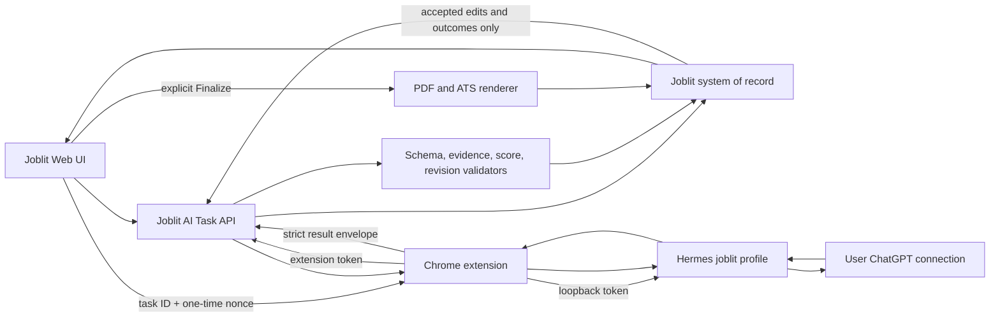

# AI-Native Joblit Platform Design

**Date:** 2026-07-15

**Status:** Architecture selected; written spec pending user review

**Decision:** Use Joblit as the deterministic system of record, the Chrome extension as a narrow security bridge, and a dedicated local Hermes profile as the user's AI runtime. Keep manual Skill Pack and optional provider API paths as fallbacks.

## Context

Joblit already owns the durable job-search workflow: authenticated user data, a Master Resume Profile, imported Jobs, `DRAFT`/`FINAL` Applications, structured AI provenance, PDF rendering, extension authentication, ATS autofill, and versioned Skill Pack generation. Its current AI paths are fragmented:

- an external/manual JSON flow;
- an optional server-side model flow;
- a Codex Batch flow;
- a Chrome extension that currently handles Joblit profile data, Seek import, and ATS autofill but does not bridge Joblit to Hermes;
- a local Hermes runtime that can use the user's own ChatGPT access and local memory, but whose current `/v1/responses` contract cannot reliably select one required skill per request.

The product direction is broader than adding another provider. Joblit should become an AI-native career operating system while preserving factual grounding, user control, predictable scoring, and multi-user security.

This design incorporates useful workflow ideas from the MIT-licensed [`MadsLorentzen/ai-job-search`](https://github.com/MadsLorentzen/ai-job-search/tree/55ba1c16528a63f790eaf7b4bbad567bae6125b3) project at audited commit `55ba1c16528a63f790eaf7b4bbad567bae6125b3`: cheap triage before deep evaluation, generalizing its location/deal-breaker veto into Joblit's broader eligibility model, separate drafting and review, outcome recording before calibration, and semantic skill-gap analysis. Joblit will implement these ideas independently against its own schemas and product boundaries. It will not copy the reference project's prompts, file-based agent state, subjective culture scoring, LaTeX constraints, or single-user assumptions.

## Decision

Adopt a hybrid local-first architecture:

1. **Joblit owns truth and control.** Authentication, authorization, source facts, schemas, score arithmetic, revisions, idempotency, persistence, PDF rendering, and Finalize remain deterministic Joblit responsibilities.
2. **Hermes owns bounded reasoning.** A dedicated per-Joblit-account Hermes profile performs requirement extraction, evidence matching, drafting, reviewing, interview coaching, and derived preference projection.
3. **The Chrome extension owns transport.** It obtains full AI task payloads from Joblit with its existing extension credential, calls loopback Hermes, and returns results to Joblit. Neither the web page nor Joblit's cloud receives the Hermes token or the user's ChatGPT credentials.
4. **Users remain in Joblit.** The normal workflow never requires copying prompts, opening ChatGPT, or pasting JSON.
5. **Every new-path generated artifact starts as a proposal.** AI output enters a `DRAFT` Application or another reviewable result. Only an explicit user action may Finalize or submit it. Existing legacy paths remain temporary exceptions during migration and must reach evidence/DRAFT parity before the master program can pass acceptance.

This decision extends rather than replaces ADR-0001 and ADR-0002. `aiContent`, provenance, stale-write detection, and the unified Generate -> Edit -> Finalize lifecycle remain authoritative.

## Goals

- Give every Joblit user one-click AI analysis, matching, tailoring, review, application-answer, interview, outcome-learning, and upskilling flows.
- Let users use their own local Hermes/ChatGPT setup without exposing those credentials to Joblit.
- Eliminate manual Skill Pack and JSON copy/paste from the primary journey.
- Make every material AI claim traceable to candidate or job evidence.
- Separate eligibility, role fit, preference fit, and confidence instead of presenting a single opaque score.
- Learn from accepted edits and real outcomes without treating correlation as causation.
- Preserve existing Application lifecycle, Skill Pack contracts, PDF rendering, and extension token infrastructure during migration.
- Support `en-AU` and `zh-CN` from the first production release of each capability.

## Non-goals

- Letting AI bypass authentication, ownership checks, schemas, or state transitions.
- Letting AI click a final job-board Submit button without a visible user confirmation.
- Inferring protected traits, personality, or "culture fit" from a Job or candidate.
- Claiming that a rejection proves a particular skill deficit.
- Uploading ChatGPT cookies, Hermes credentials, or local-memory files to Joblit.
- Replacing Joblit with a general-purpose autonomous agent.
- Shipping every capability in one implementation plan. This master design is intentionally decomposed into independently reviewable releases.

## Product Principles

### Evidence before eloquence

Every resume claim, application answer, match assertion, and interview story must cite stable evidence identifiers. Unsupported content is an error, not a creative suggestion.

### AI classifies; deterministic code validates, calculates, and enforces

Hermes performs probabilistic requirement extraction, classification, and evidence matching. Joblit validates references and schemas, computes score arithmetic, checks versions, persists the result, and enforces authorization and state transitions. UI always exposes unknowns and classification confidence.

### Progressive autonomy

Low-risk analysis may run automatically. Content mutations require review. Sensitive answers and final submission require explicit confirmation.

### Local-first, recoverable, optional

Hermes is the primary AI runtime, not a requirement for basic Joblit access. When it is missing, offline, incompatible, or rate-limited, the product remains usable and exposes a clear recovery or fallback path.

### One canonical contract

TypeScript schemas and deterministic validators in Joblit are the source of truth. Skill documents, JSON Schema files, examples, runtime prompts, and evaluator fixtures are generated from or tested against those contracts.

## System Architecture



### Trust boundaries

| Boundary | Authenticated identity / expected fields | Untrusted data | Enforcement |
|---|---|---|---|
| Browser page -> extension | task ID, nonce, requested action | every page-controlled string | exact allowed origin, typed message, size limit, nonce, sender validation |
| Extension -> Joblit | authenticated extension identity and task ID | every extension payload and local runtime result | existing token ownership, task-user binding, JSON Schema, revision checks |
| Extension -> Hermes | scoped Joblit-mode token and expected task shape | every request field, model output, and tool output | loopback-only listener, per-account profile, server-preloaded skill, tool policy, timeouts, response cap |
| Job and company content -> AI | source text and source locations | embedded instructions, markup, tracking content | content/data delimiters, prompt-injection rules, no executable tools |
| AI result -> persistence | validated evidence references | claims, patches, scores | deterministic validation and atomic commit |

## Capability Model

The platform exposes a closed action vocabulary. Adding an action requires a versioned input schema, result schema, validator, evaluator set, UI state, and failure mapping.

```ts
type AiAction =
  | "PROFILE_NORMALIZE"
  | "JOB_ANALYZE"
  | "JOB_RANK"
  | "MATCH_DEEP"
  | "TAILOR_RESUME"
  | "WRITE_COVER"
  | "REVIEW_APPLICATION"
  | "ANSWER_APPLICATION"
  | "INTERVIEW_PREP"
  | "LEARN_OUTCOME"
  | "SYNC_CONFIRMED_MEMORY"
  | "PLAN_UPSKILL";
```

### Capability journey

1. **AI Candidate Profile:** normalize the Master Resume Profile into evidence-backed capabilities and preferences.
2. **Job Intelligence:** structure requirements, responsibilities, constraints, uncertainties, and source spans.
3. **Triage Ranking:** cheaply rank many Jobs and identify likely hard blocks.
4. **Deep Match:** produce evidence-level fit analysis and deterministic scores.
5. **Application Pack:** create resume, cover, and application-answer proposals.
6. **Independent Review:** review in a separate Hermes session and return patches, not rewritten blobs.
7. **PDF and ATS Review:** verify layout plus the extracted PDF text layer.
8. **Autofill Support:** map confirmed profile and application answers onto ATS fields.
9. **Interview Coach:** prepare evidence-backed questions, STAR stories, and practice feedback.
10. **Outcome Learning:** store facts first, then update derived preferences from repeated evidence.
11. **Career Copilot:** recommend next applications, learning priorities, and weekly actions.

## Canonical Data Contracts

### Candidate snapshot

`CandidateSnapshot` is an immutable view of one `ResumeProfile` revision. It contains facts, preferences, and stable evidence identifiers. It must not contain inferred achievements.

Evidence IDs use a deterministic hash of profile ID, revision, canonical JSON Pointer, and normalized value. An edit creates a new revision and therefore a new evidence namespace; old Applications retain their original references.

```ts
type CandidateEvidence = {
  id: string;
  kind: "summary" | "experience" | "project" | "skill" | "education" | "credential" | "preference";
  jsonPointer: string;
  text: string;
  locale: "en-AU" | "zh-CN";
};

type CandidateSnapshot = {
  profileId: string;
  revision: number;
  locale: "en-AU" | "zh-CN";
  evidence: CandidateEvidence[];
  careerPreferenceRevision?: number;
  preferences?: CareerPreferenceSnapshot;
};
```

`CareerPreferenceSnapshot` comes from a new user-owned `CareerPreference` record, not from model inference or an overloaded resume field. It separates job preferences from eligibility facts and sensitive application answers. Missing fields remain `unknown`.

```ts
type CareerPreferenceSnapshot = {
  locations: string[];
  workArrangements: Array<"remote" | "hybrid" | "onsite">;
  targetRoles: string[];
  salaryText?: string;
  eligibility: Array<{
    jurisdiction: string;
    workAuthorization: "citizen" | "permanent_resident" | "visa" | "other" | "unknown";
    sponsorshipRequired: boolean | "unknown";
    expiresAt?: string;
  }>;
};
```

### Job snapshot

`JobSnapshot` freezes one Job version and turns source spans into stable requirement IDs. Job-board text remains untrusted content.

```ts
type JobRequirement = {
  id: string;
  category: "required" | "preferred" | "responsibility" | "eligibility";
  dimension: "skill" | "experience" | "seniority" | "domain" | "education" | "credential" | "language" | "location" | "authorization" | "clearance";
  scoreBucket: "required_skills" | "responsibilities_experience" | "seniority_scope" | "preferred_skills" | "domain_experience" | "education_credentials_language" | "eligibility_only";
  text: string;
  mandatory: boolean | "unknown";
  importance: 1 | 2 | 3;
  normalizedConstraint?: {
    jurisdiction?: string;
    operator: "equals" | "includes" | "at_least" | "at_most" | "required";
    value: string | number | string[];
    unit?: string;
  };
  extractionConfidence: number;
  sourceStart: number;
  sourceEnd: number;
};

type JobSnapshot = {
  jobId: string;
  contentHash: string;
  title: string;
  company?: string;
  locale: "en-AU" | "zh-CN";
  sourceText: string;
  requirements: JobRequirement[];
};
```

`contentHash` is SHA-256 over canonical Job fields and normalized source text. It does not use `updatedAt`, because timestamp-only upserts must not invalidate an assessment.

### Snapshot persistence

Candidate and Job snapshots are materialized, content-addressed records rather than transient views over mutable rows. A new user-scoped `AiSnapshot` store contains `kind`, source entity ID, source revision, canonical SHA-256, schema version, and validated payload. It deduplicates by `(userId, kind, sourceEntityId, contentHash)`.

`Application`, `JobAssessment`, and other durable AI artifacts reference the exact snapshot IDs used to create them. Deleting a source Job or Profile immediately deletes unreferenced snapshots; snapshots referenced by a retained Application/Assessment remain until that artifact is deleted. Account deletion removes every snapshot and artifact. Superseded snapshots remain available only while referenced, so historical evidence links do not silently point at edited profile or Job content.

### AI task envelope

The web page never sends resume or Job content directly to the extension. It creates an authenticated server task, then sends only `taskId`, `nonce`, and `action` through Chrome external messaging. The extension uses its own Joblit extension token to fetch the canonical envelope.

```ts
type AiTaskEnvelope<T> = {
  taskId: string;
  action: AiAction;
  contractVersion: string;
  runtimeSkill: { name: "joblit-career-agent"; version: string; contentHash: string };
  promptVersion: string;
  ruleSetVersion: number;
  locale: "en-AU" | "zh-CN";
  candidateSnapshotId?: string;
  candidateRevision?: number;
  jobSnapshotId?: string;
  jobContentHash?: string;
  applicationRevision?: number;
  idempotencyKey: string;
  expiresAt: string;
  memoryScope: "none" | "read_preferences" | "write_derived_preferences";
  executionGrant: string;
  input: T;
};
```

`memoryScope` is server-selected. Generation and `LEARN_OUTCOME` receive `none` or `read_preferences`; they cannot write memory. After the user confirms a typed proposal in Joblit's ledger, a separate idempotent `SYNC_CONFIRMED_MEMORY` task may receive `write_derived_preferences`.

`executionGrant` is a Compact JWS with algorithm locked to `EdDSA`. Hermes validates fixed issuer `https://www.joblit.tech`, audience `joblit-hermes-v1`, maximum five-minute lifetime, and a recognized `kid`. Claims bind `grantId`, `taskId`, `idempotencyKey`, `action`, `accountFingerprint`, `profileId`, `toolPolicyId`, `memoryScope`, Skill content hash, canonical input SHA-256, expiry, audience, and nonce.

Hermes trusts only a preinstalled Joblit public-key set delivered through the signed Hermes release/updater; grant-provided JWK, `jku`, `x5c`, or algorithm changes are rejected. Capabilities advertises trusted `kid` values. Key rotation distributes the new public key first, Joblit signs with a key advertised by that runtime, and the old key remains trusted until its supported-runtime window plus maximum grant lifetime has elapsed.

Input hash uses RFC 8785 JSON Canonicalization Scheme over UTF-8. Parsing rejects duplicate object keys, non-finite numbers, invalid Unicode, and non-UTF-8 bytes before hashing. Before Skill loading or model invocation, Hermes atomically inserts `grantId`, `taskId`, `idempotencyKey`, `runId`, and `expiresAt` into a persistent replay ledger with unique `grantId`. The ledger survives Hermes restart. Repeating the same grant with the same idempotency key returns the original run; every other reuse or claim mismatch is rejected. The extension cannot select or escalate a tool policy by editing the request.

### AI result envelope

```ts
type AiResultEnvelope<T> = {
  taskId: string;
  action: AiAction;
  contractVersion: string;
  result: T;
  evidenceIds: string[];
  requirementIds: string[];
  unknowns: Array<{ code: string; message: string }>;
  runtime: {
    provider: "hermes" | "provider" | "manual" | "codex_batch";
    durationMs: number;
    modelLabel?: string;
    runId?: string;
    attestedSkill?: {
      name: "joblit-career-agent";
      version: string;
      contentHash: string;
    };
    attestedToolPolicy?: { id: string; manifestHash: string };
    verifiedGrantId?: string;
  };
};
```

Business result schema is independent from runtime provenance. Runtime attestation is supplied by Hermes and carried by the extension, never model-generated content. Skill, tool-policy, and verified-grant attestations are mandatory for Hermes results and absent for manual/provider compatibility paths. The server rejects mismatched task IDs, actions, contract versions, attestations, evidence IDs, requirement IDs, revisions, or terminal task states.

### Patch contract

Final-state content changes use stable targets rather than whole-document replacement.

```ts
type EvidencePatch = {
  patchId: string;
  targetId: string;
  expectedRevision: number;
  operation: "replace" | "insert_after" | "remove";
  value?: string;
  reason: string;
  evidenceIds: string[];
  requirementIds: string[];
  risk: "low" | "medium" | "high";
};
```

Phase 1 may adapt existing `cvSummary`, `latestExperience.bullets`, `skillsFinal`, and three-paragraph `cover` output into patches at the server boundary. New AI actions must emit patches natively.

### Feedback event

Learning uses server-created append-only facts, not silent model interpretation. Clients and models cannot choose `userId`, event ID, sequence, timestamp, or source revision.

```ts
type PreferenceValue =
  | { key: "target_roles"; value: string[] }
  | { key: "locations"; value: string[] }
  | { key: "work_arrangements"; value: Array<"remote" | "hybrid" | "onsite"> }
  | { key: "salary_text"; value: string }
  | { key: "writing_style"; value: { locale: "en-AU" | "zh-CN"; traits: string[] } };

type FeedbackPayload =
  | { type: "PATCH_DECIDED"; patchId: string; decision: "accepted" | "rejected" | "edited"; finalTextHash?: string }
  | { type: "APPLICATION_FINALIZED"; applicationId: string; applicationRevision: number }
  | { type: "APPLICATION_SUBMITTED"; applicationId: string; submittedAt: string }
  | { type: "APPLICATION_OUTCOME"; applicationId: string; outcome: "interview" | "offer" | "rejection" | "no_response" }
  | { type: "PREFERENCE_CONFIRMED"; preferenceId: string; value: PreferenceValue }
  | { type: "MEMORY_OVERRIDDEN"; memoryId: string; replacement?: PreferenceValue }
  | { type: "MEMORY_TOMBSTONED"; memoryId: string };

type AiFeedbackEvent = FeedbackPayload & {
  eventId: string;        // server generated
  userId: string;         // session derived
  sequence: number;       // server monotonic per user
  occurredAt: string;     // server generated
  sourceRevision: string; // server generated
};

type DerivedPreferenceProposal = {
  proposalId: string;
  proposedValue: PreferenceValue;
  sourceEventIds: string[];
  confidence: number;
  requiresConfirmation: true;
};
```

The canonical preference registry maps each allowlisted key to a value schema, maximum item/text lengths, locale rules, and sensitivity classification. Overrides must use the original key's schema; unknown keys, free-form blobs, and sensitive eligibility answers are rejected from derived memory.

`LEARN_OUTCOME` returns only `DerivedPreferenceProposal[]` under a read-only policy. Joblit creates feedback events from authenticated product actions and requires user confirmation before a derived preference affects `Preference Fit`. Confirmation writes the ledger, then `SYNC_CONFIRMED_MEMORY` projects that exact typed value into Hermes under a one-time learning grant. Correction and deletion create override/tombstone events, so rebuilding memory cannot resurrect removed entries. Accepted wording may teach presentation style; it never becomes a new career fact.

## AI Task Lifecycle

The server persists coordination metadata in an `AiTask` record. It references materialized `AiSnapshot` rows rather than duplicating resume/JD blobs.

```text
QUEUED -> RUNNING -> VALIDATING -> SUCCEEDED
   |         |            |
   +-------> FAILED <------+
   +-------> CANCELLED
   +-------> EXPIRED
```

- Creation requires a Joblit session and user-owned entity references.
- `(userId, idempotencyKey)` is unique.
- A one-time nonce binds the web request to one extension handoff and expires within five minutes.
- The extension token must belong to the same user as the task.
- Claim uses `claimedByInstallationId`, `leaseExpiresAt`, `heartbeatAt`, and compare-and-swap updates. A second installation cannot run an active lease.
- The extension starts Hermes through idempotent `/v1/runs`, then atomically records `runtimeRunId`. Service-worker restart resumes polling that run.
- If Hermes restarts and loses an in-memory run, the adapter records `RUN_LOST`; retry creates a new attempt instead of pretending the old run resumed.
- A task result may commit once. Duplicate delivery returns the existing terminal result.
- Version mismatch produces `STALE_INPUT`; it never auto-merges.
- Retry after a terminal failure creates a new attempt linked by `parentTaskId` and a new nonce.
- Page or service-worker disconnect does not lose Joblit task state. The page may poll and reconnect; local execution resumes only when the recorded Hermes run still exists.
- Result payloads are persisted only in their canonical destination (`Application`, `JobAssessment`, interview artifact, or feedback event). `AiTask` stores the destination reference and diagnostic metadata.
- `Application.applicationRevision` is an incrementing database integer used for compare-and-swap updates and Finalize. A canonical SHA-256 may additionally protect content integrity. Existing 32-bit `aiContentHash` remains a fast UX dirty/stale hint and is never a security or idempotency boundary.

## Matching and Scoring

### Two-stage evaluation

**Triage** processes many Jobs with a compact candidate capability index. It returns eligibility risk, coarse fit bands, confidence, and the highest-value reasons. It does not generate application content.

**Deep Match** evaluates one Job requirement by requirement against the full immutable snapshots.

### Eligibility

Eligibility is separate from fit:

- `PASS`: every known hard gate is met.
- `RISK`: at least one hard gate is ambiguous or missing source information.
- `BLOCK`: a confirmed mandatory gate is not met.

Hard gates are limited to work authorization/visa, location where non-negotiable, security clearance, legally required licence/certification, mandatory language, and explicitly mandatory education or experience. Hermes identifies candidate evidence and uncertainty; Joblit applies the state rule. Missing candidate data produces `RISK`, not `BLOCK`. `BLOCK` requires an explicitly mandatory requirement plus evidence that the candidate does not satisfy it.

### Role fit

Role-fit weights are deterministic:

| Dimension | Weight |
|---|---:|
| Required skills | 30 |
| Responsibilities and demonstrated experience | 25 |
| Seniority and scope | 15 |
| Preferred skills | 10 |
| Domain experience | 10 |
| Education, credentials, and language | 10 |

Hermes returns a typed matrix; it never returns the aggregate score:

```ts
type RequirementAssessment = {
  requirementId: string;
  applicability: "applicable" | "not_applicable" | "unknown";
  verdict: "met" | "partial" | "missing" | "unknown";
  evidenceIds: string[];
  reasonCode: string;
  classificationConfidence: number;
};
```

`scoreBucket` is frozen in the validated Job Snapshot and a requirement belongs to exactly one bucket. Mapping is deterministic: required skill -> `required_skills`; preferred skill -> `preferred_skills`; responsibility or general experience -> `responsibilities_experience`; seniority -> `seniority_scope`; domain -> `domain_experience`; education/credential/language -> `education_credentials_language`; hard constraints -> `eligibility_only` and never affect role fit. Joblit rejects incompatible category/dimension/bucket combinations.

Joblit deterministically deduplicates requirements by normalized bucket, constraint, and text while retaining all source spans. A bucket with no applicable or potentially applicable requirement is removed and remaining bucket weights are renormalized to 100. Inside each bucket, requirement weight is proportional only to the frozen Job Snapshot `importance`; the assessment cannot change it.

`met = 1`, `partial = 0.5`, and confirmed `missing = 0`. `unknown` contributes 0 to the lower bound and 1 to the upper bound. Joblit returns:

- `roleFit`: conservative lower-bound score;
- `possibleRoleFitRange`: lower and upper score bounds;
- `assessmentCoverage`: known assessed weight divided by total applicable-or-unknown weight;
- `evidenceCoverage`: known weight backed by valid candidate evidence or a structured absence proof, divided by known weight;
- `classificationConfidence`: weighted mean of assessment `classificationConfidence` values.

`not_applicable` is excluded from the denominator. An empty or incomplete Candidate Snapshot produces `unknown`, never confirmed `missing`. UI headline confidence is the minimum of the three confidence components and exposes all three in details. Given the same Job Snapshot and assessment matrix, the calculator must return exactly the same score.

### Preference fit and confidence

Preference fit is a separate 0-100 score based only on explicit user preferences. It must not change role fit.

Headline confidence uses the scoring definition above. Low confidence is displayed prominently; it is never hidden behind a precise-looking score.

No culture-fit, personality, age, gender, ethnicity, health, family-status, or other protected-trait inference is permitted.

## Application Pack and Review

### Generation

One user action may orchestrate `MATCH_DEEP`, `TAILOR_RESUME`, `WRITE_COVER`, and supported `ANSWER_APPLICATION` operations. Each operation remains separately retryable and versioned.

The first release reuses the existing strict resume and cover output contracts:

- resume: `cvSummary`, `latestExperience.bullets`, `skillsFinal` with no more than five skill categories;
- cover: `cover.paragraphOne`, `cover.paragraphTwo`, and `cover.paragraphThree`, plus currently supported optional metadata.

The new local-AI path uses strict parsing. It may retry Hermes once with validation errors, then fails visibly. A deterministic server adapter reuses the current `manualImportParser` canonicalization rules while writing `aiContent` v2 provenance:

- existing bullets are matched by normalized exact match, then the existing high-similarity threshold;
- unmatched incoming bullets become reviewable AI-added proposals;
- unused base bullets remain; omission is not treated as AI-authorized deletion;
- duplicate and ungrounded additions remain visible but disabled by a quality gate;
- `skillsFinal` is compared case-insensitively against base categories/items; only new items become additions, omissions never delete base skills, and ordering changes carry no factual meaning;
- empty proposal arrays are valid and never erase base content.

The tolerant legacy parser remains isolated to legacy manual/provider compatibility until those paths adopt the same strict evidence adapter.

### Independent review

`REVIEW_APPLICATION` runs with a new `session_id`, no `previous_response_id`, and no conversation history from the drafter. It receives canonical snapshots, the proposed artifact, and validation findings. It returns evidence patches covering:

- unsupported or overstated claims;
- missed high-value requirements;
- repetition and keyword stuffing;
- unnatural or generic language;
- locale and market conventions;
- ATS-hostile structure;
- internal contradictions.

Review never silently edits the Application. The user accepts, rejects, or edits each patch.

### Finalize

Introduce `resumeStatus` and `coverStatus` with `ABSENT | DRAFT | FINAL`, plus the authoritative integer `applicationRevision`. Existing `Application.status` remains the aggregate compatibility field: it is `DRAFT` while any requested artifact is `DRAFT`, and `FINAL` when at least one artifact is `FINAL` and no requested artifact remains `DRAFT`.

Target-specific Finalize updates only that artifact status, then recomputes the aggregate in the same transaction. The single UI Finalize action invokes a pack orchestrator for all requested artifacts; partial rendering leaves the Application `DRAFT` and identifies the failed artifact. This replaces the current unsafe behavior where finalizing either target marks the entire Application `FINAL`.

Finalize requires `applicationRevision`, revalidates evidence and schema, and increments the revision atomically. PDF extracted-text verification becomes a mandatory Phase 5 gate; until then existing rendering remains available but cannot claim full master-program acceptance. `aiContentHash` remains only a non-security UX hint.

### `aiContent` v1 to v2 migration

Readers use a `schemaVersion` discriminated union and never reinterpret v1 as evidence-complete v2. New local-AI writes use v2 only. Historical v1 rows remain readable and editable through the labelled legacy path during Phases 1-3; their missing evidence cannot be invented or backfilled from the current mutable Profile/Job.

Re-generation creates new snapshots and replaces v1 with v2. At the end of Phase 4, v1 Finalize is disabled: users may view/download an existing final artifact, but a v1 draft must be regenerated before a new Finalize. No bulk migration fabricates provenance.

Per-artifact state backfill uses this matrix:

| Historical state | Resume state | Cover state | Artifact-state version |
|---|---|---|---:|
| `resumePdfUrl` and `coverPdfUrl` present | `FINAL` | `FINAL` | 1 |
| only `resumePdfUrl` present | `FINAL` | `ABSENT` | 1 |
| only `coverPdfUrl` present | `ABSENT` | `FINAL` | 1 |
| `DRAFT`, non-empty CV proposal only | `DRAFT` | `ABSENT` | 1 |
| `DRAFT`, non-empty cover proposal only | `ABSENT` | `DRAFT` | 1 |
| `DRAFT`, both proposals non-empty | `DRAFT` | `DRAFT` | 1 |
| `FINAL`, no artifact URL, target not provable | unset and ignored | unset and ignored | 0, preserve legacy aggregate status |

Empty default CV/cover placeholders do not prove that target was requested. `artifactStateVersion = 0` rows remain legacy read-only for target Finalize until re-generation sets explicit v2 artifact state.

AI never presses a job-board final Submit button. Autofill may prepare the form; the user reviews and submits it.

## Hermes Runtime and Skill Design

### Dedicated profile

Joblit uses one Hermes profile per Joblit account: `joblit-<accountFingerprint>`. `GET /api/ext/me`, authenticated by the existing extension token, returns a server-generated HMAC account fingerprint and token expiry. The extension never derives identity from an opaque token, stale cache, or page parameter. Account switching must re-fetch identity and switch profile, API key, and session namespace; a profile mismatch fails closed to prevent cross-account memory leakage.

A Joblit launcher starts Hermes with an explicit `HERMES_HOME`. `/v1/capabilities` must return an authenticated `profileId`, `homeFingerprint`, `bindPosture`, runtime version, and Joblit-mode state. Silent fallback to the default Hermes profile is incompatible.

Hermes must provide server-enforced per-request tool policies:

- `joblit-generation-readonly`: model inference plus server-preloaded Joblit skill; no terminal, file, browser, code execution, `skill_manage`, cron, session administration, or memory write;
- `joblit-learning`: the same restricted surface plus structured writes to the tenant-scoped derived-memory projection;
- onboarding verifies the exact tool lists through `/v1/toolsets`; extra tools or a missing policy produce `HERMES_INCOMPATIBLE`.

Joblit mode uses a scoped token that exposes only health, capabilities, installed-skill metadata, tool-policy metadata, idempotent runs, run polling, and run stop. It cannot access arbitrary session/history, fork/delete, cron, jobs, or admin routes. Joblit mode rejects a non-loopback bind instead of warning.

Generation requests set `persistSession: false`. This prohibits task content in `state.db`, Responses storage, conversation history, tool traces, caches, and normal debug/crash logs after success, failure, timeout, or cancellation. Logs retain only content-free identifiers and stable error codes. A unique-marker integration test searches the entire account profile after task completion and must find no task content. Derived-memory writes use the separate structured learning policy and ledger described below.

Profile isolation covers sessions, skills, state, and memory, not necessarily the user's existing global ChatGPT credential pool. Joblit mode pins the approved provider/model route in server policy, prohibits client model overrides, and reports a non-secret `authSource` plus model route in capabilities. It never returns credentials or cookies.

### Skill package

One versioned umbrella skill simplifies activation while keeping instructions modular:

```text
joblit-career-agent/
|-- SKILL.md
|-- skill-manifest.json
`-- references/
    |-- action-contracts.md
    |-- evidence-policy.md
    |-- match-scoring.md
    |-- resume-tailoring.md
    |-- cover-letter.md
    |-- application-answers.md
    |-- application-review.md
    |-- interview-coach.md
    |-- outcome-learning.md
    |-- upskilling.md
    |-- locale-en-AU.md
    `-- locale-zh-CN.md
```

The root skill routes by `AiAction`; references contain action-specific rules. Deterministic validation stays in Joblit and the extension, not in model-invoked scripts. Evaluation fixtures live in `tests/ai-evals/joblit-career-agent/`, outside the runtime Skill package.

`skill-manifest.json` is generated, not model-authored. It defines the semantic `version` and SHA-256 for every runtime content file except the manifest itself. Package `contentHash` is SHA-256 over canonical manifest JSON after sorting POSIX relative paths. Text files must be UTF-8 with LF line endings; all bytes after that repository normalization are hashed. `SKILL.md` and every reference are file entries; the manifest payload is the hash root. Symlinks, undeclared files, duplicate paths, and path traversal are rejected.

### Explicit skill activation

Production readiness requires Hermes to accept an allowlisted, content-addressed skill selection on `/v1/runs`:

```json
{
  "skills": [{ "name": "joblit-career-agent", "contentHash": "sha256:..." }],
  "toolPolicyId": "joblit-generation-readonly",
  "persistSession": false,
  "idempotencyKey": "...",
  "executionGrant": "eyJ..."
}
```

Hermes validates the execution grant, derives the tool policy from it, preloads and hashes the Skill before model invocation, and fails before inference if any check fails. It returns server-attested `loadedSkill { name, version, contentHash }`, `attestedToolPolicy`, and `verifiedGrantId` outside model content. `/v1/skills` exposes `name`, `version`, `contentHash`, `source`, and `enabled`. Model self-report, prompt echo, and model-invoked `skill_view` are never accepted as proof. Older Hermes versions without these server guarantees return `HERMES_INCOMPATIBLE`; generic unskilled generation is not a compatibility path.

## Chrome Extension Bridge

### Web-to-extension transport

Use Chrome `externally_connectable` with production matches limited to `https://www.joblit.tech/*`. Joblit receives the stable Chrome Web Store extension ID from validated deployment configuration; development builds use a separate explicit development ID and loopback Joblit origins. Missing extension detection uses a short external-connect timeout and never guesses IDs. The service worker validates `onMessageExternal` and `onConnectExternal` independently, including `sender.url`, message schema, action, byte size, task nonce, and rate limits.

The external message contains no profile, Job, result, Joblit extension token, or Hermes token. It contains only task coordination data.

### Extension-to-Hermes transport

- Default endpoint: `http://127.0.0.1:8642`. Custom endpoints may use only `http`, `127.0.0.1`, `[::1]`, or validated `localhost`; credentials, query, fragment, non-root base path, DNS hostnames, and redirects are rejected.
- Chrome host permission is exact by scheme and host; match patterns cannot restrict ports. Runtime validation separately pins the configured port and allowed Hermes paths.
- On extension startup, call `chrome.storage.local.setAccessLevel({ accessLevel: "TRUSTED_CONTEXTS" })` before reading secrets. Both the Joblit extension token and Hermes scoped token remain background/popup-only. Content-script preference access moves to typed background RPC.
- Start work through idempotent `/v1/runs`, persist the returned run ID, then poll or stop through the scoped Joblit-mode API.
- Apply connect, first-byte, total-run, and idle timeouts.
- Cap request and response sizes by action.
- Use `AbortController` for cancellation.
- Redact content from logs and error telemetry.

On Joblit sign-out, account switch, token revocation, or Hermes profile deletion, the extension stops active old-account runs, invalidates unused grants, revokes/forgets the old scoped Hermes token, clears the stored account/profile binding, and requires a fresh `/api/ext/me` exchange before new work.

### Progress and recovery

An external Chrome Port carries stage-only progress. If the port or service worker sleeps, the web UI polls Joblit `AiTask` state. The extension recovers a still-live Hermes run from the persisted run ID; Hermes restart maps to `RUN_LOST` and a new user-visible retry attempt. This guarantees recoverable product state, not impossible continuation of a lost local process.

User-facing failures map to stable codes such as:

- `EXTENSION_NOT_INSTALLED`
- `EXTENSION_NOT_CONNECTED`
- `HERMES_OFFLINE`
- `HERMES_AUTH_FAILED`
- `HERMES_INCOMPATIBLE`
- `SKILL_MISSING`
- `SKILL_STALE`
- `AI_RATE_LIMITED`
- `AI_TIMEOUT`
- `RUN_LOST`
- `INVALID_AI_RESULT`
- `STALE_INPUT`
- `TASK_EXPIRED`

Each error has one primary recovery action. Raw model or transport errors are not shown to users.

## Memory and Learning

Joblit stores source facts, append-only feedback events, and a structured derived-preference ledger. Per-account Hermes memory is a disposable local projection of user-confirmed ledger entries and reusable coaching context; it is never the only copy needed to inspect, delete, or rebuild memory.

Memory may update only from:

- explicit preferences;
- accepted or user-edited patches that were later Finalized, for style preference only;
- actual submission/interview/offer/rejection events;
- repeated behavior with at least two independent observations.

Generated drafts, model guesses, a single rejection, and no-response outcomes do not become facts. Rejection and no-response are weak signals used only in aggregate.

The Memory Center lets users:

- inspect derived memories and their source events;
- correct or delete an item;
- disable learning while retaining generation;
- clear local Hermes career memory;
- rebuild derived memory from Joblit feedback history on a new device.

Raw resume and Job content remains in Joblit's user-owned records and materialized snapshots. `persistSession: false` prevents generation sessions from becoming a second uncontrolled history. Hermes memory stores only confirmed derived summaries and source-event references; Joblit can recreate the projection after account/device change.

## User Experience

### AI onboarding

The Settings flow uses one guided sequence:

1. Detect the Joblit Chrome extension.
2. Connect the existing Joblit extension token.
3. Detect loopback Hermes.
4. Verify the account-specific `joblit-<opaqueTenantHash>` profile, home fingerprint, loopback posture, and scoped token.
5. Verify `joblit-career-agent` name, semantic version, and exact content hash.
6. Run a pure capabilities/schema/tool-policy probe with no model invocation and no memory loading.
7. Show `Local AI Ready`.

Advanced endpoint and diagnostics stay collapsed. Normal users do not paste prompts or Skill files.

### Jobs experience

Job cards show eligibility, role fit, confidence, and at most two concise reasons. Deep evidence, gaps, and unknowns live in the Job detail panel. Scores never appear until analysis exists.

Primary action: **Create application pack**. Progress uses named stages, elapsed time, cancel, and recoverable retry. The user may continue browsing while a local task runs.

### Review experience

One canonical full-screen editor presents:

- resume and cover tabs within the same Application;
- before/after diff;
- evidence and requirement links;
- Accept, Reject, Edit, and Reset to AI;
- reviewer findings grouped by severity;
- desktop/mobile preview and final PDF preview;
- a single explicit Finalize action.

Motion communicates state changes only, respects reduced-motion preferences, and never blocks input.

### Fallbacks

If local AI is unavailable, Joblit offers:

1. reconnect or repair Hermes;
2. retry after rate limits/timeouts;
3. optional provider API path when configured;
4. manual Skill Pack export/import as the last-resort compatibility path.

New-path fallbacks converge into the same `DRAFT` Application and review editor. Legacy manual/provider paths receive the same contract adapter by Phase 4; until then UI labels their weaker provenance and they are excluded from master-program acceptance.

## Security and Privacy Requirements

- Bind Hermes Joblit mode to loopback only and require an independent route-scoped token.
- Set Chrome local storage to `TRUSTED_CONTEXTS`; keep both Joblit extension and Hermes tokens out of page context, content scripts, logs, analytics, and server payloads.
- Enforce exact production origin and sender checks for external extension messaging.
- Treat Job descriptions, company pages, form labels, and AI output as untrusted data.
- Enforce server-preloaded Skill attestation and exact per-request tool policy before model invocation.
- Require a valid one-time Joblit execution grant before Hermes may select a tool policy, load task input, or invoke the model.
- Disable generation-time terminal, filesystem, browser, code execution, skill management, session administration, and memory writes.
- Validate action-specific JSON Schema, semantic evidence references, byte size, task state, entity ownership, and strong application/snapshot revisions before persistence.
- Rate-limit task creation by user and task execution by extension installation.
- Use one-time nonces and expiring tasks; reject replay.
- Log only task ID, action, stage, duration, error code, contract version, and skill version.
- Add explicit user controls for local-memory inspection, deletion, and learning opt-out.
- Run a threat-model review before public enablement.

## Observability

Joblit records content-free operational events:

- task action and terminal state;
- queue, local runtime, validation, and persistence durations;
- contract and skill versions;
- retry count and stable error code;
- result destination type;
- user acceptance/rejection aggregates with no generated text.

Dashboards track completion rate, invalid-result rate, stale-input rate, local-runtime availability, median/p95 latency, fallback usage, and accepted-patch rate. No dashboard contains resume, Job-description, cover-letter, application-answer, token, or Hermes-memory content.

## Testing and Quality Gates

### Contract and security tests

- JSON Schema and semantic validators for every action.
- Cross-user task and extension-token rejection.
- nonce replay, expiry, duplicate result, stale revision, oversized payload, and unsupported action tests.
- exact origin and malicious external-message tests.
- prompt-injection fixtures embedded in Job descriptions and ATS labels.
- proof that page/content-script contexts cannot read either token.
- startup assertion that Chrome storage is restricted to trusted extension contexts.
- profile/account mismatch, non-loopback bind, over-broad scoped token, extra tool, and missing server Skill-attestation tests.
- execution-grant tampering, replay, expiry, input-hash mismatch, profile mismatch, and attempted tool-policy escalation tests.
- concurrent double-submit, restart-then-replay, unknown `kid`, algorithm confusion, duplicate JSON key, and signing-key rotation tests.

### Runtime and extension tests

- Hermes offline, wrong token, missing skill, stale skill, incompatible API, timeout, cancellation, service-worker restart, and `RUN_LOST` recovery.
- one successful result committed exactly once after duplicate delivery.
- web reconnect/poll recovery after external Port loss.
- capabilities-only health check proving no model or profile memory is loaded.

### AI evaluations

Maintain at least 100 golden Job/candidate pairs, at least 40 per locale, including at least 25 confirmed hard-gate blocks and 25 hard-gate non-blocks. Cover strong, weak, sparse, seniority-mismatched, visa-constrained, ambiguous, adversarial, and unsupported-claim cases. Every skill change runs:

- skill-enabled evaluation;
- no-skill baseline;
- previous released skill comparison;
- human-readable evaluator report.

Release gates:

- 100% schema-valid results after no more than one repair retry;
- zero unsupported material claims in the release golden set;
- 100% valid evidence coverage for every persisted material claim;
- 100% hard-gate recall and zero false `BLOCK` decisions in the release golden set;
- measured separately for each locale: at least 98% required-requirement extraction recall and at least 95% preferred-requirement precision and recall;
- measured separately for each locale: at least 95% macro accuracy for category, dimension, score bucket, and mandatory classification;
- 100% extracted source spans resolve to the annotated source text, and duplicate-collapse precision/recall are each at least 95%;
- zero calculator drift for an identical `RequirementAssessment` matrix;
- at least 95% requirement-verdict agreement across three repeated model runs, with no more than five lower-bound role-fit points of end-to-end variation;
- zero critical prompt-injection successes;
- no cross-user access or token exposure;
- all existing Application, extension, PDF, auth, and ownership regression suites pass.

## Delivery Decomposition

This master design is too broad for one implementation plan. Delivery uses child specs and plans in this order:

### Phase 0: Hermes Joblit-mode compatibility prerequisite

- Implementation owner: Hermes runtime repository; Joblit owns consumer fixtures and acceptance tests.
- Ship `joblitRuntimeContractVersion: "1"` in capabilities. Joblit keys compatibility to this contract, not a loosely related application semantic version.
- Add account-profile attestation, strict loopback posture, scoped token/routes, Compact JWS EdDSA grant verification, trusted-key rotation, persistent atomic replay ledger, per-request tool policies, deterministic Skill manifest/hash/preload, idempotent runs, `persistSession: false`, and content-free capabilities.
- Publish canonical request/response/error fixtures under Joblit `tests/fixtures/hermes-joblit-v1/` and run them against the minimum supported Hermes release in CI.
- Provide a signed Hermes release/upgrade channel that onboarding can identify and direct users to when the runtime contract is missing.
- Do not begin a personal-data Joblit vertical slice until the compatibility suite passes. Before that point only capabilities-only probing is allowed.

### Phase 1: Local AI foundation

- AI Settings onboarding and `Local AI Ready` health state.
- authenticated `/api/ext/me` account fingerprint exchange and account/profile binding lifecycle.
- exact-origin web-to-extension external bridge.
- trusted-context token migration and content-script preference RPC.
- consume and verify Hermes Joblit-mode contract v1 from Phase 0.
- `AiTask` coordination, installation lease, lifecycle, idempotency, run recovery, progress, cancellation, and error mapping.
- minimum materialized Candidate/Job snapshots, stable evidence/requirement IDs, canonical Job hash, strict result schema, and `aiContent` v2 provenance.
- v1/v2 discriminated-union readers, explicit legacy labels, and the per-artifact historical backfill matrix.
- strong `applicationRevision` plus per-artifact status migration before changing Finalize behavior.
- one capabilities-only health action, then one evidence-complete `TAILOR_RESUME` vertical slice into the existing `DRAFT` editor.

### Phase 2: Contract expansion and evaluation foundation

- expand snapshots and evidence contracts to all actions;
- add `CareerPreference` and structured eligibility sources;
- generate Skill references from canonical TypeScript contracts;
- legacy tolerant-parser isolation;
- content-free task observability.
- baseline, previous-version, adversarial, and bilingual evaluation harness.

### Phase 3: Matching

- Job analysis, triage ranking, deep match, deterministic eligibility/role/preference/confidence calculation;
- Job-card and detail-panel UI.

### Phase 4: Application Pack

- resume, cover, and supported application-answer orchestration;
- stable evidence patches;
- unified progress and retry behavior.

### Phase 5: Independent review and artifacts

- separate reviewer sessions;
- patch review UI;
- PDF visual and extracted-text checks;
- Finalize hardening.

### Phase 6: Outcome and learning foundation

- append-only feedback events;
- application outcome capture and discriminated event schemas;
- user-confirmed derived-preference ledger and explicit learning runs;
- Memory Center, opt-out, delete, and rebuild.

### Phase 7: Career Copilot

- interview preparation;
- aggregate outcome analysis;
- upskilling plans;
- weekly application prioritization.

### Phase 8: Autofill intelligence and rollout hardening

- evidence-backed application answers in ATS autofill;
- sensitive-field confirmation;
- public rollout gates, abuse controls, security review, and staged enablement.

Each phase requires its own approved child design and implementation plan. Phase 0 is the next planning target; Phase 1 starts only after its compatibility gate passes.

## Migration and Compatibility

- Keep current manual, internal-provider, and Codex Batch paths working during Phase 1 as explicitly labelled legacy exceptions. Their existing no-evidence and `finalize=true` behavior is not covered by AI-native safety claims.
- Route every new local-AI path into the evidence-complete `DRAFT`/Edit/Finalize lifecycle.
- By the end of Phase 4, adapt manual/provider fallbacks to canonical evidence and `DRAFT`, and change Codex Batch from unattended `finalize=true` to evidence-complete batch draft generation. The master program cannot pass acceptance while either exception remains.
- Do not rewrite immutable historical migrations.
- Introduce new task/assessment/feedback storage through forward migrations only.
- Preserve existing `promptMeta`, `skillPackVersion`, `aiContent`, and `aiContentHash` for compatibility. Do not reuse `skillPackVersion` as runtime Skill identity: runtime Skill, contract, prompt, rules, candidate, Job, and Application versions remain separate.
- Mark manual Skill Pack as fallback only after local AI reaches release gates.
- Do not remove a fallback until telemetry shows a stable replacement and a separate removal decision is approved.

## Acceptance Criteria for the Master Program

- A new user can connect Extension and Hermes, verify the Joblit skill, and reach `Local AI Ready` without copying a prompt or JSON.
- A user can analyze a Job, understand eligibility/fit/confidence with source evidence, and create a reviewable Application Pack entirely inside Joblit.
- Every persisted AI claim references valid candidate evidence and, where applicable, Job requirements.
- AI output cannot bypass `DRAFT`, ownership checks, schema validation, revision checks, or explicit Finalize.
- The page never gains access to extension or Hermes credentials.
- Local AI failure leaves Joblit usable and offers a clear recovery or fallback.
- User-approved edits and real outcomes can improve local derived memory; unapproved drafts and one-off model guesses cannot.
- Users can inspect, disable, clear, and rebuild career memory.
- Matching and generation meet the stated evaluation gates in `en-AU` and `zh-CN`.
- Existing extension autofill, Application editing, PDF rendering, and authentication remain regression-safe. Codex Batch migration is explicitly versioned and tested when it moves from legacy immediate Finalize to batch draft generation.

## Consequences

### Positive

- Uses the user's local AI access while preserving a cohesive Joblit experience.
- Keeps runtime credentials and the Hermes memory projection local while retaining an auditable, user-controlled derived-preference ledger in Joblit.
- Makes scoring and state transitions explainable and testable.
- Reuses mature Application, Skill Pack, extension-token, and PDF foundations.
- Supports additional runtimes later through one versioned task contract.

### Negative

- Requires coordinated changes across Joblit, the Chrome extension, and Hermes compatibility.
- Browser extension service-worker suspension requires durable task coordination and recovery.
- Local runtime setup creates onboarding and support burden.
- Strict evidence and schema gates may reject plausible but insufficiently sourced model output.

### Risks and mitigations

| Risk | Mitigation |
|---|---|
| Hermes version fragmentation | capability probe, minimum supported version, server-attested Skill hash, exact tool/profile posture, fail closed |
| Prompt injection from Jobs or ATS pages | untrusted-data framing, no executable tools, adversarial evals, semantic validators |
| Credential leakage | trusted-context extension storage, scoped token, no page payloads, redacted telemetry, security tests |
| Duplicate or stale writes | idempotency key, terminal-state guard, materialized snapshots, integer `applicationRevision` |
| Hallucinated career claims | stable evidence references, strict validator, independent review, zero-claim release gate |
| Misleading match precision | separate eligibility/fit/confidence, deterministic weights, visible unknowns |
| Over-learning from noisy outcomes | append-only facts, minimum repeated evidence, user controls, rejection as weak signal |
| Scope explosion | phased child specs; only Phase 1 enters the next implementation plan |

## References

- [ADR-0001: Persist AI provenance on the Application row](../../adr/0001-application-aicontent-provenance.md)
- [ADR-0002: Unified draft -> edit -> finalize flow](../../adr/0002-unified-tailor-edit-flow.md)
- [ADR-0003: Seek browser-extension path](../../adr/0003-seek-fetch-via-browser-extension.md)
- [Joblit domain glossary](../../../CONTEXT.md)
- [`MadsLorentzen/ai-job-search` at audited commit `55ba1c1`](https://github.com/MadsLorentzen/ai-job-search/tree/55ba1c16528a63f790eaf7b4bbad567bae6125b3), reference workflow only
- [Reference repository MIT License](https://github.com/MadsLorentzen/ai-job-search/blob/55ba1c16528a63f790eaf7b4bbad567bae6125b3/LICENSE); no prompt, LaTeX, or file-state implementation is copied
