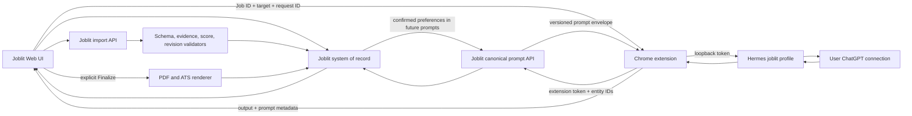

# AI-Native Joblit Platform Design

**Date:** 2026-07-15

**Status:** Accepted

**Decision:** Use Joblit as the deterministic system of record, the Chrome extension as a narrow security bridge, and an official, unmodified Hermes profile as the user's local AI runtime. Do not fork Hermes. Keep manual Skill Pack and optional provider API paths as fallbacks.

## Context

Joblit already owns the durable job-search workflow: authenticated user data, a Master Resume Profile, imported Jobs, `DRAFT`/`FINAL` Applications, structured AI provenance, PDF rendering, extension authentication, ATS autofill, and versioned Skill Pack generation. Its current AI paths are fragmented:

- an external/manual JSON flow;
- an optional server-side model flow;
- a Codex Batch flow;
- a Chrome extension that currently handles Joblit profile data, Seek import, and ATS autofill but does not bridge Joblit to Hermes;
- a local Hermes runtime that can use the user's own ChatGPT access and persist local state, but whose official interactive API cannot deterministically preload one required Skill per request or safely partition built-in memory by request.

The product direction is broader than adding another provider. Joblit should become an AI-native career operating system while preserving factual grounding, user control, predictable scoring, and multi-user security.

This design incorporates useful workflow ideas from the MIT-licensed [`MadsLorentzen/ai-job-search`](https://github.com/MadsLorentzen/ai-job-search/tree/55ba1c16528a63f790eaf7b4bbad567bae6125b3) project at audited commit `55ba1c16528a63f790eaf7b4bbad567bae6125b3`: cheap triage before deep evaluation, generalizing its location/deal-breaker veto into Joblit's broader eligibility model, separate drafting and review, outcome recording before calibration, and semantic skill-gap analysis. Joblit will implement these ideas independently against its own schemas and product boundaries. It will not copy the reference project's prompts, file-based agent state, subjective culture scoring, LaTeX constraints, or single-user assumptions.

## Decision

Adopt a hybrid local-first architecture:

1. **Joblit owns truth and control.** Authentication, authorization, source facts, schemas, score arithmetic, revisions, idempotency, persistence, PDF rendering, and Finalize remain deterministic Joblit responsibilities.
2. **Hermes owns bounded reasoning.** A dedicated per-Joblit-account Hermes profile performs requirement extraction, evidence matching, drafting, reviewing, and interview coaching. Joblit supplies bounded confirmed preferences; first-release Hermes memory stays disabled.
3. **The Chrome extension owns transport.** It obtains canonical prompt envelopes from Joblit with its existing extension credential, calls loopback Hermes, and returns bounded output to the authenticated page for strict import. Neither the web page nor Joblit's cloud receives the Hermes token or the user's ChatGPT credentials.
4. **Users remain in Joblit.** The normal workflow never requires copying prompts, opening ChatGPT, or pasting JSON.
5. **Every new-path generated artifact starts as a proposal.** AI output enters a `DRAFT` Application or another reviewable result. Only an explicit user action may Finalize or submit it. Existing legacy paths remain temporary exceptions during migration and must reach evidence/DRAFT parity before the master program can pass acceptance.
6. **Hermes stays stock.** Joblit consumes documented Hermes HTTP APIs and distributes a minimal Joblit profile/SOUL/Skill package. It does not patch, fork, or publish a custom Hermes runtime.

This decision extends rather than replaces ADR-0001 and ADR-0002. `aiContent`, provenance, stale-write detection, and the unified Generate -> Edit -> Finalize lifecycle remain authoritative.

## Goals

- Give every Joblit user one-click AI analysis, matching, tailoring, review, application-answer, interview, outcome-learning, and upskilling flows.
- Let users use their own local Hermes/ChatGPT setup without exposing those credentials to Joblit.
- Eliminate manual Skill Pack and JSON copy/paste from the primary journey.
- Make every material AI claim traceable to candidate or job evidence.
- Separate eligibility, role fit, preference fit, and confidence instead of presenting a single opaque score.
- Learn from accepted edits and real outcomes without treating correlation as causation.
- Preserve existing Application lifecycle, Skill Pack contracts, PDF rendering, and extension token infrastructure during migration.
- Support `en-AU` and `zh-CN` from the first production release of each capability.

## Non-goals

- Letting AI bypass authentication, ownership checks, schemas, or state transitions.
- Letting AI click a final job-board Submit button without a visible user confirmation.
- Inferring protected traits, personality, or "culture fit" from a Job or candidate.
- Claiming that a rejection proves a particular skill deficit.
- Uploading ChatGPT cookies, Hermes credentials, or local-memory files to Joblit.
- Replacing Joblit with a general-purpose autonomous agent.
- Shipping every capability in one implementation plan. This master design is intentionally decomposed into independently reviewable releases.

## Product Principles

### Evidence before eloquence

Every resume claim, application answer, match assertion, and interview story must cite stable evidence identifiers. Unsupported content is an error, not a creative suggestion.

### AI classifies; deterministic code validates, calculates, and enforces

Hermes performs probabilistic requirement extraction, classification, and evidence matching. Joblit validates references and schemas, computes score arithmetic, checks versions, persists the result, and enforces authorization and state transitions. UI always exposes unknowns and classification confidence.

### Progressive autonomy

Low-risk analysis may run automatically. Content mutations require review. Sensitive answers and final submission require explicit confirmation.

### Local-first, recoverable, optional

Hermes is the primary AI runtime, not a requirement for basic Joblit access. When it is missing, offline, incompatible, or rate-limited, the product remains usable and exposes a clear recovery or fallback path.

### One canonical contract

TypeScript schemas and deterministic validators in Joblit are the source of truth. Skill documents, JSON Schema files, examples, runtime prompts, and evaluator fixtures are generated from or tested against those contracts.

## System Architecture



### Trust boundaries

| Boundary | Authenticated identity / expected fields | Untrusted data | Enforcement |
|---|---|---|---|
| Browser page -> extension | Job ID, target, client request ID | every page-controlled string | exact allowed origin, typed message, size limit, expiry, sender validation |
| Extension -> Joblit | authenticated extension identity and entity IDs | every extension request | existing token ownership, entity ownership, action allowlist, canonical prompt builder |
| Extension -> Hermes | dedicated profile API key and fixed action vocabulary | every request field and model output | loopback-only endpoint, minimal profile toolsets, full versioned Joblit prompt, capability/tool probes, timeouts, response cap |
| Job and company content -> AI | source text and source locations | embedded instructions, markup, tracking content | content/data delimiters, prompt-injection rules, no executable tools |
| Extension -> browser page | request ID, prompt metadata, bounded model output | every model-written byte | exact origin, correlation, status allowlist, response cap |
| AI result -> persistence | authenticated web session and validated evidence references | claims, patches, scores | deterministic validation, ownership/revision checks, atomic `DRAFT` write |

## Capability Model

The platform exposes a closed action vocabulary. Adding an action requires a versioned input schema, result schema, validator, evaluator set, UI state, and failure mapping.

```ts
type AiAction =
  | "PROFILE_NORMALIZE"
  | "JOB_ANALYZE"
  | "JOB_RANK"
  | "MATCH_DEEP"
  | "TAILOR_RESUME"
  | "WRITE_COVER"
  | "REVIEW_APPLICATION"
  | "ANSWER_APPLICATION"
  | "INTERVIEW_PREP"
  | "LEARN_OUTCOME"
  | "PLAN_UPSKILL";
```

### Capability journey

1. **AI Candidate Profile:** normalize the Master Resume Profile into evidence-backed capabilities and preferences.
2. **Job Intelligence:** structure requirements, responsibilities, constraints, uncertainties, and source spans.
3. **Triage Ranking:** cheaply rank many Jobs and identify likely hard blocks.
4. **Deep Match:** produce evidence-level fit analysis and deterministic scores.
5. **Application Pack:** create resume, cover, and application-answer proposals.
6. **Independent Review:** review in a separate Hermes session and return patches, not rewritten blobs.
7. **PDF and ATS Review:** verify layout plus the extracted PDF text layer.
8. **Autofill Support:** map confirmed profile and application answers onto ATS fields.
9. **Interview Coach:** prepare evidence-backed questions, STAR stories, and practice feedback.
10. **Outcome Learning:** store facts first, then update derived preferences from repeated evidence.
11. **Career Copilot:** recommend next applications, learning priorities, and weekly actions.

## Canonical Data Contracts

### Candidate snapshot

`CandidateSnapshot` is an immutable view of one `ResumeProfile` revision. It contains facts, preferences, and stable evidence identifiers. It must not contain inferred achievements.

Evidence IDs use a deterministic hash of profile ID, revision, canonical JSON Pointer, and normalized value. An edit creates a new revision and therefore a new evidence namespace; old Applications retain their original references.

```ts
type CandidateEvidence = {
  id: string;
  kind: "summary" | "experience" | "project" | "skill" | "education" | "credential" | "preference";
  jsonPointer: string;
  text: string;
  locale: "en-AU" | "zh-CN";
};

type CandidateSnapshot = {
  profileId: string;
  revision: number;
  locale: "en-AU" | "zh-CN";
  evidence: CandidateEvidence[];
  careerPreferenceRevision?: number;
  preferences?: CareerPreferenceSnapshot;
};
```

`CareerPreferenceSnapshot` comes from a new user-owned `CareerPreference` record, not from model inference or an overloaded resume field. It separates job preferences from eligibility facts and sensitive application answers. Missing fields remain `unknown`.

```ts
type CareerPreferenceSnapshot = {
  locations: string[];
  workArrangements: Array<"remote" | "hybrid" | "onsite">;
  targetRoles: string[];
  salaryText?: string;
  eligibility: Array<{
    jurisdiction: string;
    workAuthorization: "citizen" | "permanent_resident" | "visa" | "other" | "unknown";
    sponsorshipRequired: boolean | "unknown";
    expiresAt?: string;
  }>;
};
```

### Job snapshot

`JobSnapshot` freezes one Job version and turns source spans into stable requirement IDs. Job-board text remains untrusted content.

```ts
type JobRequirement = {
  id: string;
  category: "required" | "preferred" | "responsibility" | "eligibility";
  dimension: "skill" | "experience" | "seniority" | "domain" | "education" | "credential" | "language" | "location" | "authorization" | "clearance";
  scoreBucket: "required_skills" | "responsibilities_experience" | "seniority_scope" | "preferred_skills" | "domain_experience" | "education_credentials_language" | "eligibility_only";
  text: string;
  mandatory: boolean | "unknown";
  importance: 1 | 2 | 3;
  normalizedConstraint?: {
    jurisdiction?: string;
    operator: "equals" | "includes" | "at_least" | "at_most" | "required";
    value: string | number | string[];
    unit?: string;
  };
  extractionConfidence: number;
  sourceStart: number;
  sourceEnd: number;
};

type JobSnapshot = {
  jobId: string;
  contentHash: string;
  title: string;
  company?: string;
  locale: "en-AU" | "zh-CN";
  sourceText: string;
  requirements: JobRequirement[];
};
```

`contentHash` is SHA-256 over canonical Job fields and normalized source text. It does not use `updatedAt`, because timestamp-only upserts must not invalidate an assessment.

### Snapshot persistence

Candidate and Job snapshots are materialized, content-addressed records rather than transient views over mutable rows. A new user-scoped `AiSnapshot` store contains `kind`, source entity ID, source revision, canonical SHA-256, schema version, and validated payload. It deduplicates by `(userId, kind, sourceEntityId, contentHash)`.

`Application`, `JobAssessment`, and other durable AI artifacts reference the exact snapshot IDs used to create them. Deleting a source Job or Profile immediately deletes unreferenced snapshots; snapshots referenced by a retained Application/Assessment remain until that artifact is deleted. Account deletion removes every snapshot and artifact. Superseded snapshots remain available only while referenced, so historical evidence links do not silently point at edited profile or Job content.

### Local AI prompt envelope

The web page never sends a resume, Job description, or page-authored prompt to
the extension. It sends only `jobId`, target, and a client-generated request ID
through the dedicated content-script bridge. The extension uses its own Joblit
extension token to fetch the canonical prompt envelope from an extension-auth
endpoint that rechecks entity ownership.

```ts
type LocalAiPromptEnvelope<T> = {
  requestId: string;
  action: AiAction;
  contractVersion: string;
  promptVersion: string;
  outputSchemaVersion: string;
  ruleSetVersion: number;
  locale: "en-AU" | "zh-CN";
  candidateSnapshotId?: string;
  candidateRevision?: number;
  jobSnapshotId?: string;
  jobContentHash?: string;
  applicationRevision?: number;
  expiresAt: string;
  confirmedPreferenceSnapshotId?: string;
  promptHash: string;
  systemPrompt: string;
  userPrompt: string;
  input: T;
};
```

The complete prompt is produced by Joblit's versioned prompt builder and is the
authoritative execution contract. The extension does not accept page-supplied
prompts and does not ask Hermes to choose a Skill. Expiry, ownership, prompt
hash, and source revisions are enforced before the payload is returned and
again before a result is imported. Confirmed
preferences are materialized by Joblit and injected as bounded data, not
granted as a model-controlled memory-write permission.

### AI result envelope

```ts
type LocalAiResultEnvelope<T> = {
  requestId: string;
  action: AiAction;
  contractVersion: string;
  result: T;
  evidenceIds: string[];
  requirementIds: string[];
  unknowns: Array<{ code: string; message: string }>;
  runtime: {
    provider: "hermes" | "provider" | "manual" | "codex_batch";
    durationMs: number;
    modelLabel?: string;
    runId?: string;
    promptVersion: string;
    advertisedModel?: string;
    promptPackageVersion: string;
    locallyVerifiedProfilePackageVersion?: string;
  };
};
```

Business result schema is independent from runtime provenance. Runtime metadata
comes from the extension and official Hermes responses, never from model-written
JSON. `locallyVerifiedProfilePackageVersion` is present only when a Joblit local
installer/verifier supplied it; stock Hermes HTTP endpoints cannot report or
attest that package version. The import endpoint rejects mismatched request
metadata, actions, contract versions, prompt versions/hashes, evidence IDs,
requirement IDs, ownership, or source revisions.

### Patch contract

Final-state content changes use stable targets rather than whole-document replacement.

```ts
type EvidencePatch = {
  patchId: string;
  targetId: string;
  expectedRevision: number;
  operation: "replace" | "insert_after" | "remove";
  value?: string;
  reason: string;
  evidenceIds: string[];
  requirementIds: string[];
  risk: "low" | "medium" | "high";
};
```

Phase 1 may adapt existing `cvSummary`, `latestExperience.bullets`, `skillsFinal`, and three-paragraph `cover` output into patches at the server boundary. New AI actions must emit patches natively.

### Feedback event

Learning uses server-created append-only facts, not silent model interpretation. Clients and models cannot choose `userId`, event ID, sequence, timestamp, or source revision.

```ts
type PreferenceValue =
  | { key: "target_roles"; value: string[] }
  | { key: "locations"; value: string[] }
  | { key: "work_arrangements"; value: Array<"remote" | "hybrid" | "onsite"> }
  | { key: "salary_text"; value: string }
  | { key: "writing_style"; value: { locale: "en-AU" | "zh-CN"; traits: string[] } };

type FeedbackPayload =
  | { type: "PATCH_DECIDED"; patchId: string; decision: "accepted" | "rejected" | "edited"; finalTextHash?: string }
  | { type: "APPLICATION_FINALIZED"; applicationId: string; applicationRevision: number }
  | { type: "APPLICATION_SUBMITTED"; applicationId: string; submittedAt: string }
  | { type: "APPLICATION_OUTCOME"; applicationId: string; outcome: "interview" | "offer" | "rejection" | "no_response" }
  | { type: "PREFERENCE_CONFIRMED"; preferenceId: string; value: PreferenceValue }
  | { type: "MEMORY_OVERRIDDEN"; memoryId: string; replacement?: PreferenceValue }
  | { type: "MEMORY_TOMBSTONED"; memoryId: string };

type AiFeedbackEvent = FeedbackPayload & {
  eventId: string;        // server generated
  userId: string;         // session derived
  sequence: number;       // server monotonic per user
  occurredAt: string;     // server generated
  sourceRevision: string; // server generated
};

type DerivedPreferenceProposal = {
  proposalId: string;
  proposedValue: PreferenceValue;
  sourceEventIds: string[];
  confidence: number;
  requiresConfirmation: true;
};
```

The canonical preference registry maps each allowlisted key to a value schema, maximum item/text lengths, locale rules, and sensitivity classification. Overrides must use the original key's schema; unknown keys, free-form blobs, and sensitive eligibility answers are rejected from derived memory.

`LEARN_OUTCOME` returns only `DerivedPreferenceProposal[]` under a read-only policy. Joblit creates feedback events from authenticated product actions and requires user confirmation before a derived preference affects `Preference Fit`. Confirmation writes the Joblit ledger and future runs receive a fresh bounded snapshot of confirmed preferences. Correction and deletion create override/tombstone events, so rebuilding that snapshot cannot resurrect removed entries. The first-release generation profile does not write Hermes memory. Accepted wording may teach presentation style; it never becomes a new career fact.

## Local Run Lifecycle

The first release coordinates one browser-visible local run without a new
Prisma task table. Canonical source data and imported output remain in Joblit;
the extension retains only bounded transient run coordination.

```text
IDLE -> STARTING -> QUEUED -> RUNNING -> IMPORTING -> SUCCEEDED
           |          |          |           |
           +--------> FAILED <---+-----------+
                       +-------> CANCELLED
                       +-------> RUN_LOST
```

- The authenticated page creates a random `requestId`; the bridge rejects malformed, expired, oversized, or recently replayed starts.
- The extension fetches the canonical prompt with its own Joblit token. A token/account mismatch or inaccessible Job fails before Hermes starts.
- The extension maps `requestId` to one Hermes `runId` in `chrome.storage.session`. A duplicate start for the same active request returns the existing mapping.
- Stock `POST /v1/runs` is not idempotent and ignores `Idempotency-Key`. After an ambiguous start response, Joblit reports `RUN_START_UNKNOWN` and never silently retries with the same request.
- Each page poll triggers at most one short `GET /v1/runs/{id}` call. Terminal statuses are cached in bounded extension session state.
- Stop maps to `/v1/runs/{id}/stop`. `cancelled` is shown only after Hermes reports terminal cancellation; `stopping` remains in progress.
- Hermes restart or expired run status maps to `RUN_LOST`; user retry gets a new request ID and new run. Existing `DRAFT`/`FINAL` Application data is unchanged.
- Completed model output plus authoritative `promptMeta` returns to the authenticated page, which calls the existing strict import endpoint. Only that endpoint may persist a `DRAFT` Application.
- `Application.applicationRevision` is a later hardening migration, not an existing field or first-release blocker. Existing prompt metadata and `aiContentHash` remain stale/dirty hints, never security boundaries.
- Durable background coordination, cross-device execution, or offline continuation may introduce a server `AiTask` later; it is not a first-release dependency.

## Matching and Scoring

### Two-stage evaluation

**Triage** processes many Jobs with a compact candidate capability index. It returns eligibility risk, coarse fit bands, confidence, and the highest-value reasons. It does not generate application content.

**Deep Match** evaluates one Job requirement by requirement against the full immutable snapshots.

### Eligibility

Eligibility is separate from fit:

- `PASS`: every known hard gate is met.
- `RISK`: at least one hard gate is ambiguous or missing source information.
- `BLOCK`: a confirmed mandatory gate is not met.

Hard gates are limited to work authorization/visa, location where non-negotiable, security clearance, legally required licence/certification, mandatory language, and explicitly mandatory education or experience. Hermes identifies candidate evidence and uncertainty; Joblit applies the state rule. Missing candidate data produces `RISK`, not `BLOCK`. `BLOCK` requires an explicitly mandatory requirement plus evidence that the candidate does not satisfy it.

### Role fit

Role-fit weights are deterministic:

| Dimension | Weight |
|---|---:|
| Required skills | 30 |
| Responsibilities and demonstrated experience | 25 |
| Seniority and scope | 15 |
| Preferred skills | 10 |
| Domain experience | 10 |
| Education, credentials, and language | 10 |

Hermes returns a typed matrix; it never returns the aggregate score:

```ts
type RequirementAssessment = {
  requirementId: string;
  applicability: "applicable" | "not_applicable" | "unknown";
  verdict: "met" | "partial" | "missing" | "unknown";
  evidenceIds: string[];
  reasonCode: string;
  classificationConfidence: number;
};
```

`scoreBucket` is frozen in the validated Job Snapshot and a requirement belongs to exactly one bucket. Mapping is deterministic: required skill -> `required_skills`; preferred skill -> `preferred_skills`; responsibility or general experience -> `responsibilities_experience`; seniority -> `seniority_scope`; domain -> `domain_experience`; education/credential/language -> `education_credentials_language`; hard constraints -> `eligibility_only` and never affect role fit. Joblit rejects incompatible category/dimension/bucket combinations.

Joblit deterministically deduplicates requirements by normalized bucket, constraint, and text while retaining all source spans. A bucket with no applicable or potentially applicable requirement is removed and remaining bucket weights are renormalized to 100. Inside each bucket, requirement weight is proportional only to the frozen Job Snapshot `importance`; the assessment cannot change it.

`met = 1`, `partial = 0.5`, and confirmed `missing = 0`. `unknown` contributes 0 to the lower bound and 1 to the upper bound. Joblit returns:

- `roleFit`: conservative lower-bound score;
- `possibleRoleFitRange`: lower and upper score bounds;
- `assessmentCoverage`: known assessed weight divided by total applicable-or-unknown weight;
- `evidenceCoverage`: known weight backed by valid candidate evidence or a structured absence proof, divided by known weight;
- `classificationConfidence`: weighted mean of assessment `classificationConfidence` values.

`not_applicable` is excluded from the denominator. An empty or incomplete Candidate Snapshot produces `unknown`, never confirmed `missing`. UI headline confidence is the minimum of the three confidence components and exposes all three in details. Given the same Job Snapshot and assessment matrix, the calculator must return exactly the same score.

### Preference fit and confidence

Preference fit is a separate 0-100 score based only on explicit user preferences. It must not change role fit.

Headline confidence uses the scoring definition above. Low confidence is displayed prominently; it is never hidden behind a precise-looking score.

No culture-fit, personality, age, gender, ethnicity, health, family-status, or other protected-trait inference is permitted.

## Application Pack and Review

### Generation

One user action may orchestrate `MATCH_DEEP`, `TAILOR_RESUME`, `WRITE_COVER`, and supported `ANSWER_APPLICATION` operations. Each operation remains separately retryable and versioned.

The first release reuses the existing strict resume and cover output contracts:

- resume: `cvSummary`, `latestExperience.bullets`, `skillsFinal` with no more than five skill categories;
- cover: `cover.paragraphOne`, `cover.paragraphTwo`, and `cover.paragraphThree`, plus currently supported optional metadata.

The new local-AI path uses strict parsing. It may retry Hermes once with validation errors, then fails visibly. A deterministic server adapter reuses the current `manualImportParser` canonicalization rules while writing `aiContent` v2 provenance:

- existing bullets are matched by normalized exact match, then the existing high-similarity threshold;
- unmatched incoming bullets become reviewable AI-added proposals;
- unused base bullets remain; omission is not treated as AI-authorized deletion;
- duplicate and ungrounded additions remain visible but disabled by a quality gate;
- `skillsFinal` is compared case-insensitively against base categories/items; only new items become additions, omissions never delete base skills, and ordering changes carry no factual meaning;
- empty proposal arrays are valid and never erase base content.

The tolerant legacy parser remains isolated to legacy manual/provider compatibility until those paths adopt the same strict evidence adapter.

### Independent review

`REVIEW_APPLICATION` runs with a new `session_id`, no `previous_response_id`, and no conversation history from the drafter. It receives canonical snapshots, the proposed artifact, and validation findings. It returns evidence patches covering:

- unsupported or overstated claims;
- missed high-value requirements;
- repetition and keyword stuffing;
- unnatural or generic language;
- locale and market conventions;
- ATS-hostile structure;
- internal contradictions.

Review never silently edits the Application. The user accepts, rejects, or edits each patch.

### Finalize

Introduce `resumeStatus` and `coverStatus` with `ABSENT | DRAFT | FINAL`, plus the authoritative integer `applicationRevision`. Existing `Application.status` remains the aggregate compatibility field: it is `DRAFT` while any requested artifact is `DRAFT`, and `FINAL` when at least one artifact is `FINAL` and no requested artifact remains `DRAFT`.

Target-specific Finalize updates only that artifact status, then recomputes the aggregate in the same transaction. The single UI Finalize action invokes a pack orchestrator for all requested artifacts; partial rendering leaves the Application `DRAFT` and identifies the failed artifact. This replaces the current unsafe behavior where finalizing either target marks the entire Application `FINAL`.

Finalize requires `applicationRevision`, revalidates evidence and schema, and increments the revision atomically. PDF extracted-text verification becomes a mandatory Phase 5 gate; until then existing rendering remains available but cannot claim full master-program acceptance. `aiContentHash` remains only a non-security UX hint.

### `aiContent` v1 to v2 migration

Readers use a `schemaVersion` discriminated union and never reinterpret v1 as evidence-complete v2. New local-AI writes use v2 only. Historical v1 rows remain readable and editable through the labelled legacy path during Phases 1-3; their missing evidence cannot be invented or backfilled from the current mutable Profile/Job.

Re-generation creates new snapshots and replaces v1 with v2. At the end of Phase 4, v1 Finalize is disabled: users may view/download an existing final artifact, but a v1 draft must be regenerated before a new Finalize. No bulk migration fabricates provenance.

Per-artifact state backfill uses this matrix:

| Historical state | Resume state | Cover state | Artifact-state version |
|---|---|---|---:|
| `resumePdfUrl` and `coverPdfUrl` present | `FINAL` | `FINAL` | 1 |
| only `resumePdfUrl` present | `FINAL` | `ABSENT` | 1 |
| only `coverPdfUrl` present | `ABSENT` | `FINAL` | 1 |
| `DRAFT`, non-empty CV proposal only | `DRAFT` | `ABSENT` | 1 |
| `DRAFT`, non-empty cover proposal only | `ABSENT` | `DRAFT` | 1 |
| `DRAFT`, both proposals non-empty | `DRAFT` | `DRAFT` | 1 |
| `FINAL`, no artifact URL, target not provable | unset and ignored | unset and ignored | 0, preserve legacy aggregate status |

Empty default CV/cover placeholders do not prove that target was requested. `artifactStateVersion = 0` rows remain legacy read-only for target Finalize until re-generation sets explicit v2 artifact state.

AI never presses a job-board final Submit button. Autofill may prepare the form; the user reviews and submits it.

## Hermes Runtime and Skill Design

### Dedicated profile

Each connected Joblit account uses one dedicated stock Hermes profile named
`joblit-<opaqueAccountHash>`. Joblit does not create, fork, or patch a Hermes
runtime. The existing extension token identifies the Joblit account for Joblit
API calls; it is not reused as the Hermes API credential. Each profile has its
own API key, sessions, state, and—when multiple profiles run concurrently—port.
Account switching provisions or selects a different profile instead of relying
on a session header for tenant isolation. Each profile explicitly completes its
own OAuth flow; missing profile credentials must not silently rely on global
fallback auth. A Hermes profile is state isolation, not cryptographic account
attestation or an OS sandbox.

A minimal Joblit profile distribution is installed under that profile. It owns
only product defaults; credentials and user state stay installer-owned:

```text
joblit-hermes/
|-- distribution.yaml
|-- config.yaml
|-- SOUL.md
|-- .no-bundled-skills
|-- joblit-package-manifest.json
|-- joblit-package-manifest.sig
`-- skills/
    `-- joblit-career-agent/
```

The profile uses Hermes' `openai-codex` provider with
`model.openai_runtime: auto`. Users authorize their own ChatGPT subscription
through Hermes' model picker/device-code flow. The optional
`codex_app_server` runtime is forbidden for Joblit because its Codex-native
shell and patch tools remain available independently of Hermes platform
toolsets.

The profile config sets `platform_toolsets.api_server` to `[no_mcp]`, installs
no third-party plugins, and disables terminal, file, browser, web,
code-execution, cron, delegation, session-search, memory, and Skill-management
toolsets for API generation. Built-in and external Hermes memory are disabled
in the first release; Joblit injects confirmed preferences on every run.
`skills.write_approval` is defense in depth for interactive model-originated
Skill maintenance only; the API generation surface exposes no Skill-management
tools. This is profile-level configuration, not a per-request policy or OS
sandbox.

```yaml
platform_toolsets:
  api_server:
    - no_mcp
  cron:
    - no_mcp
memory:
  memory_enabled: false
  user_profile_enabled: false
agent:
  disabled_toolsets:
    - memory
    - session_search
```

The API server is configured only through the dedicated profile's environment:

```dotenv
API_SERVER_ENABLED=true
API_SERVER_HOST=127.0.0.1
API_SERVER_PORT=8642
API_SERVER_KEY=<random high-entropy local key>
```

### Local bootstrap boundary

A web page or ordinary Chrome extension cannot run `hermes profile install`,
write profile `.env`, inspect final config, or start a gateway. The first release
therefore ships a user-launched **Joblit Local Bootstrap** and labels the feature
`Hermes Local AI Beta`. The bootstrap downloads a signed release into a stable
local cache, verifies signature/hash/path allowlists, installs or updates the
account-specific profile with the intended config, generates its key/port,
starts or restarts the gateway, reads configuration back, and emits connection
details for the trusted extension UI. No Hermes source is modified.

A later signed native installer may register a Chrome Native Messaging host to
make this one-click. Until that host exists, onboarding must show the manual
local setup step and must not claim the extension installed or attested Hermes.
Production readiness uses the signed profile-distribution path only; a Skills
tap may support manual Hermes users but is never a second API-readiness source.

The Joblit installer/verifier checks the active profile config and package
manifest after every install/update: expected profile label, `openai-codex`,
`model.openai_runtime: auto`, `[no_mcp]`, disabled toolsets/memory, plugins, bind,
port, and API-key presence. The extension connects only to loopback and never
enables browser CORS. It checks `/health`, `/v1/capabilities`, `/v1/models`, and
`/v1/toolsets` for API compatibility and the advertised Hermes toolsets.
Stock HTTP probes do not expose the active provider/runtime, inherited default
MCP servers, or Codex app-server built-ins; they cannot replace local config
verification or serve as runtime attestation.

Official Hermes may persist sessions and Responses state. Joblit therefore
does not claim zero local retention. Session IDs are purpose-specific and local
history controls are visible. Reduced-history mode deletes a completed Hermes
transcript through the Sessions API after successful import; this does not clear
Responses storage, profile memory, external providers, logs, run-status TTL
records, or provider-side retention. Joblit telemetry remains content-free.

### Skill package

One versioned umbrella Skill simplifies manual Hermes invocation and source organization while keeping instructions modular:

```text
joblit-career-agent/
|-- SKILL.md
`-- references/
    |-- action-contracts.md
    |-- evidence-policy.md
    |-- match-scoring.md
    |-- resume-tailoring.md
    |-- cover-letter.md
    |-- application-answers.md
    |-- application-review.md
    |-- interview-coach.md
    |-- outcome-learning.md
    |-- upskilling.md
    |-- locale-en-AU.md
    `-- locale-zh-CN.md
```

The root skill routes by `AiAction`; references contain action-specific rules.
Deterministic validation stays in Joblit and the extension, not in model-invoked
scripts. Evaluation fixtures live in `tests/ai-evals/joblit-career-agent/`,
outside the runtime Skill package.

The root `joblit-package-manifest.json` is generated, not model-authored. It
records package version, compatible Hermes versions, source commit, allowed
paths, sizes, SHA-256 values, and security-policy hash. A detached Ed25519
signature is verified with a Joblit release public key before install. The
release artifact root contains only allowlisted distribution files because
stock distribution ownership metadata is not treated as a sufficient copy
boundary. Stock `profile update` preserves existing `config.yaml` unless
forced, so the verifier always rechecks active config after update. This
protects distribution integrity; it does not prove a particular run loaded a
Skill.

`distribution.yaml` still declares the exact `distribution_owned` paths,
including `.no-bundled-skills`, but Bootstrap and CI independently enforce the
same allowlist. CI installs the release artifact into a temporary profile and
asserts the resulting file tree. Development repository metadata, tests,
workflows, and documentation never ship as the distribution source.

### API execution contract

The official `/v1/runs` endpoint has no `skills` field and does not execute the
CLI/gateway `/skill-name` parser. `/v1/skills` exposes discovery metadata only.
Joblit therefore never depends on model-selected `skill_view` or slash-command
activation for API correctness.

For every run, Joblit compiles the action-specific Skill rules into the
versioned `systemPrompt` and sends the complete prompt contract:

```http
POST /v1/runs
Authorization: Bearer <local API_SERVER_KEY>
Content-Type: application/json
```

```json
{
  "input": "<versioned Joblit user prompt>",
  "instructions": "<versioned Joblit system prompt and output contract>",
  "session_id": "joblit:<jobId>:<action>:<attemptId>"
}
```

`/v1/runs` reads `session_id` from the JSON body; it does not use
`X-Hermes-Session-Id`. `X-Hermes-Session-Key` is reserved for a future explicit
external-memory-provider release. It scopes providers such as Honcho, not
Hermes built-in `MEMORY.md`/`USER.md`, and is not authentication.

The installed Skill remains valuable for manual Hermes use, transparent user
inspection, and shared source material. Joblit's prompt builder and the Skill
package are generated from or tested against the same contracts so they cannot
silently diverge.

## Chrome Extension Bridge

### Web-to-extension transport

Use a dedicated content script on `https://www.joblit.tech/*` and a typed
`window.postMessage` bridge into the extension service worker. This avoids
shipping or guessing the Chrome Web Store extension ID. The bridge accepts only
`GET_STATUS`, `START_RUN`, `GET_RUN`, and `STOP_RUN`; it validates
`event.source`, origin, request ID, action, byte size, expiry, and rate limits.
The service worker independently validates every message before touching local
credentials or HTTP.

Start messages contain only `jobId`, target, request ID, expiry, and bridge
nonce. The extension fetches the canonical prompt/input with its Joblit token.
Poll responses may return bounded model output and authoritative `promptMeta`
to the authenticated page for strict import. Messages never contain the Joblit
extension token, Hermes API key, provider OAuth credentials, Resume Profile, Job
description, page-authored prompt, or unrestricted URL/path data. Every payload
is typed, bounded, correlated, and treated as untrusted by both sides.

### Extension-to-Hermes transport

- Default endpoint: `http://127.0.0.1:8642`. Custom endpoints may use only `http`, `127.0.0.1`, `[::1]`, or validated `localhost`; credentials, query, fragment, non-root base path, DNS hostnames, and redirects are rejected.
- Chrome host permission is exact by scheme and host; match patterns cannot restrict ports. Runtime validation separately pins the configured port and allowed Hermes paths.
- On extension startup, call `chrome.storage.local.setAccessLevel({ accessLevel: "TRUSTED_CONTEXTS" })` before reading secrets. Both the Joblit extension token and dedicated Hermes API key remain background/popup-only. Content-script preference access moves to typed background RPC.
- Start work through official `/v1/runs`, persist the `requestId` to Hermes `runId` mapping in extension-owned `chrome.storage.session`, then poll `/v1/runs/{id}` or call `/v1/runs/{id}/stop`. The extension prevents normal duplicate starts for an active request; stock Runs has no idempotency-key behavior.
- Apply connect, first-byte, total-run, and idle timeouts.
- Cap request and response sizes by action.
- Use `AbortController` for cancellation.
- Redact content from logs and error telemetry.
- In reduced-history mode, attempt fixed-route `DELETE /api/sessions/{sessionId}` after success/import, failure, or cancellation. Treat it as best-effort logical transcript deletion, never secure erase or zero-retention proof.

On Joblit sign-out, account switch, token revocation, or Hermes profile deletion,
the extension stops tracked old-account runs, forgets the stored Hermes API key,
clears account/profile bindings and run IDs, and requires a fresh connection to
the correct account-specific profile before new work. It never deletes a user's
Hermes profile or auth credentials without a separate explicit local action.

### Progress and recovery

The page polls one short extension request at a time; each request makes at most
one short Hermes status call, and the service worker never holds a long-running
Promise that Chrome may suspend. Extension-owned `chrome.storage.session` keeps
the request/run mapping across service-worker suspension. The page keeps only
its current request ID in page `sessionStorage`; refresh may resume while the
extension session and Hermes run status still exist. Browser restart, Hermes
restart, or expired run status maps to `RUN_LOST` and a user-visible retry.
Canonical content remains in the existing Application workflow, so a lost local
run never corrupts an Application.

User-facing failures map to stable codes such as:

- `EXTENSION_NOT_INSTALLED`
- `EXTENSION_NOT_CONNECTED`
- `HERMES_OFFLINE`
- `HERMES_AUTH_FAILED`
- `HERMES_INCOMPATIBLE`
- `PROFILE_PACKAGE_MISSING`
- `PROFILE_CONFIG_UNVERIFIED`
- `UNSAFE_TOOL_SURFACE`
- `AI_RATE_LIMITED`
- `AI_TIMEOUT`
- `RUN_START_UNKNOWN`
- `RUN_LOST`
- `INVALID_AI_RESULT`
- `STALE_INPUT`
- `REQUEST_EXPIRED`

Each error has one primary recovery action. Raw model or transport errors are not shown to users.

## Memory and Learning

Joblit stores source facts, append-only feedback events, and a structured
derived-preference ledger. That ledger is the only authoritative preference
source. Every AI run receives a bounded snapshot of user-confirmed preferences,
so generation correctness never depends on Hermes memory.

Hermes built-in memory is profile-wide; `X-Hermes-Session-Key` does not partition
it. The first-release generation profile therefore disables built-in memory,
external memory providers, and memory/session-search tools. Honcho is also
disabled because it adds separate storage, inference, retention, cost, and no
request-scoped write acknowledgement. A later opt-in Hermes-memory release needs
its own isolation, approval, inspection, deletion, and retention design.

The following update policy applies only to Joblit's derived-preference ledger:

- explicit preferences;
- accepted or user-edited patches that were later Finalized, for style preference only;
- actual submission/interview/offer/rejection events;
- repeated behavior with at least two independent observations.

Generated drafts, model guesses, a single rejection, and no-response outcomes do not become facts. Rejection and no-response are weak signals used only in aggregate.

The Memory Center lets users:

- inspect derived memories and their source events;
- correct or delete an item;
- disable learning while retaining generation;
- open separate Hermes local-history controls;
- clear tracked local Hermes transcripts where the official Sessions API permits;
- rebuild Joblit's confirmed-preference snapshot on a new device.

Raw resume and Job content remains in Joblit's user-owned records and
materialized snapshots. Official Hermes may persist local session/Responses
state, so onboarding and Settings state this accurately. Reduced-history mode
deletes the completed transcript through the Sessions API after successful
import. It is not a non-persistence guarantee and does not clear Responses
storage, profile memory, external providers, logs, run-status TTL records, or
provider-side retention. Neither mode changes Joblit's content-free telemetry.

## User Experience

### AI onboarding

The Settings flow uses one guided sequence:

1. Detect the Joblit Chrome extension.
2. Connect the existing Joblit extension token.
3. Run the Joblit installer/verifier for the account-specific official Hermes profile and complete that profile's `openai-codex` device-code sign-in.
4. Revalidate profile config/package state, then store its loopback endpoint and dedicated API key in trusted extension storage.
5. Probe stock `/health`, `/v1/capabilities`, `/v1/models`, and `/v1/toolsets` for API compatibility, expected advertised profile label, and observable Hermes toolsets. State clearly that HTTP cannot attest provider/runtime or Codex-native tools.
6. Run one explicit low-sensitivity model connection test. Label that this may create local Hermes session/Responses state.
7. Show `Local AI Ready` with advertised profile, endpoint, locally verified package version, history mode, and a link to rerun verification after updates.

Advanced endpoint and diagnostics stay collapsed. Normal users do not paste prompts or Skill files.

### Jobs experience

Job cards show eligibility, role fit, confidence, and at most two concise reasons. Deep evidence, gaps, and unknowns live in the Job detail panel. Scores never appear until analysis exists.

Primary action: **Create application pack**. Progress uses named stages, elapsed time, cancel, and recoverable retry. The user may continue browsing while a local run remains attached to the current browser session.

### Review experience

One canonical full-screen editor presents:

- resume and cover tabs within the same Application;
- before/after diff;
- evidence and requirement links;
- Accept, Reject, Edit, and Reset to AI;
- reviewer findings grouped by severity;
- desktop/mobile preview and final PDF preview;
- a single explicit Finalize action.

Motion communicates state changes only, respects reduced-motion preferences, and never blocks input.

### Fallbacks

If local AI is unavailable, Joblit offers:

1. reconnect or repair Hermes;
2. retry after rate limits/timeouts;
3. optional provider API path when configured;
4. manual Skill Pack export/import as the last-resort compatibility path.

New-path fallbacks converge into the same `DRAFT` Application and review editor. Legacy manual/provider paths receive the same contract adapter by Phase 4; until then UI labels their weaker provenance and they are excluded from master-program acceptance.

## Security and Privacy Requirements

- Accept only a fixed loopback Hermes base URL and a dedicated high-entropy `API_SERVER_KEY`; stock Hermes keys are API-wide, not route-scoped.
- Set Chrome local storage to `TRUSTED_CONTEXTS`; keep both Joblit extension and Hermes tokens out of page context, content scripts, logs, analytics, and server payloads.
- Enforce exact production origin, `event.source`, direction marker, request ID, action allowlist, schema, byte limit, expiry, and rate limit on the content-script bridge.
- Treat Job descriptions, company pages, form labels, and AI output as untrusted data.
- Send the complete versioned Joblit instructions and output schema on every `/v1/runs` call; never depend on server-preloaded Skill selection or slash-command activation.
- Ship the dedicated profile with MCP inheritance disabled and a zero-tool API surface. Require local installer/verifier checks for `openai_runtime: auto`; HTTP probes alone cannot detect Codex app-server built-ins or the active provider/runtime.
- Do not expose a generic Hermes proxy to page code. Allow only status, start, poll, and stop operations on fixed Hermes routes.
- Keep generation-time terminal, filesystem, browser, code execution, Skill management, cron, and delegation outside the supported Joblit profile surface.
- Validate action-specific JSON Schema, semantic evidence references, byte size, prompt hash/metadata, entity ownership, and available source revisions before persistence.
- Rate-limit canonical-prompt creation by user and local-run starts in the extension.
- Use expiring bridge nonces and request IDs; reject normal replay without claiming Hermes Runs idempotency.
- Log only request ID, action, stage, duration, error code, contract version, and prompt-package version.
- Add explicit controls for Joblit derived-memory inspection/deletion/opt-out and separately labelled Hermes transcript controls.
- Run a threat-model review before public enablement.

## Observability

Joblit records content-free operational events:

- run action and terminal state;
- queue, local runtime, validation, and persistence durations;
- contract and prompt-package versions;
- retry count and stable error code;
- result destination type;
- user acceptance/rejection aggregates with no generated text.

Dashboards track completion rate, invalid-result rate, stale-input rate, local-runtime availability, median/p95 latency, fallback usage, and accepted-patch rate. No dashboard contains resume, Job-description, cover-letter, application-answer, token, or Hermes-memory content.

## Testing and Quality Gates

### Contract and security tests

- JSON Schema and semantic validators for every action.
- Cross-user canonical-prompt and extension-token rejection.
- bridge nonce replay, expiry, duplicate terminal response, stale prompt metadata, oversized payload, and unsupported action tests.
- exact origin and malicious `window.postMessage` tests.
- prompt-injection fixtures embedded in Job descriptions and ATS labels.
- proof that page/content-script contexts cannot read either token.
- startup assertion that Chrome storage is restricted to trusted extension contexts.
- local verifier tests for unsafe provider/runtime/profile config, plus extension tests for non-loopback endpoint, credential-bearing URL, redirect, unexpected advertised tool surface, and malformed capability responses.
- bridge direction spoofing, unknown action, replayed/expired request ID, oversized payload, unrestricted path, and attempted generic-proxy tests.
- concurrent double-submit, restart-then-resume, malformed JSON, duplicate JSON key, stale input, and result-schema downgrade tests.

### Runtime and extension tests

- Hermes offline, wrong token, missing profile package metadata, incompatible API, malformed run/status response, timeout, cancellation, service-worker restart, and `RUN_LOST` recovery.
- one successful result imported once despite duplicate terminal polling.
- web reconnect/poll recovery after content-script or service-worker restart.
- read-only health probes proving no `/v1/runs` call occurs; the separate model test is explicit and user-visible.

### AI evaluations

Maintain at least 100 golden Job/candidate pairs, at least 40 per locale, including at least 25 confirmed hard-gate blocks and 25 hard-gate non-blocks. Cover strong, weak, sparse, seniority-mismatched, visa-constrained, ambiguous, adversarial, and unsupported-claim cases. Every prompt-package change runs:

- released prompt-package evaluation;
- minimal-instruction baseline;
- previous released prompt-package comparison;
- human-readable evaluator report.

Release gates:

- 100% schema-valid results after no more than one repair retry;
- zero unsupported material claims in the release golden set;
- 100% valid evidence coverage for every persisted material claim;
- 100% hard-gate recall and zero false `BLOCK` decisions in the release golden set;
- measured separately for each locale: at least 98% required-requirement extraction recall and at least 95% preferred-requirement precision and recall;
- measured separately for each locale: at least 95% macro accuracy for category, dimension, score bucket, and mandatory classification;
- 100% extracted source spans resolve to the annotated source text, and duplicate-collapse precision/recall are each at least 95%;
- zero calculator drift for an identical `RequirementAssessment` matrix;
- at least 95% requirement-verdict agreement across three repeated model runs, with no more than five lower-bound role-fit points of end-to-end variation;
- zero critical prompt-injection successes;
- no cross-user access or token exposure;
- all existing Application, extension, PDF, auth, and ownership regression suites pass.

## Delivery Decomposition

This master design is too broad for one implementation plan. Delivery uses child specs and plans in this order:

### Phase 0: Stock Hermes integration baseline

- Hermes remains an unmodified upstream dependency. Joblit owns only the profile distribution, versioned prompt package, extension bridge, validators, fixtures, and compatibility matrix.
- Pin and document the minimum supported official Hermes version plus required stock endpoints: `/health`, `/v1/capabilities`, `/v1/models`, `/v1/toolsets`, and `/v1/runs` lifecycle routes.
- Publish the minimal account-specific Joblit profile distribution with `openai-codex`, `model.openai_runtime: auto`, loopback API settings, MCP and memory disabled, and a zero-tool API surface.
- Add a Joblit-owned installer/verifier that pins a trusted release-asset digest, generates the profile key/port, verifies active config after updates, and emits connection details without changing Hermes source.
- Add package allowlist/signature/config-policy tests and publish the supported stock-Hermes compatibility matrix.

### Phase 1: Local AI foundation

- AI Settings onboarding and `Local AI Ready` health state.
- existing Joblit account connection plus clear separation between Joblit and Hermes credentials.
- exact-origin, typed web-to-content-script-to-service-worker bridge.
- trusted-context token migration and content-script preference RPC.
- stock Hermes compatibility probes, fixed `/v1/runs` client, polling, cancellation, restart recovery, and stable error mapping.
- extension-side loopback validation, trusted secret storage, fixed-route client, typed bridge, and mock Hermes fixtures.
- extension-auth canonical-prompt endpoint, bridge request de-duplication, transient run mapping, progress, cancellation, restart/error recovery, and bounded result return.
- reuse the existing prompt builder, strict JSON parser, `manual-generate?finalize=false`, and canonical `DRAFT` editor without a new `AiTask` table.
- preserve existing `promptMeta`/hash/revision guards; materialized evidence snapshots and integer `applicationRevision` remain later hardening migrations.
- one explicit connection test, then grounded strict-schema `TAILOR_RESUME` and `WRITE_COVER` vertical slices into the existing `DRAFT` editor; Phase 2 upgrades them to stable evidence IDs.

### Phase 2: Contract expansion and evaluation foundation

- expand snapshots and evidence contracts to all actions;
- add `CareerPreference` and structured eligibility sources;
- generate Skill references from canonical TypeScript contracts;
- legacy tolerant-parser isolation;
- content-free run observability.
- baseline, previous-version, adversarial, and bilingual evaluation harness.

### Phase 3: Matching

- Job analysis, triage ranking, deep match, deterministic eligibility/role/preference/confidence calculation;
- Job-card and detail-panel UI.

### Phase 4: Application Pack

- resume, cover, and supported application-answer orchestration;
- stable evidence patches;
- unified progress and retry behavior.

### Phase 5: Independent review and artifacts

- separate reviewer sessions;
- patch review UI;
- PDF visual and extracted-text checks;
- Finalize hardening.

### Phase 6: Outcome and learning foundation

- append-only feedback events;
- application outcome capture and discriminated event schemas;
- user-confirmed derived-preference ledger and explicit learning runs;
- Memory Center, opt-out, delete, and rebuild.

### Phase 7: Career Copilot

- interview preparation;
- aggregate outcome analysis;
- upskilling plans;
- weekly application prioritization.

### Phase 8: Autofill intelligence and rollout hardening

- evidence-backed application answers in ATS autofill;
- sensitive-field confirmation;
- public rollout gates, abuse controls, security review, and staged enablement.

Each phase requires its own approved child design and implementation plan. Phase 0 is the next planning target; Phase 1 starts only after its compatibility gate passes.

## Migration and Compatibility

- Keep current manual, internal-provider, and Codex Batch paths working during Phase 1 as explicitly labelled legacy exceptions. Manual import already uses `finalize=false`; only callers that still finalize immediately remain migration exceptions. Missing evidence remains outside AI-native safety claims.
- Route every new local-AI path into `DRAFT`/Edit/Finalize immediately. Phase 1 is explicitly labelled grounded legacy-schema provenance; Phase 2 upgrades new local writes to stable evidence-complete contracts.
- By the end of Phase 4, adapt manual/provider fallbacks to canonical evidence and `DRAFT`, and change Codex Batch from unattended `finalize=true` to evidence-complete batch draft generation. The master program cannot pass acceptance while either exception remains.
- Do not rewrite immutable historical migrations.
- Introduce new assessment/feedback/artifact-state storage through forward migrations only.
- Preserve existing `promptMeta`, `skillPackVersion`, `aiContent`, and `aiContentHash` for compatibility. Do not reuse `skillPackVersion` as proof of runtime Skill activation; prompt package, profile package, contract, rules, candidate, Job, and Application versions remain separate.
- Mark manual Skill Pack as fallback only after local AI reaches release gates.
- Do not remove a fallback until telemetry shows a stable replacement and a separate removal decision is approved.

## Acceptance Criteria for the Master Program

- A new user can connect Extension and stock Hermes, locally verify the account-specific Joblit profile configuration, and reach `Local AI Ready` without copying a prompt or JSON.
- A user can analyze a Job, understand eligibility/fit/confidence with source evidence, and create a reviewable Application Pack entirely inside Joblit.
- Every persisted AI claim references valid candidate evidence and, where applicable, Job requirements.
- AI output cannot bypass `DRAFT`, ownership checks, schema validation, prompt/source freshness checks, or explicit Finalize.
- The page never gains access to extension or Hermes credentials.
- Local AI failure leaves Joblit usable and offers a clear recovery or fallback.
- User-approved edits and real outcomes can improve local derived memory; unapproved drafts and one-off model guesses cannot.
- Users can inspect, disable, clear, and rebuild career memory.
- Matching and generation meet the stated evaluation gates in `en-AU` and `zh-CN`.
- Existing extension autofill, Application editing, PDF rendering, and authentication remain regression-safe. Codex Batch migration is explicitly versioned and tested when it moves from legacy immediate Finalize to batch draft generation.

## Consequences

### Positive

- Uses the user's local AI access while preserving a cohesive Joblit experience.
- Keeps runtime credentials and Hermes transcript state local while retaining an auditable, user-controlled derived-preference ledger in Joblit.
- Makes scoring and state transitions explainable and testable.
- Reuses mature Application, Skill Pack, extension-token, and PDF foundations.
- Supports additional runtimes later through one versioned local-run contract.

### Negative

- Requires coordinated changes across Joblit web, the Chrome extension, the Joblit profile package, and the supported-upstream Hermes compatibility matrix.
- Browser/extension restart loses transient run coordination; the first release offers explicit `RUN_LOST` recovery rather than pretending durable background execution.
- Local runtime setup creates onboarding and support burden.
- Strict evidence and schema gates may reject plausible but insufficiently sourced model output.

### Risks and mitigations

| Risk | Mitigation |
|---|---|
| Hermes version fragmentation | minimum supported version, pinned package, local config verifier, API capability/tool probes, fail closed where observable |
| Prompt injection from Jobs or ATS pages | untrusted-data framing, no executable tools, adversarial evals, semantic validators |
| Credential leakage | trusted-context extension storage, dedicated API key, fixed loopback routes, redacted telemetry, security tests |
| Duplicate or stale writes | bridge request de-duplication, prompt hash/metadata checks, strict import, later integer `applicationRevision` migration |
| Hallucinated career claims | stable evidence references, strict validator, independent review, zero-claim release gate |
| Misleading match precision | separate eligibility/fit/confidence, deterministic weights, visible unknowns |
| Over-learning from noisy outcomes | append-only facts, minimum repeated evidence, user controls, rejection as weak signal |
| Scope explosion | phased child specs; stock-Hermes baseline and first CV/cover slice enter the next implementation plan |

## References

- [ADR-0001: Persist AI provenance on the Application row](../../adr/0001-application-aicontent-provenance.md)
- [ADR-0002: Unified draft -> edit -> finalize flow](../../adr/0002-unified-tailor-edit-flow.md)
- [ADR-0003: Seek browser-extension path](../../adr/0003-seek-fetch-via-browser-extension.md)
- [ADR-0004: Use the stock Hermes local API runtime](../../adr/0004-hybrid-local-ai-runtime.md)
- [Joblit domain glossary](../../../CONTEXT.md)
- [Hermes API Server](https://hermes-agent.nousresearch.com/docs/user-guide/features/api-server/)
- [Hermes Profiles](https://hermes-agent.nousresearch.com/docs/user-guide/profiles/)
- [Hermes Profile Distributions](https://hermes-agent.nousresearch.com/docs/user-guide/profile-distributions)
- [Hermes Codex app-server runtime](https://hermes-agent.nousresearch.com/docs/user-guide/features/codex-app-server-runtime)
- [`MadsLorentzen/ai-job-search` at audited commit `55ba1c1`](https://github.com/MadsLorentzen/ai-job-search/tree/55ba1c16528a63f790eaf7b4bbad567bae6125b3), reference workflow only
- [Reference repository MIT License](https://github.com/MadsLorentzen/ai-job-search/blob/55ba1c16528a63f790eaf7b4bbad567bae6125b3/LICENSE); no prompt, LaTeX, or file-state implementation is copied
